# Migration Sequence Diagrams: Spring Web App to Azure App Service

## Migration Steps Table

The following table outlines the precise ordered sequence for migrating from Spring Web Application to Azure App Service:

| Order | From (Spring Web App) | To (Azure App Service) | Dependencies | Migration Type | Risk Level | Description |
|-------|----------------------|------------------------|--------------|------------|------------|-------------|
| 1 | Local Development Environment | Azure Development Environment | None | Environment Setup | Low | Set up Azure subscription, resource groups, and dev tools |
| 2 | PostgreSQL (Local) | Azure Database for PostgreSQL | Step 1 | Infrastructure | Medium | Provision and configure Azure database, migrate schema and data |
| 3 | AWS S3 Storage | Azure Blob Storage | Step 1 | Infrastructure | Medium | Provision Azure Storage, configure containers and access policies |
| 4 | RabbitMQ Messaging | Azure Service Bus | Step 1 | Infrastructure | Medium | Provision Service Bus, configure topics and queues |
| 5 | Manual Deployment | Azure DevOps/GitHub CI/CD | Steps 1-4 | DevOps | Medium | Set up build and release pipelines |
| 6 | Properties-based Configuration | Azure App Configuration & Key Vault | Steps 1, 5 | Application Code | Medium | Refactor configuration management |
| 7 | AWS S3 Integration | Azure Blob Storage SDK | Steps 3, 6 | Application Code | High | Update storage service layer to use Azure SDK |
| 8 | RabbitMQ Integration | Azure Service Bus SDK | Steps 4, 6 | Application Code | High | Update messaging service layer to use Azure SDK |
| 9 | Basic Authentication | Azure AD Integration (Optional) | Step 6 | Application Code | Medium | Implement Azure AD authentication |
| 10 | Standard Logging | Application Insights | Steps 6-9 | Application Code | Low | Integrate comprehensive monitoring |
| 11 | JAR Deployment | Containerization (Optional) | Steps 6-10 | DevOps | Medium | Create Docker containers for application |
| 12 | Standalone Application | Azure App Service (Web) | Steps 2, 3, 6, 7, 10 | Deployment | High | Deploy and configure web module |
| 13 | Standalone Worker | Azure App Service (Worker Jobs) | Steps 2, 3, 4, 6, 8, 10 | Deployment | High | Deploy and configure worker module |
| 14 | Basic Scaling | Auto-scaling Configuration | Steps 12, 13 | Configuration | Low | Set up scaling rules based on metrics |
| 15 | Basic Monitoring | Azure Monitor Dashboard | Steps 10, 12, 13 | Monitoring | Low | Configure comprehensive monitoring solution |
| 16 | Full Application Stack | Optimized Azure Architecture | All previous steps | Optimization | Medium | Performance tuning and cost optimization |

## Complete Modernization Sequence

The following diagram shows the complete modernization sequence with all dependencies:

```mermaid
flowchart TB
    start["Current State: Spring Web App"] --> env["1. Azure Development Environment Setup"]
    
    subgraph "Infrastructure Migration"
        env --> db["2. Azure Database for PostgreSQL"]
        env --> storage["3. Azure Blob Storage"]
        env --> messaging["4. Azure Service Bus"]
        env --> cicd["5. CI/CD Pipeline Setup"]
    end
    
    subgraph "Application Code Modernization"
        cicd --> config["6. Azure Configuration & Key Vault"]
        db & storage & config --> storageCode["7. Azure Storage SDK Integration"]
        messaging & config --> messagingCode["8. Azure Service Bus SDK Integration"]
        config --> auth["9. Azure AD Integration"]
        config & storageCode & messagingCode --> monitoring["10. Application Insights Integration"]
    end
    
    subgraph "Deployment and Integration"
        storageCode & messagingCode & monitoring --> container["11. Containerization"]
        db & storage & storageCode & monitoring --> webDeploy["12. Web Module Deployment"]
        db & storage & messaging & messagingCode & monitoring --> workerDeploy["13. Worker Module Deployment"]
        webDeploy & workerDeploy --> scaling["14. Auto-scaling Configuration"]
        monitoring & webDeploy & workerDeploy --> dashboard["15. Azure Monitor Dashboard"]
    end
    
    scaling & dashboard --> optimize["16. Performance Tuning and Optimization"]
    
    optimize --> end["Final State: Azure App Service"]
    
    classDef current fill:#f96,stroke:#333,stroke-width:2px
    classDef target fill:#9c6,stroke:#333,stroke-width:2px
    classDef infrastructure fill:#69f,stroke:#333,stroke-width:1px
    classDef code fill:#c9a,stroke:#333,stroke-width:1px
    classDef deployment fill:#9cf,stroke:#333,stroke-width:1px
    
    class start current
    class end target
    class env,db,storage,messaging,cicd infrastructure
    class config,storageCode,messagingCode,auth,monitoring code
    class container,webDeploy,workerDeploy,scaling,dashboard,optimize deployment
```

## Specific Modernization Paths

### 1. Database Migration Path

```mermaid
flowchart LR
    local["PostgreSQL (Local)"] --> prov["Provision Azure Database for PostgreSQL"]
    prov --> config["Configure Firewall & Networking"]
    config --> schema["Migrate Schema"]
    schema --> data["Migrate Data"]
    data --> validate["Validate Migration"]
    validate --> update["Update Connection Strings"]
    update --> test["Test Application with Azure DB"]
    test --> monitor["Set up Monitoring & Alerts"]
    monitor --> done["Database Migration Complete"]
    
    classDef step fill:#c9e,stroke:#333,stroke-width:1px
    class local,done fill:#f96,stroke:#333,stroke-width:2px
    class prov,config,schema,data,validate,update,test,monitor step
```

### 2. Storage Migration Path

```mermaid
flowchart LR
    s3["AWS S3 Storage"] --> prov["Provision Azure Blob Storage"]
    prov --> config["Configure Containers & Access Policies"]
    config --> sas["Generate SAS Tokens"]
    sas --> migrate["Migrate Existing Data"]
    migrate --> sdk["Update Code with Azure SDK"]
    sdk --> test["Test Storage Operations"]
    test --> parallel["Run Parallel (S3 & Azure)"]
    parallel --> cutover["Complete Cutover"]
    cutover --> done["Storage Migration Complete"]
    
    classDef step fill:#c9e,stroke:#333,stroke-width:1px
    class s3,done fill:#f96,stroke:#333,stroke-width:2px
    class prov,config,sas,migrate,sdk,test,parallel,cutover step
```

### 3. Messaging Migration Path

```mermaid
flowchart LR
    rabbit["RabbitMQ Messaging"] --> prov["Provision Azure Service Bus"]
    prov --> topics["Configure Topics & Queues"]
    topics --> policy["Set Message Policies"]
    policy --> sdk["Update Code with Service Bus SDK"]
    sdk --> test["Test Message Flow"]
    test --> parallel["Run Parallel (RabbitMQ & Service Bus)"]
    parallel --> cutover["Complete Cutover"]
    cutover --> done["Messaging Migration Complete"]
    
    classDef step fill:#c9e,stroke:#333,stroke-width:1px
    class rabbit,done fill:#f96,stroke:#333,stroke-width:2px
    class prov,topics,policy,sdk,test,parallel,cutover step
```

### 4. Web Application Deployment Path

```mermaid
flowchart LR
    jar["JAR Deployment"] --> container["Create Docker Container (Optional)"]
    container --> plan["Provision App Service Plan"]
    plan --> config["Configure App Settings"]
    config --> deploy["Deploy Application"]
    deploy --> slots["Configure Deployment Slots"]
    slots --> scaling["Set Auto-scaling Rules"]
    scaling --> domain["Configure Custom Domain & SSL"]
    domain --> test["Test Deployment"]
    test --> done["Web Deployment Complete"]
    
    classDef step fill:#c9e,stroke:#333,stroke-width:1px
    class jar,done fill:#f96,stroke:#333,stroke-width:2px
    class container,plan,config,deploy,slots,scaling,domain,test step
```

### 5. Worker Deployment Path

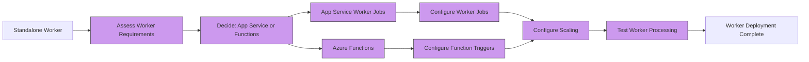

## Dependencies Between Components

The following diagram illustrates the dependencies between different Azure components in the target architecture:

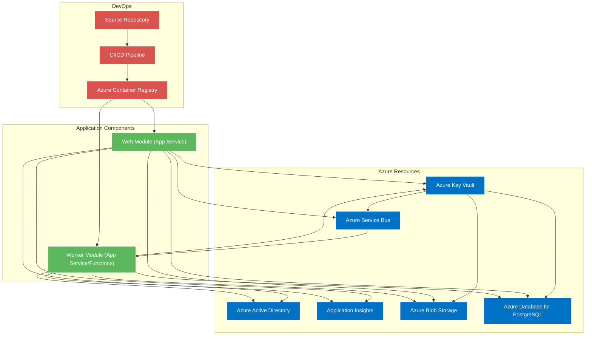

## Critical Path Analysis

The critical path represents the sequence of tasks that must be completed on schedule for the entire project to be completed on time:

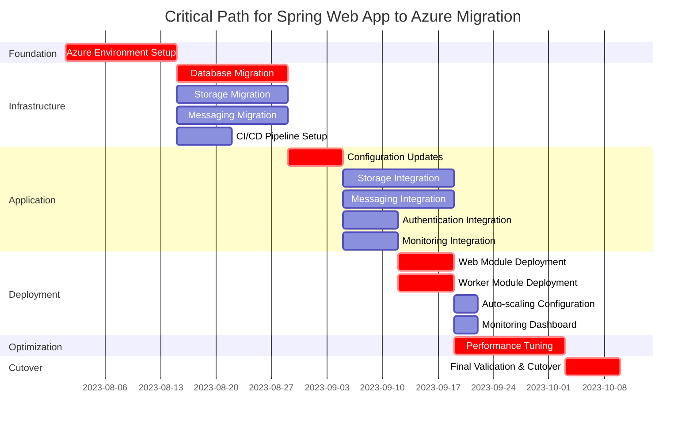

## Risk Assessment Visualization

The following heat map visualizes the risks associated with different migration components:

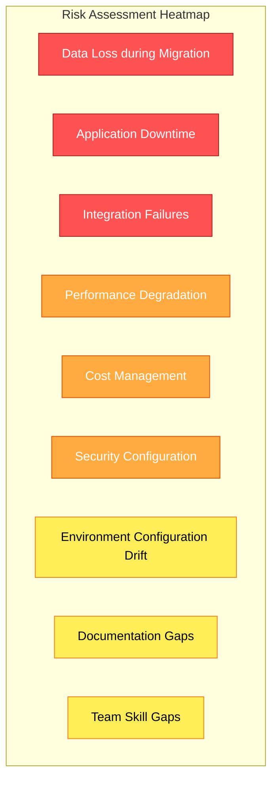

## Decision Trees for Key Migration Choices

### Worker Implementation Decision

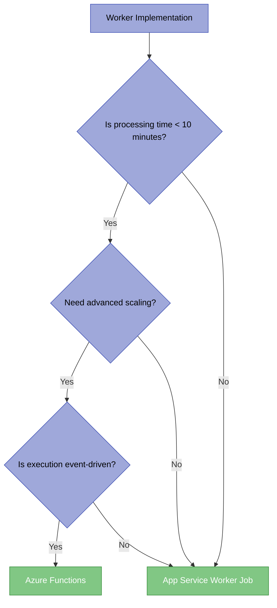

### Storage Implementation Decision

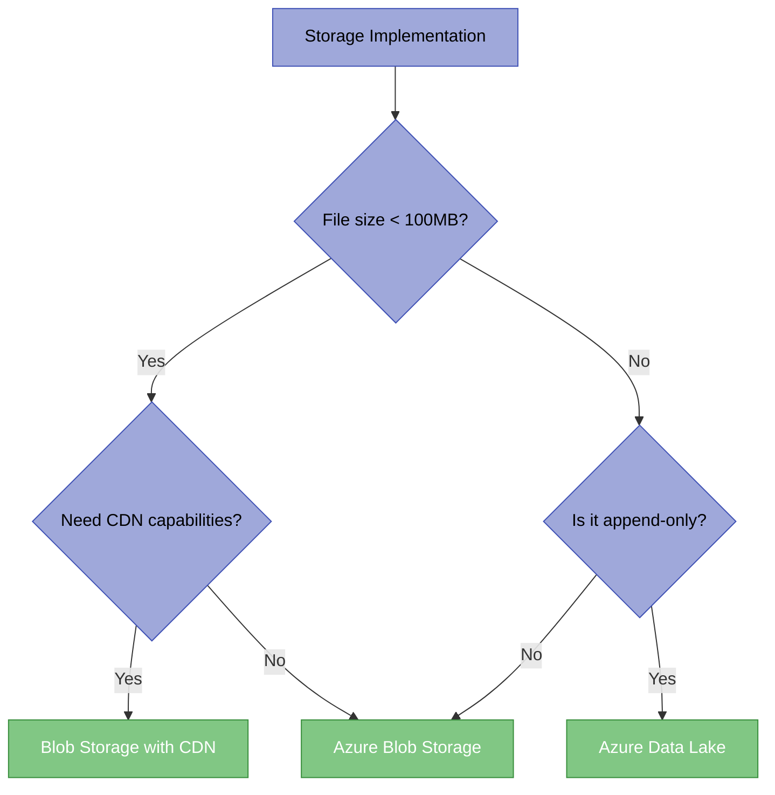

## Migration Success Visualization

The following diagram shows the key metrics that will indicate successful migration:

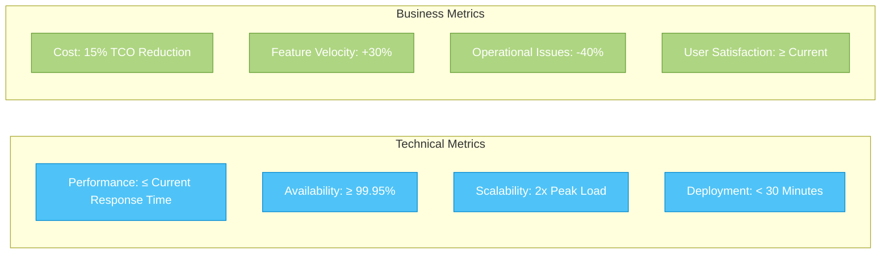

## Implementation Steps for Key Migrations

### Web Module to Azure App Service

**Prerequisites**:
- Azure subscription and resource group
- Azure CLI and development tools
- Azure App Service plan
- Azure Blob Storage configured
- Azure Database for PostgreSQL configured
- Azure Key Vault configured

**Implementation Steps**:

1. **Update application.properties for Azure**:
   ```properties
   # Azure Blob Storage (replaced AWS S3)
   azure.storage.connection-string=${AZURE_STORAGE_CONNECTION_STRING}
   azure.storage.container-name=assets
   
   # Azure Database for PostgreSQL
   spring.datasource.url=${POSTGRESQL_CONNECTION_STRING}
   spring.datasource.username=${POSTGRESQL_USERNAME}
   spring.datasource.password=${POSTGRESQL_PASSWORD}
   
   # Azure Service Bus (replaced RabbitMQ)
   azure.servicebus.connection-string=${SERVICEBUS_CONNECTION_STRING}
   azure.servicebus.queue.name=image-processing
   
   # Azure App Insights
   applicationinsights.connection.string=${APPINSIGHTS_CONNECTION_STRING}
   ```

2. **Update storage service to use Azure Blob Storage**:
   ```java
   @Service
   @RequiredArgsConstructor
   public class AzureStorageService implements StorageService {
       private final BlobServiceClient blobServiceClient;
       private final String containerName;
       
       // Implement methods using Azure SDK instead of AWS S3 SDK
   }
   ```

3. **Update messaging service to use Azure Service Bus**:
   ```java
   @Service
   @RequiredArgsConstructor
   public class AzureServiceBusService {
       private final ServiceBusSenderClient senderClient;
       
       // Implement methods using Azure Service Bus SDK
   }
   ```

4. **Configure App Service settings**:
   ```json
   {
     "appSettings": [
       { "name": "AZURE_STORAGE_CONNECTION_STRING", "@Microsoft.KeyVault(SecretUri=https://your-keyvault.vault.azure.net/secrets/storage-connection-string/)" },
       { "name": "POSTGRESQL_CONNECTION_STRING", "@Microsoft.KeyVault(SecretUri=https://your-keyvault.vault.azure.net/secrets/postgresql-connection-string/)" },
       { "name": "POSTGRESQL_USERNAME", "@Microsoft.KeyVault(SecretUri=https://your-keyvault.vault.azure.net/secrets/postgresql-username/)" },
       { "name": "POSTGRESQL_PASSWORD", "@Microsoft.KeyVault(SecretUri=https://your-keyvault.vault.azure.net/secrets/postgresql-password/)" },
       { "name": "SERVICEBUS_CONNECTION_STRING", "@Microsoft.KeyVault(SecretUri=https://your-keyvault.vault.azure.net/secrets/servicebus-connection-string/)" },
       { "name": "APPINSIGHTS_CONNECTION_STRING", "@Microsoft.KeyVault(SecretUri=https://your-keyvault.vault.azure.net/secrets/appinsights-connection-string/)" }
     ]
   }
   ```

5. **Configure deployment slots for zero-downtime deployment**:
   - Create staging slot
   - Deploy to staging
   - Validate deployment
   - Swap slots

6. **Implement health checks**:
   ```java
   @RestController
   public class HealthController {
       @GetMapping("/health")
       public ResponseEntity<String> healthCheck() {
           return ResponseEntity.ok("Healthy");
       }
   }
   ```

7. **Configure auto-scaling rules**:
   - CPU percentage-based scaling
   - Schedule-based scaling for known peak times

**Verification**:
- Verify application starts correctly
- Test all endpoints and functionality
- Verify logging to Application Insights
- Test auto-scaling by generating load
- Verify database connectivity and operations
- Test blob storage operations
- Monitor for any errors or exceptions

### Worker Module to Azure App Service

**Implementation Steps**:

1. **Update worker module configuration**:
   ```properties
   # Azure Blob Storage (replaced AWS S3)
   azure.storage.connection-string=${AZURE_STORAGE_CONNECTION_STRING}
   azure.storage.container-name=assets
   
   # Azure Database for PostgreSQL
   spring.datasource.url=${POSTGRESQL_CONNECTION_STRING}
   spring.datasource.username=${POSTGRESQL_USERNAME}
   spring.datasource.password=${POSTGRESQL_PASSWORD}
   
   # Azure Service Bus (replaced RabbitMQ)
   azure.servicebus.connection-string=${SERVICEBUS_CONNECTION_STRING}
   azure.servicebus.queue.name=image-processing
   ```

2. **Implement Service Bus message processing**:
   ```java
   @Service
   public class ServiceBusProcessingService {
       @Bean
       public Consumer<ServiceBusReceivedMessage> processMessage() {
           return message -> {
               // Process message from Service Bus
           };
       }
   }
   ```

3. **Configure WebJobs for the worker module**:
   - Create a `webjobs-publish-settings.json` file
   - Configure continuous WebJob
   - Set WebJob schedule if needed

4. **Update worker deployment script**:
   - Package application as WebJob
   - Deploy to App Service

**Verification**:
- Verify WebJob is running
- Test message processing end-to-end
- Monitor for exceptions in Application Insights
- Verify database updates from worker
- Test scaled-out scenarios
