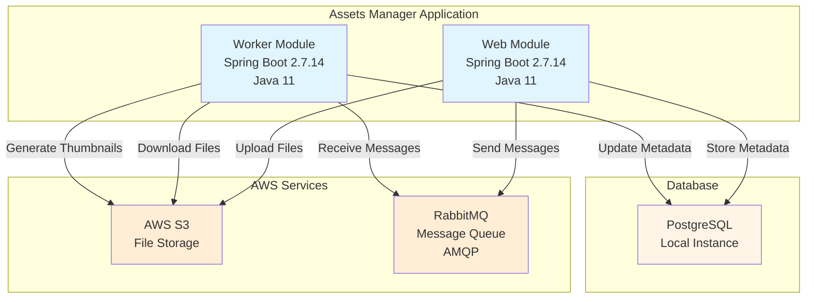
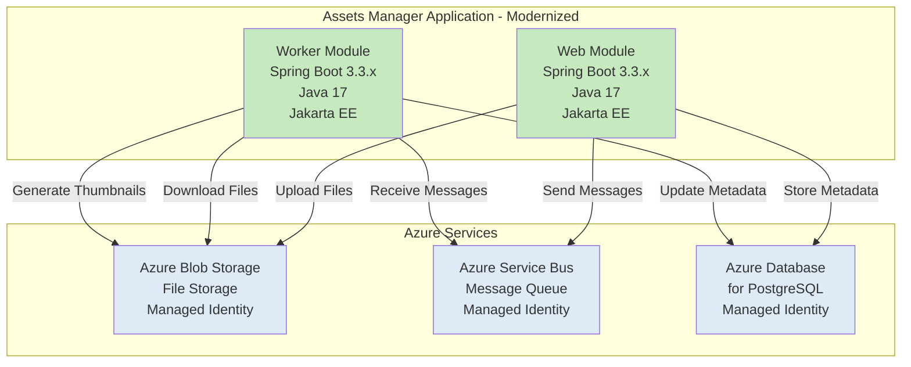

# Modernization Plan

**Branch**: `001-azure-modernization` | **Date**: 2025-12-01

---

## Modernization Goal

Modernize the assets-manager application for Azure deployment by upgrading the Java/Spring Boot framework to supported versions and migrating from AWS services to Azure equivalents. This ensures the application is compatible with Azure Container Apps, Azure App Service, or Azure Kubernetes Service.

## Scope

Based on the assessment report (`.github/appmod/appcat/result/summary.md`), this modernization plan covers:

1. **Java Upgrade**
   - JDK (11 → 17) [based on assessment - rule: azure-java-version-02000]
   - Spring Boot (2.7.14 → 3.3.x) [based on assessment - rule: spring-boot-to-azure-spring-boot-version-01000]
   - Spring Framework (→ 6.x, included in Spring Boot 3.3.x) [based on assessment - rule: spring-framework-version-01000]
   - Jakarta EE (javax.* → jakarta.*) [based on assessment - rule: java-11-deprecate-javaee-00001]

2. **Migration To Azure**
   - Migrate from AWS S3 to Azure Blob Storage [based on assessment - rules: azure-aws-config-s3-03000, azure-aws-config-s3-03001, local-storage-00005]
   - Migrate from RabbitMQ (AMQP) to Azure Service Bus [based on assessment - rules: azure-message-queue-amqp-02000, azure-message-queue-config-rabbitmq-01000, azure-message-queue-rabbitmq-01000]
   - Migrate to Azure Database for PostgreSQL with Managed Identity [based on assessment - rule: azure-database-postgresql-02000, localhost-jdbc-00002]

## References

- `.github/appmod/appcat/result/summary.md` - AppCAT assessment report with identified issues

## Application Information

### Current Architecture

The application is a multi-module Maven project with two Spring Boot applications:

**Key Components:**

1. **Web Module** (`assets-manager-web`)
   - Framework: Spring Boot 2.7.14, Spring MVC, Thymeleaf
   - Database: Spring Data JPA with PostgreSQL
   - Dependencies: AWS S3 SDK (2.25.13), Spring AMQP
   - Purpose: Handles file uploads and viewing

2. **Worker Module** (`assets-manager-worker`)
   - Framework: Spring Boot 2.7.14
   - Database: Spring Data JPA with PostgreSQL
   - Dependencies: AWS S3 SDK (2.25.13), Spring AMQP
   - Purpose: Background processing for thumbnail generation

3. **External Dependencies:**
   - AWS S3: File storage for assets and thumbnails
   - RabbitMQ: Message queue for async task processing
   - PostgreSQL: Relational database for metadata

## Clarification

No open issues requiring user clarification. The assessment provides clear guidance on all required migrations.

## Target Architecture

After modernization, the application will use Azure services and modern framework versions:

**Modernization Changes:**

1. **Framework Upgrades:**
   - Java 11 → Java 17
   - Spring Boot 2.7.14 → Spring Boot 3.3.x (latest stable)
   - Spring Framework → 6.x (included in Spring Boot 3.3.x)
   - javax.* → jakarta.* packages (JavaEE → Jakarta EE)

2. **Azure Service Migrations:**
   - AWS S3 → Azure Blob Storage with Managed Identity
   - RabbitMQ (AMQP) → Azure Service Bus with Managed Identity
   - Local PostgreSQL → Azure Database for PostgreSQL with Managed Identity

3. **Security & Authentication:**
   - Managed Identity for all Azure service connections (credential-free)
   - Secure, cloud-native authentication patterns

## Task Breakdown

### 1. Upgrade Spring Boot to 3.3.x
- **Task Type**: Java Upgrade
- **Description**: Upgrade Spring Boot from 2.7.14 to 3.3.x. This upgrade automatically includes upgrading JDK to 17, Spring Framework to 6.x, and migrating from JavaEE (javax.*) to Jakarta EE (jakarta.*). This resolves all framework compatibility issues and ensures the application uses fully supported, modern versions.
- **Solution Id**: `spring-boot-upgrade`

### 2. Migrate from AWS S3 to Azure Blob Storage
- **Task Type**: Migration To Azure
- **Description**: Replace AWS S3 SDK usage with Azure Blob Storage SDK. Update all file upload, download, and storage operations to use Azure Blob Storage. This addresses AWS dependency issues (rules: azure-aws-config-s3-03000, azure-aws-config-s3-03001) and local file system usage (rule: local-storage-00005).
- **Solution Id**: `s3-to-azure-blob-storage`

### 3. Migrate from RabbitMQ to Azure Service Bus
- **Task Type**: Migration To Azure
- **Description**: Replace Spring AMQP (RabbitMQ) implementation with Azure Service Bus messaging. Update message producers and consumers to use Azure Service Bus SDK with AMQP protocol support. This addresses RabbitMQ usage issues (rules: azure-message-queue-amqp-02000, azure-message-queue-config-rabbitmq-01000, azure-message-queue-rabbitmq-01000).
- **Solution Id**: `amqp-rabbitmq-servicebus`

### 4. Migrate to Azure Database for PostgreSQL
- **Task Type**: Migration To Azure
- **Description**: Update database connection configuration to use Azure Database for PostgreSQL with Azure SDK and managed identity for secure, credential-free authentication. This addresses local JDBC calls (rule: localhost-jdbc-00002) and PostgreSQL configuration (rule: azure-database-postgresql-02000).
- **Solution Id**: `mi-postgresql-azure-sdk-public-cloud`

---

**End of Modernization Plan**
