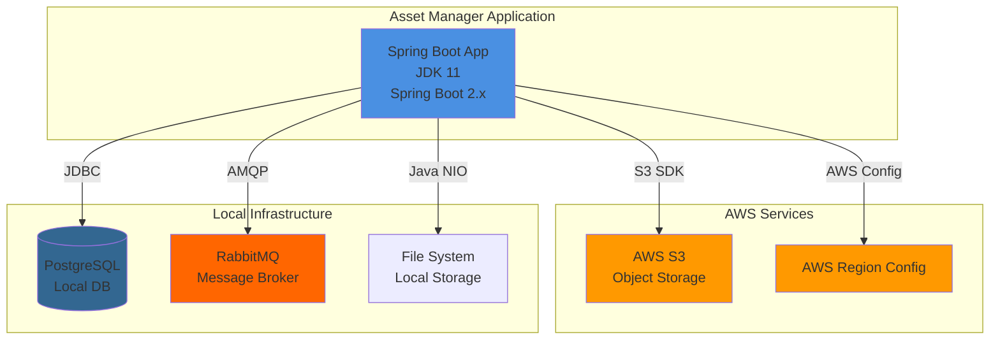
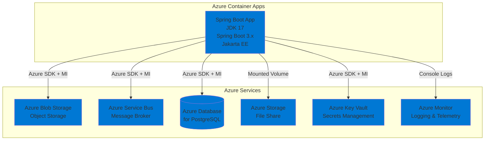

# Modernization Plan

**Branch**: `001-migrate-to-azure-container-app` | **Date**: 2025-11-18 | **Github Issue**: N/A

---

## Modernization Goal

Migrate the asset-manager-copilot application to Azure Container Apps with necessary code changes to ensure cloud-native compatibility and Azure service integration.

## Scope

This modernization plan covers the following scope types focusing on code changes:

1. **Java Upgrade**
   - JDK (11 → 17) [based on assessment report showing azure-java-version-02000]
   - Spring Boot (current → 3.x) [based on assessment report showing spring-boot-to-azure-spring-boot-version-01000]
   - Spring Framework upgrade (included in Spring Boot upgrade) [based on assessment report showing spring-framework-version-01000]

2. **Migration To Azure**
   - Migrate from AWS S3 to Azure Blob Storage [based on assessment report showing azure-aws-config-s3-03000, azure-aws-config-s3-03001]
   - Migrate from RabbitMQ to Azure Service Bus [based on assessment report showing azure-message-queue-amqp-02000, azure-message-queue-config-rabbitmq-01000, azure-message-queue-rabbitmq-01000]
   - Migrate from local PostgreSQL to Azure Database for PostgreSQL [based on assessment report showing azure-database-postgresql-02000, localhost-jdbc-00002]
   - Migrate plaintext credentials to Azure Key Vault [based on assessment report showing azure-password-01000]
   - Migrate local file system access to Azure Storage File Share mounts [based on assessment report showing local-storage-00005]
   - Migrate logging to console output [for cloud-native Azure Monitor integration]

**Note**: Containerization and deployment tasks are excluded from this iteration as per user request.

## References

- `.github/testreport/summary.md` - Contains the application assessment report with identified issues

## Application Information

### Current Architecture

**Current Stack:**
- **Runtime**: JDK 11
- **Framework**: Spring Boot 2.x, Spring Framework (out of support version)
- **Build Tool**: Maven
- **Storage**: AWS S3 for object storage, local file system
- **Database**: PostgreSQL (localhost connection)
- **Messaging**: RabbitMQ with AMQP
- **Configuration**: AWS region configuration, plaintext passwords

## Clarification

1. **Azure Database for PostgreSQL Configuration**: What is the target Azure Database for PostgreSQL instance (server name, database name)? If not yet created, should managed identity be used for authentication?
   - Answer: 
   - Status: Open

2. **Azure Storage Account Details**: What is the target Azure Storage Account name and container name for S3 migration? Should we use managed identity for authentication?
   - Answer: 
   - Status: Open

3. **Azure Service Bus Configuration**: What is the target Azure Service Bus namespace? Should we use managed identity for authentication?
   - Answer: 
   - Status: Open

4. **File System Access Pattern**: The assessment shows Java NIO file system access (14 locations). What type of files are being accessed? Are they configuration files, data files, or temporary files? This will help determine if Azure Storage File Share or Blob Storage is more appropriate.
   - Answer: 
   - Status: Open

5. **Secrets Management**: Which secrets should be migrated to Azure Key Vault? (Database passwords, RabbitMQ credentials, AWS credentials, etc.)
   - Answer: 
   - Status: Open

## Target Architecture

**Target Stack:**
- **Runtime**: JDK 17
- **Framework**: Spring Boot 3.x, Spring Framework 6.x, Jakarta EE
- **Hosting**: Azure Container Apps
- **Storage**: Azure Blob Storage, Azure Storage File Share
- **Database**: Azure Database for PostgreSQL with managed identity
- **Messaging**: Azure Service Bus with managed identity
- **Secrets**: Azure Key Vault with managed identity
- **Monitoring**: Azure Monitor with console logging

## Task Breakdown

### 1. Java Upgrade

#### Task 1: Upgrade Spring Boot to 3.x
- **Task Type**: Java Upgrade
- **Description**: Upgrade Spring Boot from current version to 3.x. This upgrade includes upgrading JDK to 17, Spring Framework to 6.x, and migrating from JavaEE (javax.*) to Jakarta EE (jakarta.*). This resolves the following issues:
  - Legacy Java version (azure-java-version-02000)
  - Spring Boot version is low (spring-boot-to-azure-spring-boot-version-01000)
  - Spring Framework version out of support (spring-framework-version-01000)
  - Java annotation module removed from OpenJDK 11 (java-11-deprecate-javaee-00001)
- **Solution Id**: spring-boot-upgrade

### 2. Migration To Azure

#### Task 2: Migrate from AWS S3 to Azure Blob Storage
- **Task Type**: Migration To Azure
- **Description**: Migrate object storage from AWS S3 to Azure Blob Storage with managed identity for secure, credential-free authentication. This resolves:
  - AWS S3 dependency usage (azure-aws-config-s3-03001)
  - AWS S3 usage in code (azure-aws-config-s3-03000)
  - AWS region configuration (azure-aws-config-region-02000)
- **Solution Id**: s3-to-azure-blob-storage

#### Task 3: Migrate from RabbitMQ to Azure Service Bus
- **Task Type**: Migration To Azure
- **Description**: Migrate messaging infrastructure from RabbitMQ with AMQP to Azure Service Bus for a fully managed messaging service with managed identity. This resolves:
  - Spring AMQP dependency (azure-message-queue-amqp-02000)
  - RabbitMQ connection strings in configuration (azure-message-queue-config-rabbitmq-01000)
  - Spring RabbitMQ usage in code (azure-message-queue-rabbitmq-01000)
- **Solution Id**: amqp-rabbitmq-servicebus

#### Task 4: Migrate from local PostgreSQL to Azure Database for PostgreSQL
- **Task Type**: Migration To Azure
- **Description**: Migrate from local PostgreSQL database to Azure Database for PostgreSQL with Azure SDK and managed identity for secure, credential-free authentication. This resolves:
  - PostgreSQL database found (azure-database-postgresql-02000)
  - Local JDBC calls (localhost-jdbc-00002)
- **Solution Id**: mi-postgresql-azure-sdk-public-cloud

#### Task 5: Migrate from local file system to Azure Storage File Share
- **Task Type**: Migration To Azure
- **Description**: Migrate from local file system access to Azure Storage Account File Share mounts for scalable and secure file storage in cloud environment. This resolves:
  - File system Java NIO usage (local-storage-00005)
- **Solution Id**: local-files-to-mounted-azure-storage

#### Task 6: Migrate plaintext credentials to Azure Key Vault
- **Task Type**: Migration To Azure
- **Description**: Migrate plaintext credentials from configuration files to Azure Key Vault for secure storage and access to sensitive information. This resolves:
  - Password found in configuration file (azure-password-01000)
- **Solution Id**: plaintext-credential-to-azure-keyvault

#### Task 7: Migrate to console logging
- **Task Type**: Migration To Azure
- **Description**: Migrate from file-based logging to console logging to support cloud-native applications and enable integration with Azure Monitor for centralized log management.
- **Solution Id**: log-to-console
