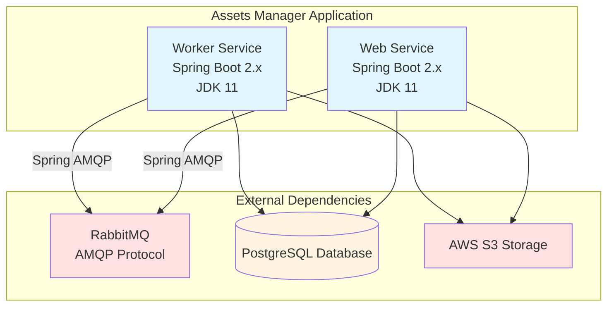
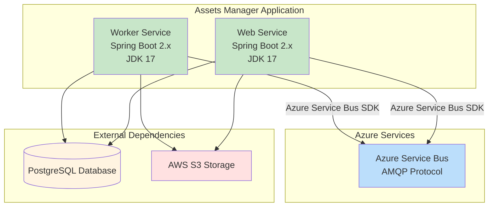

# Modernization Plan

**Branch**: `001-upgrade-jdk17-migrate-rabbitmq-to-azure-service-bus` | **Date**: 2025-11-12 | **Github Issue**: N/A

---

## Modernization Goal

Upgrade the assets-manager application to JDK 17 and migrate the messaging system from RabbitMQ to Azure Service Bus, preparing the application for deployment on Azure Container Apps.

## Scope

This modernization plan covers the following scope for this iteration:

1. **Java Upgrade**
   - JDK (11 → 17) [based on user request and project information showing current JDK 11]

2. **Migration To Azure**
   - Migrate messaging from RabbitMQ(AMQP) to Azure Service Bus [based on user request and assessment report showing RabbitMQ usage]

**Note**: This iteration focuses specifically on JDK upgrade and RabbitMQ to Service Bus migration as requested. Other issues identified in the assessment report (AWS S3, local storage, PostgreSQL, etc.) are out of scope for this iteration.

## References

- `.github/testreport/assets-manager.data.md` - Contains the application assessment summary

## Application Information

### Current Architecture

**Key Components:**
- **Framework**: Spring Boot 2.x with Spring Framework
- **JDK Version**: 11 (legacy, requires upgrade)
- **Build Tool**: Maven
- **Messaging**: RabbitMQ with Spring AMQP
- **Database**: PostgreSQL (with JDBC connections)
- **Storage**: AWS S3

## Target Architecture

**Target State:**
- **Framework**: Spring Boot 2.x with Spring Framework
- **JDK Version**: 17 (upgraded from 11)
- **Build Tool**: Maven
- **Messaging**: Azure Service Bus with Azure SDK
- **Database**: PostgreSQL (unchanged for this iteration)
- **Storage**: AWS S3 (unchanged for this iteration)

## Task Breakdown

### 1. Upgrade JDK to 17
- **Task Type**: Java Upgrade
- **Description**: Upgrade the Java Development Kit from version 11 to version 17 to ensure the application uses a modern, supported version with improved performance and security features. This includes updating build configurations, resolving any deprecated API usage, and ensuring compatibility with JDK 17.
- **Solution Id**: `java-version-upgrade`

### 2. Migrate from RabbitMQ(AMQP) to Azure Service Bus
- **Task Type**: Migration To Azure
- **Description**: Replace RabbitMQ messaging infrastructure with Azure Service Bus. This migration involves replacing Spring AMQP dependencies with Azure Service Bus SDK, updating message producer and consumer implementations, configuring Azure Service Bus connection settings, and removing RabbitMQ-specific configurations from application properties.
- **Solution Id**: `amqp-rabbitmq-servicebus`

---

**Note**: This plan is scoped to address only the JDK upgrade and RabbitMQ migration as requested. Additional modernization tasks for other identified issues (AWS S3 → Azure Blob Storage, local storage → Azure Storage, etc.) can be addressed in future iterations.
