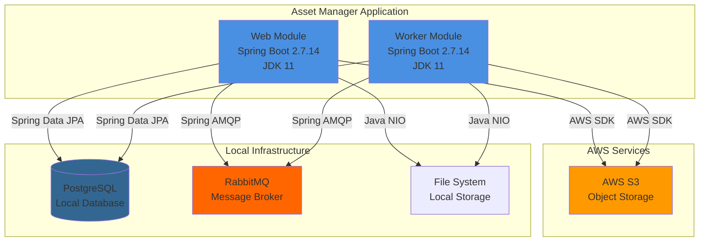
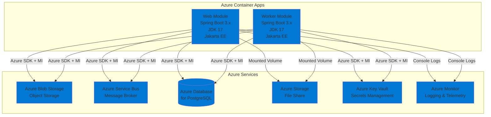

# Modernization Plan

**Branch**: `002-generate-modernization-plan` | **Date**: 2025-12-01 | **Github Issue**: N/A

---

## Modernization Goal

Modernize the assets-manager-parent application to Azure by upgrading the Java/Spring Boot stack to the latest supported versions and migrating from AWS services and on-premises infrastructure to Azure native services for cloud-native deployment.

## Scope

This modernization plan covers the following scope types focusing on code changes:

1. **Java Upgrade**
   - Spring Boot (2.7.14 → 3.x) [based on assessment report showing spring-boot-to-azure-spring-boot-version-01000]
   - Note: This includes JDK 11 → 17, Spring Framework to 6.x, and Jakarta EE migration

2. **Migration To Azure**
   - Migrate from AWS S3 to Azure Blob Storage [based on assessment report showing azure-aws-config-s3-03000, azure-aws-config-s3-03001]
   - Migrate from RabbitMQ to Azure Service Bus [based on assessment report showing azure-message-queue-amqp-02000, azure-message-queue-config-rabbitmq-01000, azure-message-queue-rabbitmq-01000]
   - Migrate from local PostgreSQL to Azure Database for PostgreSQL with Managed Identity [based on assessment report showing azure-database-postgresql-02000, localhost-jdbc-00002]
   - Migrate local file system access to Azure Storage File Share mounts [based on assessment report showing local-storage-00005]
   - Migrate plaintext credentials to Azure Key Vault [based on assessment report showing azure-password-01000]
   - Migrate logging to console output [for cloud-native Azure Monitor integration]

3. **Containerize**
   - Generate Dockerfile for containerization [based on assessment report showing dockerfile-00000]

## References

- `.github/testreport/summary.md` - Contains the application assessment report with identified issues

## Application Information

### Current Architecture

**Current Stack:**
- **Runtime**: JDK 11
- **Framework**: Spring Boot 2.7.14, Spring Framework 5.x
- **Build Tool**: Maven (multi-module)
- **Modules**: 
  - `web` - Web module for file uploads and viewing (uses Thymeleaf, Spring Web, Spring AMQP, AWS S3 SDK, PostgreSQL)
  - `worker` - Worker module for thumbnail generation (uses Spring AMQP, AWS S3 SDK, PostgreSQL)
- **Storage**: AWS S3 for object storage, local file system for temporary files
- **Database**: PostgreSQL (localhost connection)
- **Messaging**: RabbitMQ with Spring AMQP
- **Configuration**: Plaintext passwords in configuration files

## Target Architecture

**Target Stack:**
- **Runtime**: JDK 17
- **Framework**: Spring Boot 3.x, Spring Framework 6.x, Jakarta EE
- **Hosting**: Azure Container Apps
- **Storage**: Azure Blob Storage for object storage, Azure Storage File Share for file mounts
- **Database**: Azure Database for PostgreSQL with Managed Identity
- **Messaging**: Azure Service Bus with Managed Identity
- **Secrets**: Azure Key Vault with Managed Identity
- **Monitoring**: Azure Monitor with console logging

## Task Breakdown

### 1. Java Upgrade

#### Task 1: Upgrade Spring Boot to 3.x
- **Task Type**: Java Upgrade
- **Description**: Upgrade Spring Boot from 2.7.14 to 3.x. This upgrade includes upgrading JDK to 17, Spring Framework to 6.x, and migrating from JavaEE (javax.*) to Jakarta EE (jakarta.*). This resolves the following issues:
  - Legacy Java version (azure-java-version-02000)
  - Spring Boot version is low (spring-boot-to-azure-spring-boot-version-01000)
  - Spring Framework version out of support (spring-framework-version-01000)
  - Java annotation module removed from OpenJDK 11 (java-11-deprecate-javaee-00001)
- **Solution Id**: spring-boot-upgrade

### 2. Migration To Azure

#### Task 2: Migrate from AWS S3 to Azure Blob Storage
- **Task Type**: Migration To Azure
- **Description**: Migrate object storage from AWS S3 to Azure Blob Storage with managed identity for secure, credential-free authentication. This resolves:
  - AWS S3 dependency usage (azure-aws-config-s3-03001)
  - AWS S3 usage in code (azure-aws-config-s3-03000)
  - AWS region configuration (azure-aws-config-region-02000)
- **Solution Id**: s3-to-azure-blob-storage

#### Task 3: Migrate from RabbitMQ to Azure Service Bus
- **Task Type**: Migration To Azure
- **Description**: Migrate messaging infrastructure from RabbitMQ with AMQP to Azure Service Bus for a fully managed messaging service with managed identity. This resolves:
  - Spring AMQP dependency (azure-message-queue-amqp-02000)
  - RabbitMQ connection strings in configuration (azure-message-queue-config-rabbitmq-01000)
  - Spring RabbitMQ usage in code (azure-message-queue-rabbitmq-01000)
- **Solution Id**: amqp-rabbitmq-servicebus

#### Task 4: Migrate from local file system to Azure Storage File Share
- **Task Type**: Migration To Azure
- **Description**: Migrate from local file system access to Azure Storage Account File Share mounts for scalable and secure file storage in cloud environment. This resolves:
  - File system Java NIO usage (local-storage-00005)
- **Solution Id**: local-files-to-mounted-azure-storage

#### Task 5: Migrate plaintext credentials to Azure Key Vault
- **Task Type**: Migration To Azure
- **Description**: Migrate plaintext credentials from configuration files to Azure Key Vault for secure storage and access to sensitive information. This resolves:
  - Password found in configuration file (azure-password-01000)
- **Solution Id**: plaintext-credential-to-azure-keyvault

#### Task 6: Migrate from local PostgreSQL to Azure Database for PostgreSQL
- **Task Type**: Migration To Azure
- **Description**: Migrate from local PostgreSQL database to Azure Database for PostgreSQL with Azure SDK and managed identity for secure, credential-free authentication. This resolves:
  - PostgreSQL database found (azure-database-postgresql-02000)
  - Local JDBC calls (localhost-jdbc-00002)
- **Solution Id**: mi-postgresql-azure-sdk-public-cloud

#### Task 7: Migrate to console logging
- **Task Type**: Migration To Azure
- **Description**: Migrate from file-based logging to console logging to support cloud-native applications and enable integration with Azure Monitor for centralized log management.
- **Solution Id**: log-to-console

### 3. Containerize

#### Task 8: Containerize the application
- **Task Type**: Containerize
- **Description**: Generate Dockerfile and related configuration files to containerize the application for deployment to Azure Container Apps. This resolves:
  - No Dockerfile found (dockerfile-00000)
- **Solution Id**: containerization-copilot-agent
