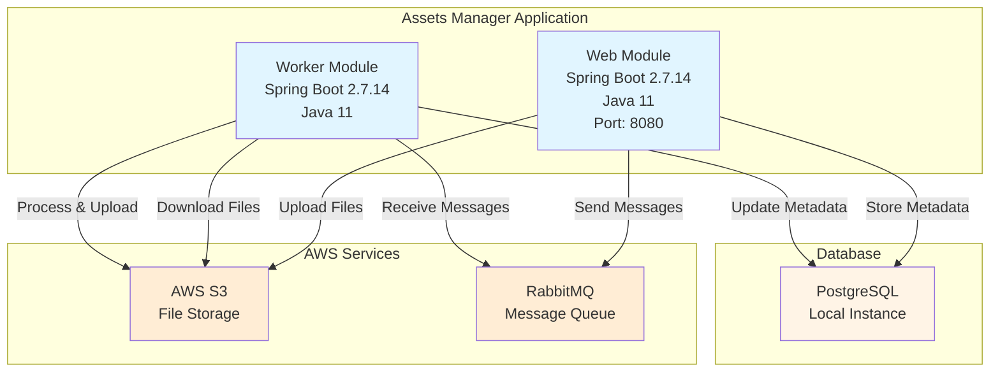
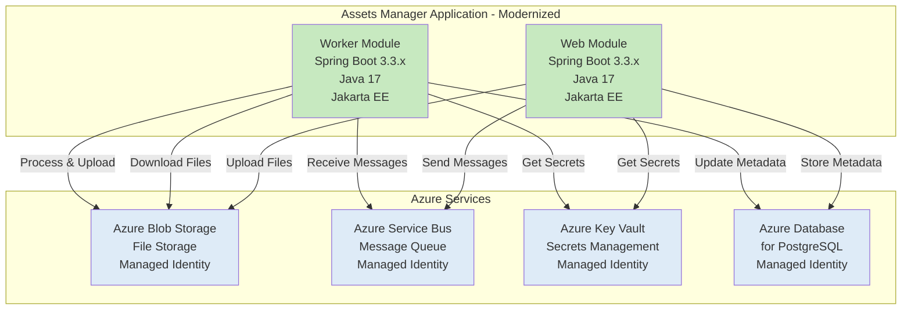

# Modernization Plan

**Branch**: `002-migrate-to-azure-container-app` | **Date**: 2025-12-01

---

## Modernization Goal

Migrate the assets-manager application to Azure Container Apps, focusing on Java/Spring Boot upgrades and Azure service migrations. This includes upgrading the application framework to modern versions and migrating AWS services to Azure equivalents to ensure compatibility with Azure Container Apps deployment.

## Scope

Based on the assessment report (`.github/testreport/summary.md`), this modernization plan covers the following scope focusing on **code changes only** (excluding containerization and deployment):

1. **Java Upgrade**
   - JDK (11 → 17) [based on assessment report - rule: azure-java-version-02000]
   - Spring Boot (2.7.14 → 3.3.x) [based on assessment report - rule: spring-boot-to-azure-spring-boot-version-01000]
   - Spring Framework (upgrade to 6.x as part of Spring Boot 3.x) [based on assessment report - rule: spring-framework-version-01000]
   - Jakarta EE (javax.* → jakarta.*) [based on assessment report - rule: java-11-deprecate-javaee-00001]

2. **Migration To Azure**
   - Migrate from AWS S3 to Azure Blob Storage [based on assessment report - rules: azure-aws-config-s3-03000, azure-aws-config-s3-03001, local-storage-00005]
   - Migrate from RabbitMQ (AMQP) to Azure Service Bus [based on assessment report - rules: azure-message-queue-amqp-02000, azure-message-queue-config-rabbitmq-01000, azure-message-queue-rabbitmq-01000]
   - Migrate from plaintext credentials to Azure Key Vault [based on assessment report - rule: azure-password-01000]
   - Migrate to Azure Database for PostgreSQL [based on assessment report - rule: azure-database-postgresql-02000]

## References

- `.github/testreport/summary.md` - AppCAT assessment report containing all identified migration issues

## Application Information

### Current Architecture

The application is a multi-module Spring Boot application consisting of two modules:

**Key Components:**

1. **Web Module** (`assets-manager-web`)
   - Framework: Spring Boot 2.7.14 with Spring MVC
   - UI: Thymeleaf templates
   - Database: Spring Data JPA with PostgreSQL
   - Dependencies: AWS S3 SDK, Spring AMQP (RabbitMQ)
   - Purpose: Handles file uploads and viewing

2. **Worker Module** (`assets-manager-worker`)
   - Framework: Spring Boot 2.7.14
   - Database: Spring Data JPA with PostgreSQL
   - Dependencies: AWS S3 SDK, Spring AMQP (RabbitMQ)
   - Purpose: Processes messages and generates thumbnails

3. **External Dependencies:**
   - AWS S3: File storage for assets and thumbnails
   - RabbitMQ: Message queue for async processing
   - PostgreSQL: Database for metadata storage
   - Plaintext credentials in configuration files

## Clarification

No open issues requiring user clarification. The assessment report provides clear guidance on all required migrations.

## Target Architecture

After modernization, the application will use Azure services and modern frameworks:

**Modernization Changes:**

1. **Framework Upgrades:**
   - Java 11 → Java 17
   - Spring Boot 2.7.14 → Spring Boot 3.3.x
   - Spring Framework → 6.x (included in Spring Boot 3.3.x)
   - javax.* → jakarta.* packages

2. **Azure Service Migrations:**
   - AWS S3 → Azure Blob Storage (with Managed Identity)
   - RabbitMQ → Azure Service Bus (with Managed Identity)
   - Plaintext credentials → Azure Key Vault (with Managed Identity)
   - Local PostgreSQL → Azure Database for PostgreSQL (with Managed Identity)

3. **Security & Authentication:**
   - Managed Identity for all Azure service connections (credential-free authentication)
   - Azure Key Vault for sensitive configuration management

## Task Breakdown

### 1. Upgrade Spring Boot to 3.3.x
- **Task Type**: Java Upgrade
- **Description**: Upgrade Spring Boot from 2.7.14 to 3.3.x. This upgrade automatically includes upgrading JDK to 17, Spring Framework to 6.x, and migrating from JavaEE (javax.*) to Jakarta EE (jakarta.*). This resolves compatibility issues with deprecated Java 11 features and ensures the application uses supported framework versions.
- **Solution Id**: `spring-boot-upgrade`

### 2. Migrate from AWS S3 to Azure Blob Storage
- **Task Type**: Migration To Azure
- **Description**: Replace AWS S3 SDK usage with Azure Blob Storage SDK. Update all file upload, download, and storage operations to use Azure Blob Storage. Migrate file storage configuration from AWS to Azure. This addresses the AWS dependency issues identified in the assessment (rules: azure-aws-config-s3-03000, azure-aws-config-s3-03001) and local file system usage (rule: local-storage-00005).
- **Solution Id**: `s3-to-azure-blob-storage`

### 3. Migrate from RabbitMQ to Azure Service Bus
- **Task Type**: Migration To Azure
- **Description**: Replace Spring AMQP (RabbitMQ) implementation with Azure Service Bus messaging. Update message producers and consumers to use Azure Service Bus SDK. This addresses the RabbitMQ usage issues identified in the assessment (rules: azure-message-queue-amqp-02000, azure-message-queue-config-rabbitmq-01000, azure-message-queue-rabbitmq-01000).
- **Solution Id**: `amqp-rabbitmq-servicebus`

### 4. Migrate from PostgreSQL to Azure Database for PostgreSQL
- **Task Type**: Migration To Azure
- **Description**: Update database connection configuration to connect to Azure Database for PostgreSQL using Azure SDK and managed identity for secure, credential-free authentication. This addresses the local JDBC calls (rule: localhost-jdbc-00002) and PostgreSQL configuration issues (rule: azure-database-postgresql-02000).
- **Solution Id**: `mi-postgresql-azure-sdk-public-cloud`

### 5. Migrate plaintext credentials to Azure Key Vault
- **Task Type**: Migration To Azure
- **Description**: Remove plaintext passwords and sensitive configuration from application properties files. Implement Azure Key Vault integration to securely retrieve secrets at runtime. This addresses the password security issues identified in the assessment (rule: azure-password-01000).
- **Solution Id**: `plaintext-credential-to-azure-keyvault`

### 6. Enable Managed Identity for Azure services
- **Task Type**: Migration To Azure
- **Description**: Configure managed identity authentication for all Azure service connections (Blob Storage, Service Bus, Key Vault, PostgreSQL). This eliminates the need for credential management and provides secure, credential-free authentication to Azure resources.
- **Solution Id**: `managed_identity_knowledge_base`

---

**End of Modernization Plan**
