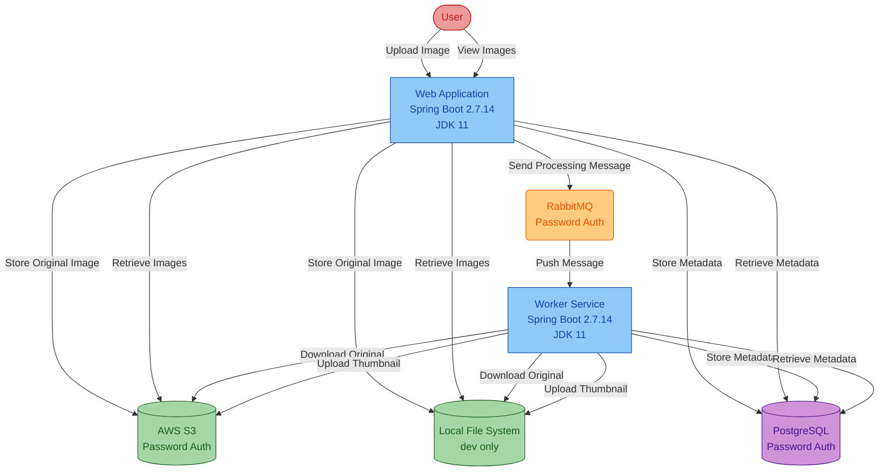
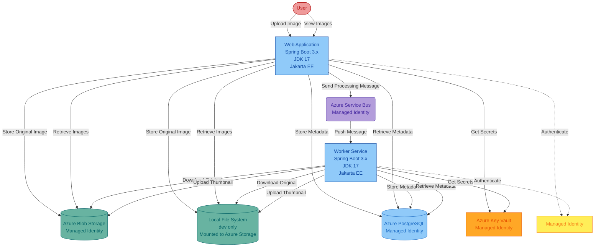

# Modernization Plan

**Branch**: `002-modernization-plan` | **Date**: 2026-01-06 | **Github Issue**: https://github.com/zhiyongli_microsoft/asset-manager/issues/17

---

## Modernization Goal

Migrate the Asset Manager application from AWS infrastructure to Azure cloud services, targeting deployment on Azure Container Apps, Azure App Service, or Azure Kubernetes Service. The migration will modernize the application stack, replace AWS services with Azure equivalents using Managed Identity authentication, and containerize the application for cloud-native deployment.

## Scope

This modernization plan covers the following scope based on the AppCAT assessment report and user requirements:

### 1. Java Upgrade
- JDK (11 → 17) [based on AppCAT report: azure-java-version-02000]
- Spring Boot (2.7.14 → 3.x) [based on AppCAT report: spring-boot-to-azure-spring-boot-version-01000]
- Spring Framework (→ 6.x) [included in Spring Boot 3.x upgrade, based on AppCAT report: spring-framework-version-01000]
- JavaEE to Jakarta EE migration (javax.* → jakarta.*) [based on AppCAT report: java-11-deprecate-javaee-00001]

### 2. Migration To Azure
- Migrate storage from AWS S3 to Azure Blob Storage with Managed Identity [based on AppCAT report: azure-aws-config-s3-03000, azure-aws-config-s3-03001]
- Migrate messaging from RabbitMQ to Azure Service Bus with Managed Identity [based on AppCAT report: azure-message-queue-rabbitmq-01000, azure-message-queue-config-rabbitmq-01000]
- Migrate database authentication to Azure Database for PostgreSQL with Managed Identity [based on AppCAT report: azure-database-postgresql-02000, azure-password-01000]
- Migrate local file storage paths to mounted Azure storage [based on AppCAT report: local-storage-00005]
- Migrate hardcoded credentials to Azure Key Vault with Managed Identity [based on AppCAT report: azure-password-01000]

### 3. Deploy
- Generate Dockerfile and deployment files for Azure [based on AppCAT report: dockerfile-00000]
- Deploy to Azure Container Apps / Azure App Service / Azure Kubernetes Service

## References

- GitHub Issue: https://github.com/zhiyongli_microsoft/asset-manager/issues/17 - AppCAT assessment report and migration requirements

## Application Information

### Current Architecture

The Asset Manager application is a Spring Boot 2.7.14 multi-module Maven project running on JDK 11. It consists of two main components:

**Technology Stack:**
- Java 11
- Spring Boot 2.7.14
- Spring Framework (from Spring Boot parent)
- Maven build tool
- PostgreSQL database
- AWS S3 for object storage
- RabbitMQ for messaging

**Application Modules:**
1. **Web Application** (`assets-manager-web`): Handles user uploads, image viewing, and metadata management
2. **Worker Service** (`assets-manager-worker`): Processes images asynchronously to generate thumbnails

**Current Issues:**
- Using legacy Java 11 and Spring Boot 2.7.14 (both EOL)
- AWS-specific dependencies (S3 SDK)
- Password-based authentication for all services
- Hardcoded credentials in configuration files
- Local file system usage for development
- No containerization (no Dockerfile)

## Target Architecture

The modernized application will run on Azure cloud infrastructure with modern authentication and cloud-native deployment:

**Target Technology Stack:**
- Java 17
- Spring Boot 3.x
- Spring Framework 6.x
- Jakarta EE (jakarta.* packages)
- Maven build tool
- Azure Database for PostgreSQL
- Azure Blob Storage
- Azure Service Bus
- Azure Key Vault
- Managed Identity authentication

**Deployment Options:**
- Azure Container Apps (recommended for simplicity)
- Azure App Service (for traditional PaaS)
- Azure Kubernetes Service (for advanced orchestration)

**Key Improvements:**
- Modern Java 17 and Spring Boot 3.x stack
- Azure-native services with Managed Identity
- Secure credential management via Azure Key Vault
- Cloud-native deployment with containers
- Mounted storage for local development

## Task Breakdown

### Task 1: Upgrade Spring Boot to 3.x
- **Task Type**: Java Upgrade
- **Description**: Upgrade the application from Spring Boot 2.7.14 to Spring Boot 3.x (latest 3.5.x version). This task includes upgrading JDK from 11 to 17, Spring Framework to 6.x, and migrating from JavaEE (javax.*) to Jakarta EE (jakarta.*). This single task addresses multiple AppCAT issues: azure-java-version-02000, spring-boot-to-azure-spring-boot-version-01000, spring-framework-version-01000, and java-11-deprecate-javaee-00001.
- **Solution**: Use Java upgrade tools (`generate_upgrade_plan` with Spring Boot 3.x target)

### Task 2: Migrate from AWS S3 to Azure Blob Storage
- **Task Type**: Migration To Azure
- **Description**: Replace AWS S3 SDK and client code with Azure Blob Storage SDK. Migrate all S3 operations (putObject, getObject, listObjects, deleteObject) to equivalent Azure Blob Storage operations. Update configuration to use Azure Storage connection strings. This addresses AppCAT issues: azure-aws-config-s3-03000 (11 locations), azure-aws-config-s3-03001 (2 locations), and azure-aws-config-region-02000 (5 locations).
- **Solution Id**: s3-to-azure-blob-storage

### Task 3: Migrate from RabbitMQ to Azure Service Bus
- **Task Type**: Migration To Azure
- **Description**: Replace RabbitMQ messaging with Azure Service Bus. Migrate Spring AMQP configuration and code to use Azure Service Bus SDK. Update message producers and consumers to use Service Bus queues/topics. This addresses AppCAT issues: azure-message-queue-rabbitmq-01000 (10 locations), azure-message-queue-config-rabbitmq-01000 (6 locations), and azure-message-queue-amqp-02000 (3 locations).
- **Solution Id**: amqp-rabbitmq-servicebus

### Task 4: Migrate Local File Storage to Mounted Azure Storage
- **Task Type**: Migration To Azure
- **Description**: Update local file system paths (Java NIO) to support mounting to Azure Blob Storage or Azure Files in cloud environment. Ensure file operations work with both local development and cloud-mounted storage. This addresses AppCAT issue: local-storage-00005 (14 locations).
- **Solution Id**: local-files-to-mounted-azure-storage

### Task 5: Migrate Credentials to Azure Key Vault
- **Task Type**: Migration To Azure
- **Description**: Remove hardcoded passwords and credentials from configuration files. Migrate all secrets (database passwords, storage account keys, Service Bus connection strings) to Azure Key Vault. Update application to retrieve secrets from Key Vault at runtime. This addresses AppCAT issue: azure-password-01000 (5 locations).
- **Solution Id**: plaintext-credential-to-azure-keyvault

### Task 6: Configure Azure Database for PostgreSQL with Managed Identity
- **Task Type**: Migration To Azure
- **Description**: Configure the application to connect to Azure Database for PostgreSQL using Managed Identity authentication instead of username/password. Update JDBC connection strings and add Azure PostgreSQL authentication libraries. This addresses AppCAT issues: azure-database-postgresql-02000 (5 locations) and localhost-jdbc-00002 (2 locations).
- **Solution Id**: mi-postgresql-spring

### Task 7: Configure Managed Identity for All Azure Services
- **Task Type**: Migration To Azure
- **Description**: Configure Managed Identity authentication for Azure Blob Storage, Azure Service Bus, Azure Database for PostgreSQL, and Azure Key Vault. Remove password-based authentication and configure Azure resources to accept Managed Identity. This addresses the authentication security requirements across all Azure services.
- **Solution Id**: Combined managed identity solutions:
  - mi-azure-blob-storage (for Blob Storage)
  - mi-servicebus-azure-sdk-public-cloud (for Service Bus)
  - mi-postgresql-spring (for PostgreSQL)
  - mi-keyvault (for Key Vault)

### Task 8: Generate Deployment Files and Deploy to Azure
- **Task Type**: Deploy
- **Description**: Generate Dockerfile for containerizing both web and worker applications. Create deployment configuration files for target Azure service (Azure Container Apps, Azure App Service, or Azure Kubernetes Service). Configure CI/CD pipeline for automated deployment. This addresses AppCAT issue: dockerfile-00000.
- **Solution**: Use Azure deployment tools (containerization and deployment are included in this task)

---

**Total Tasks**: 8 tasks
- Java Upgrade: 1 task
- Migration To Azure: 6 tasks
- Deploy: 1 task

**Estimated Effort**: Medium to High complexity migration
**Recommended Sequence**: Execute tasks in the order listed above to minimize dependencies and conflicts
