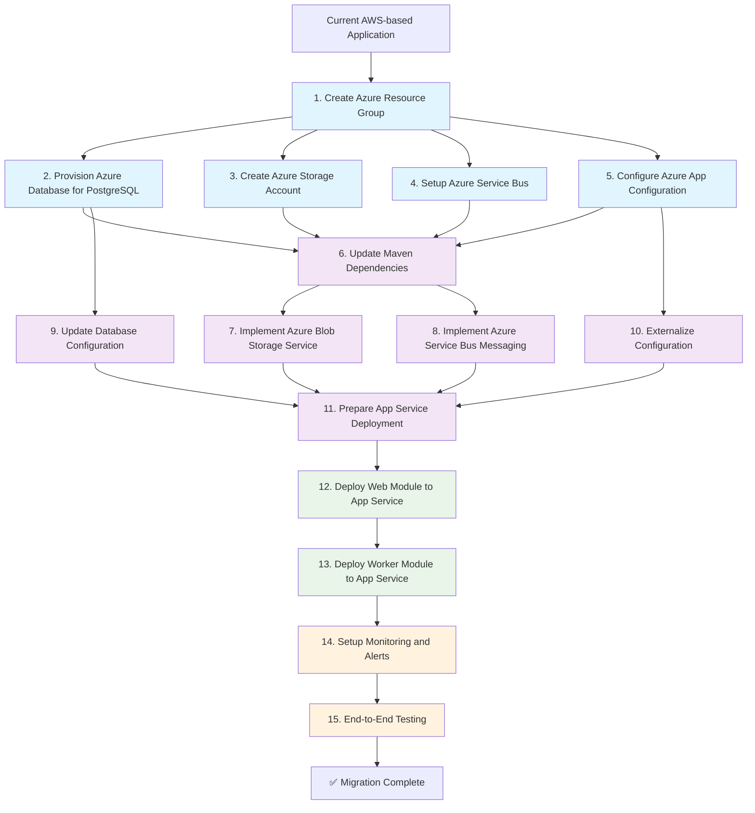
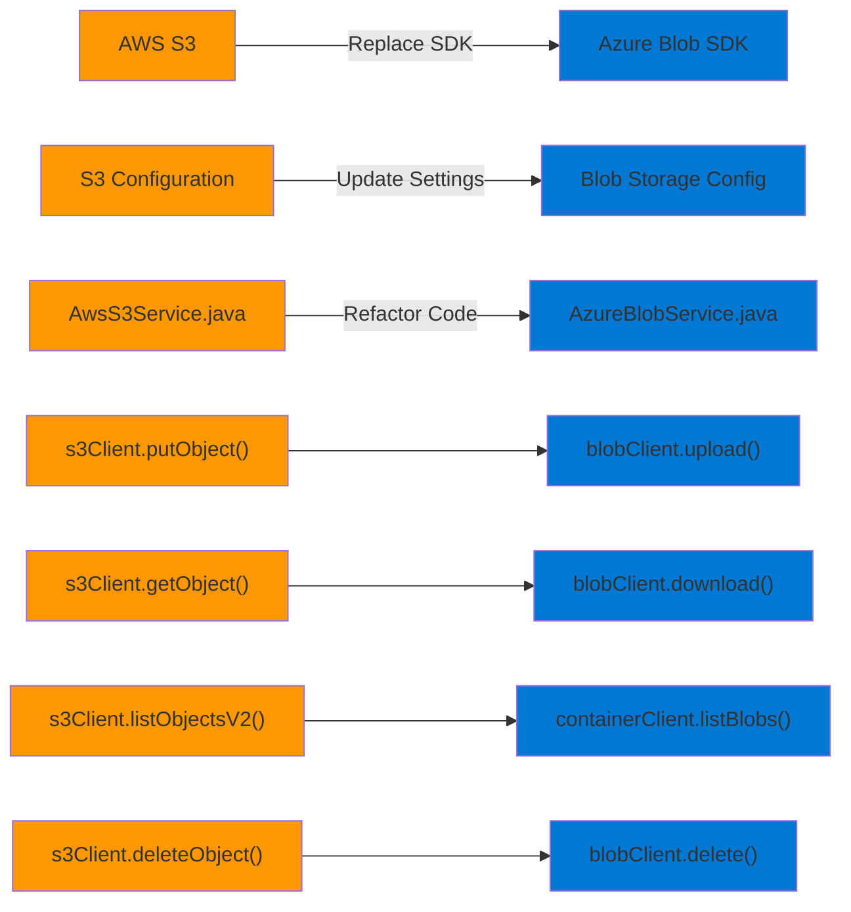
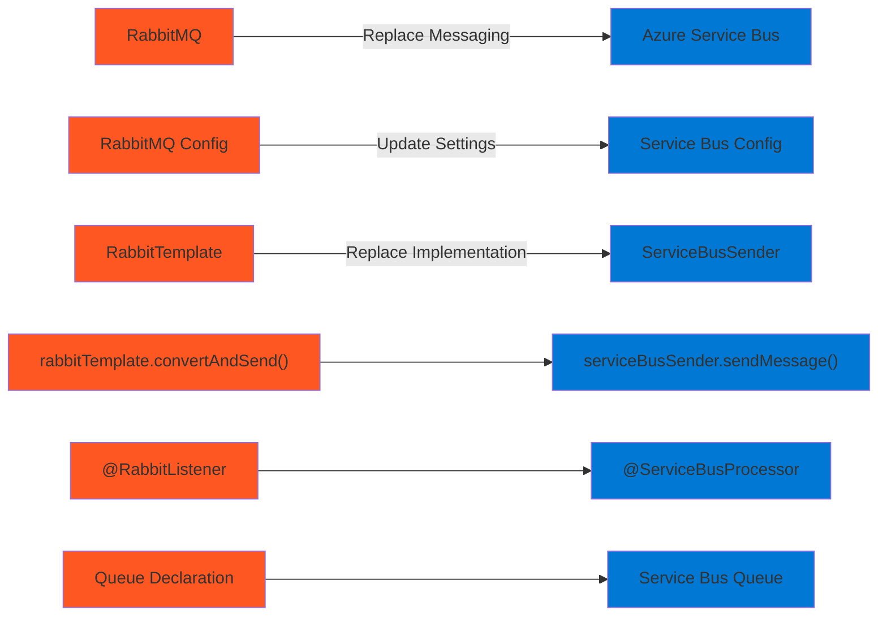
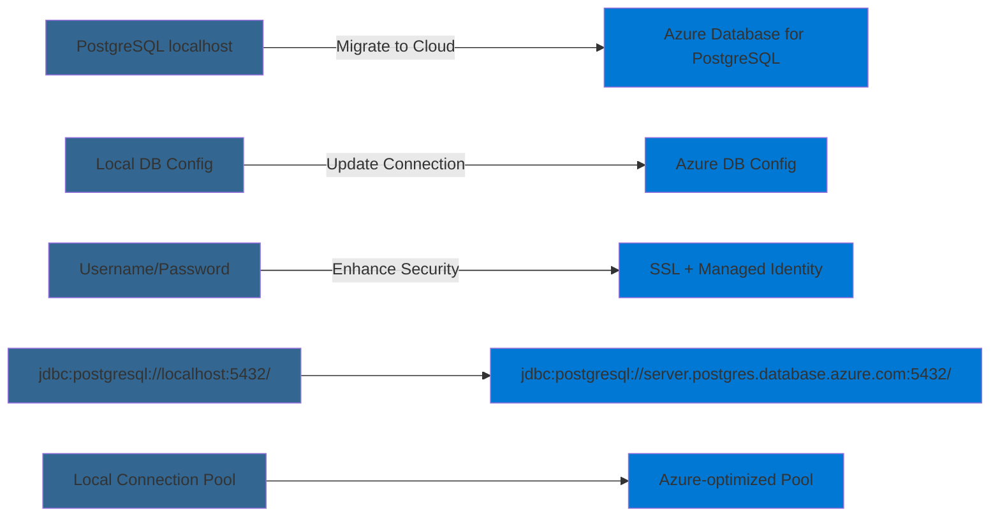
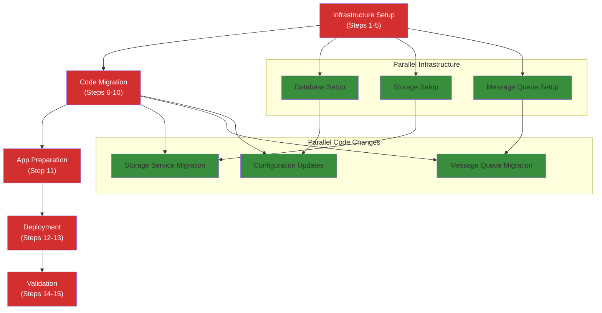
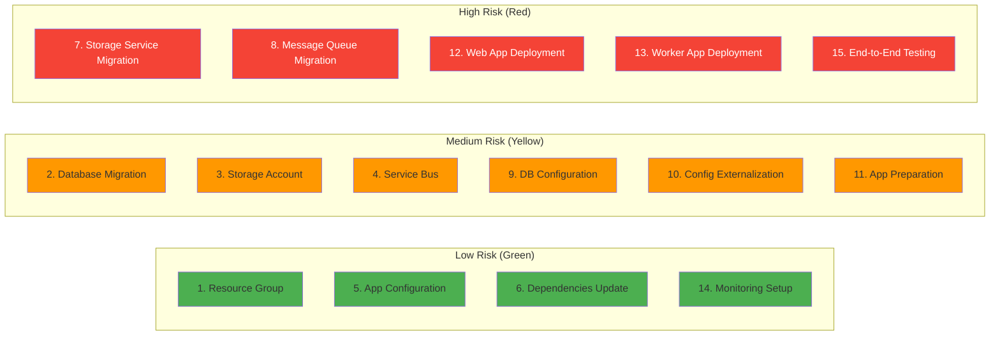
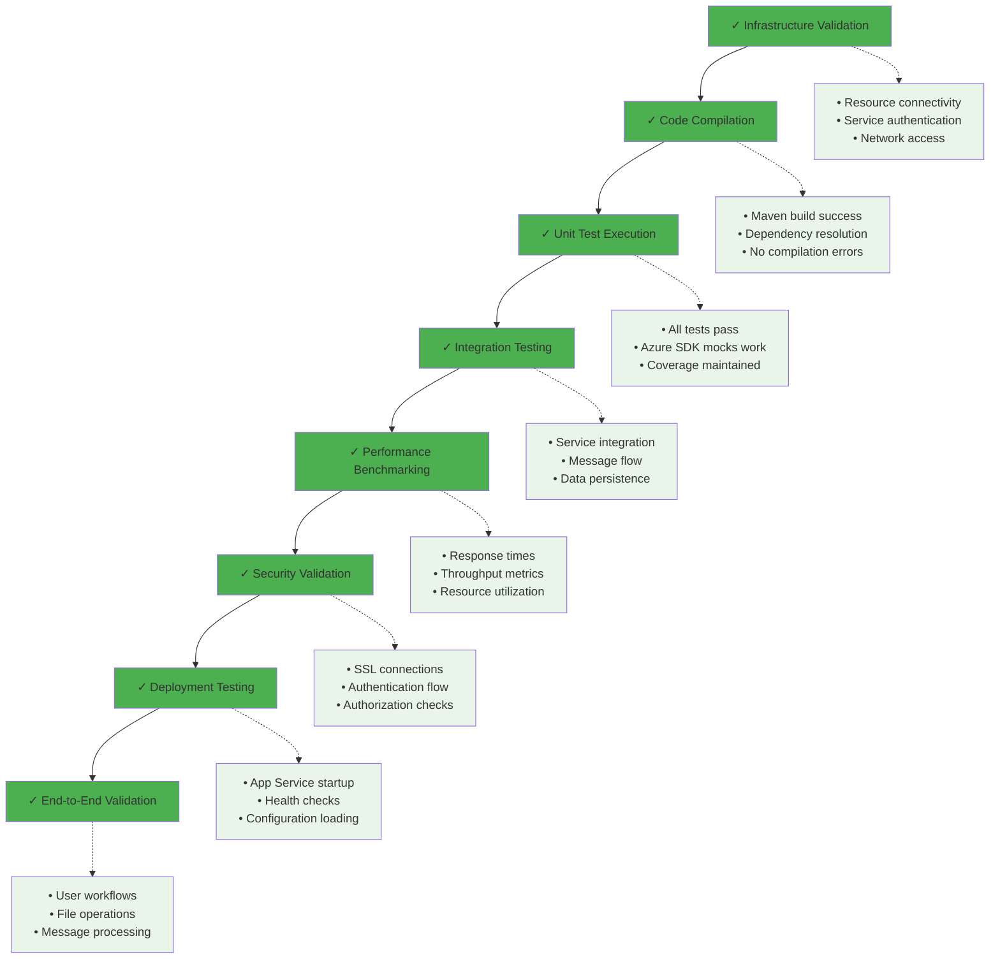
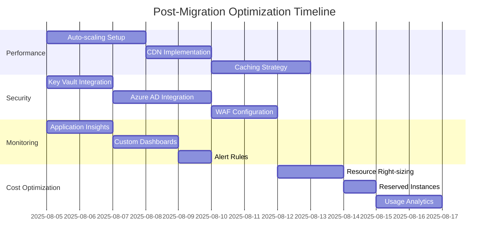

# Modernization Sequence Diagrams
## AWS to Azure Migration for Spring Boot Asset Manager

### Modernization Steps Table

The following table shows the precise ordered sequence for migrating from AWS-based Spring Web Application to Azure App Service:

| Order | From (AWS/Current) | To (Azure) | Dependencies | Migration Type | Risk Level | Description |
|-------|-------------------|------------|--------------|------------|------------|-------------|
| 1 | Local Development Environment | Azure Resource Group | None | Infrastructure Setup | Low | Create Azure resource group, establish naming conventions, and set up basic governance policies |
| 2 | PostgreSQL localhost:5432 | Azure Database for PostgreSQL Flexible Server | Step 1 | Infrastructure Setup | Medium | Provision managed PostgreSQL database with appropriate compute and storage tiers |
| 3 | AWS S3 Bucket Configuration | Azure Storage Account with Blob containers | Step 1 | Infrastructure Setup | Medium | Create Azure Storage Account and configure blob containers for file storage and thumbnails |
| 4 | RabbitMQ localhost:5672 | Azure Service Bus Premium | Step 1 | Infrastructure Setup | Medium | Provision Azure Service Bus namespace with queues for image processing messages |
| 5 | Azure App Configuration Service | Azure App Configuration | Step 1 | Infrastructure Setup | Low | Set up centralized configuration management service for application settings |
| 6 | AWS SDK Dependencies (pom.xml) | Azure SDK Dependencies | None | Application Code Change | Medium | Update Maven dependencies in both web and worker modules |
| 7 | AwsS3Service Implementation | AzureBlobStorageService | Step 3, 6 | Application Code Change | High | Replace AWS S3 operations with Azure Blob Storage SDK implementation |
| 8 | RabbitMQ Configuration (Spring AMQP) | Azure Service Bus Configuration | Step 4, 6 | Application Code Change | High | Update message queue implementation for Service Bus integration |
| 9 | Database Connection (localhost) | Azure Database Connection | Step 2 | Configuration | Medium | Update connection strings, authentication, and SSL configuration |
| 10 | application.properties (hardcoded values) | Azure App Configuration integration | Step 5 | Configuration | Medium | Externalize configuration to Azure App Configuration service |
| 11 | Local JAR Execution | Azure App Service deployment package | Step 7-10 | Application Code Change | Medium | Prepare applications with Azure-specific configurations and dependencies |
| 12 | Single deployment model | Separate Web App Service | Step 11 | Deployment | High | Deploy web module to dedicated Azure App Service instance |
| 13 | Combined deployment | Separate Worker App Service | Step 12 | Deployment | High | Deploy worker module to dedicated Azure App Service instance |
| 14 | Manual testing | Automated monitoring setup | Step 12-13 | Configuration | Medium | Configure Azure Application Insights and monitoring dashboards |
| 15 | Development validation | End-to-End Production Testing | Step 12-14 | Manual Action | High | Comprehensive testing of file upload, processing, storage, and retrieval workflows |

### Complete Modernization Sequence Diagram

### Specific AWS → Azure Migration Paths

#### Storage Migration Path

#### Message Queue Migration Path

#### Database Migration Path

### Dependencies and Critical Path Analysis

#### Critical Path Dependencies

### Risk Assessment Visualization

#### Risk Level by Migration Step

### Multi-Module Deployment Strategy

#### Deployment Architecture

```mermaid
graph TB
    %% Current Architecture
    subgraph "Current AWS Architecture"
        CW["Web Module<br/>(Spring Boot JAR)"]
        CR["Worker Module<br/>(Spring Boot JAR)"]
        CS3["AWS S3"]
        CRQ["RabbitMQ"]
        CDB["PostgreSQL"]
        
        CW --> |"Publishes Messages"| CRQ
        CRQ --> |"Consumes Messages"| CR
        CW --> |"Stores Files"| CS3
        CR --> |"Processes Files"| CS3
        CW --> |"Metadata"| CDB
        CR --> |"Updates"| CDB
    end
    
    %% Target Azure Architecture
    subgraph "Target Azure Architecture"
        AW["Web App Service<br/>(assets-manager-web)"]
        AR["Worker App Service<br/>(assets-manager-worker)"]
        AB["Azure Blob Storage"]
        ASB["Azure Service Bus"]
        ADB["Azure Database for PostgreSQL"]
        
        AW --> |"Publishes Messages"| ASB
        ASB --> |"Consumes Messages"| AR
        AW --> |"Stores Files"| AB
        AR --> |"Processes Files"| AB
        AW --> |"Metadata"| ADB
        AR --> |"Updates"| ADB
    end
    
    classDef current fill:#ff9800
    classDef azure fill:#0078d4
    
    class CW,CR,CS3,CRQ,CDB current
    class AW,AR,AB,ASB,ADB azure
```

### Implementation Validation Points

#### Validation Checkpoints

### Post-Migration Optimization Roadmap

#### Optimization Sequence

This modernization sequence provides a comprehensive visual representation of the migration path from AWS-based Spring Web Application to Azure App Service, with clear dependencies, risk assessments, and validation checkpoints throughout the process.