# Azure Migration Sequence Diagrams
## Asset Manager Application Migration to Azure

---

## Migration Steps Overview Table

| Order | From (Current) | To (Azure) | Dependencies | Migration Type | Risk Level | Description |
|-------|----------------|------------|--------------|------------|------------|-------------|
| 1 | Local Development Environment | Azure DevOps + GitHub | None | Environment Setup | Low | Set up Azure DevOps organization, create repository, establish CI/CD foundation |
| 2 | Manual Deployment Scripts | Azure Resource Manager Templates | Step 1 | Infrastructure Setup | Low | Create ARM templates for all Azure resources and automate provisioning |
| 3 | Local PostgreSQL | Azure Database for PostgreSQL | Step 2 | Infrastructure Setup | Medium | Migrate database to managed Azure PostgreSQL service |
| 4 | AWS S3 SDK | Azure Blob Storage SDK | Step 2, 3 | Application Code Change | Medium | Replace AWS S3 client with Azure Blob Storage client in application code |
| 5 | RabbitMQ | Azure Service Bus | Step 2, 3 | Application Code Change | High | Replace RabbitMQ message handling with Azure Service Bus implementation |
| 6 | Local File Storage | Azure Blob Storage Configuration | Step 4 | Configuration | Low | Update application properties for Azure Blob Storage endpoints and authentication |
| 7 | Spring Boot JAR | Azure App Service Deployment | Step 1, 2, 5 | Deployment | Medium | Configure and deploy web module to Azure App Service |
| 8 | Worker Module JAR | Azure App Service Deployment | Step 1, 2, 5, 7 | Deployment | Medium | Configure and deploy worker module to separate Azure App Service |
| 9 | Basic Logging | Azure Application Insights | Step 7, 8 | Configuration | Low | Integrate Azure Application Insights for monitoring and diagnostics |
| 10 | Manual Testing | Automated Testing Pipeline | Step 1, 7, 8 | Manual Action | Low | Set up automated testing in Azure DevOps pipeline |
| 11 | Development Environment | Production Deployment | Step 1-10 | Deployment | High | Deploy complete solution to production Azure environment |
| 12 | Legacy Infrastructure | Infrastructure Decommission | Step 11 | Manual Action | Medium | Decommission old infrastructure after successful migration validation |

---

## Complete Migration Sequence Flow

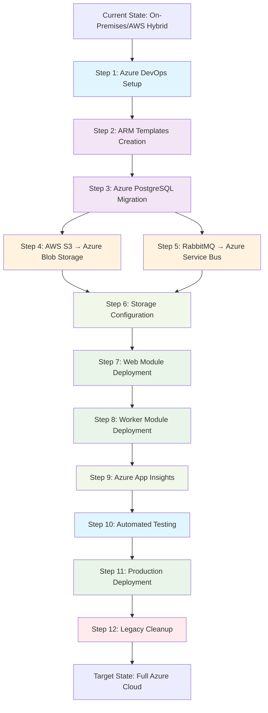

---

## Phase 1: Infrastructure Foundation

### Step 1: Azure DevOps Setup
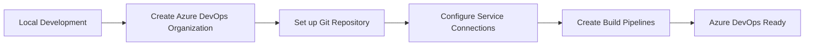

### Step 2: Infrastructure as Code
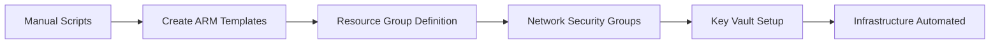

### Step 3: Database Migration
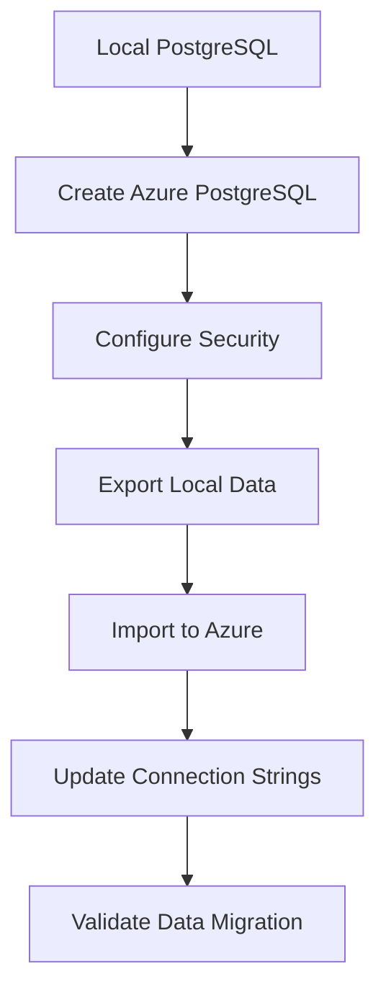

---

## Phase 2: Application Code Modernization

### Step 4: Storage Migration (AWS S3 → Azure Blob Storage)
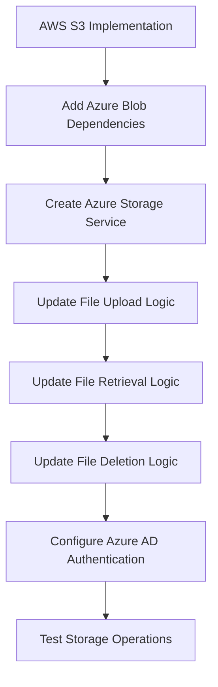

### Step 5: Message Queue Migration (RabbitMQ → Azure Service Bus)
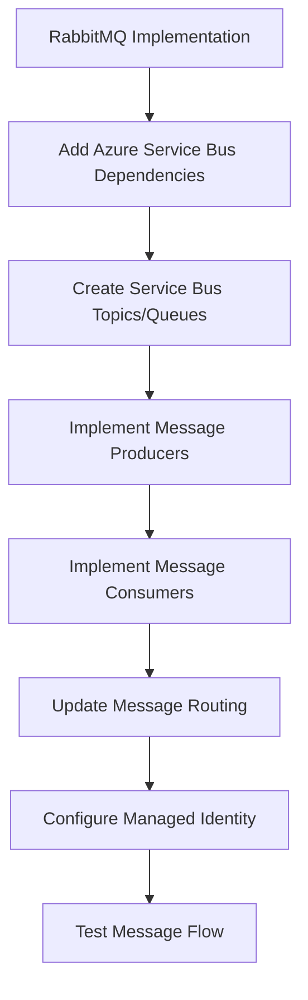

---

## Phase 3: Deployment and Configuration

### Step 6: Azure Configuration
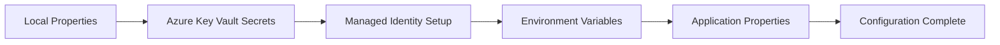

### Step 7-8: Application Deployment
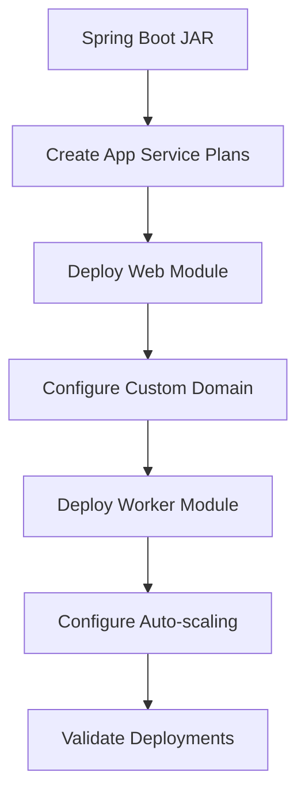

---

## Phase 4: Monitoring and Production

### Step 9: Monitoring Setup
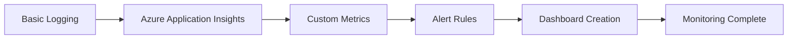

### Step 10-12: Production Validation
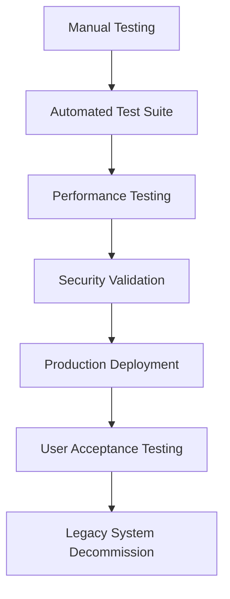

---

## Critical Path Analysis

### Primary Dependencies Chain
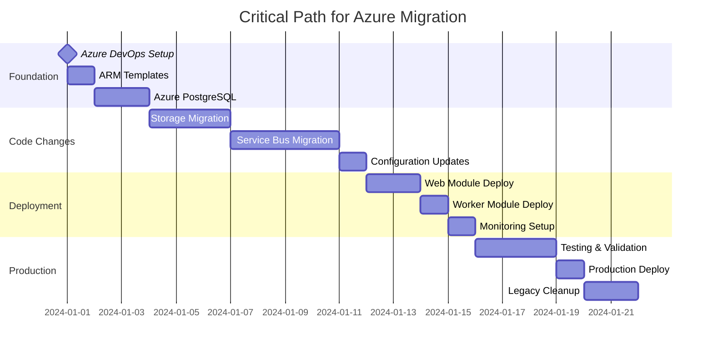

---

## Technology-Specific Migration Paths

### AWS S3 → Azure Blob Storage Migration
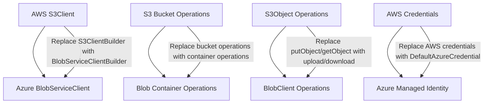

### RabbitMQ → Azure Service Bus Migration
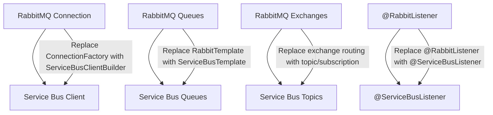

---

## Risk Assessment Visualization

### Migration Risk Matrix
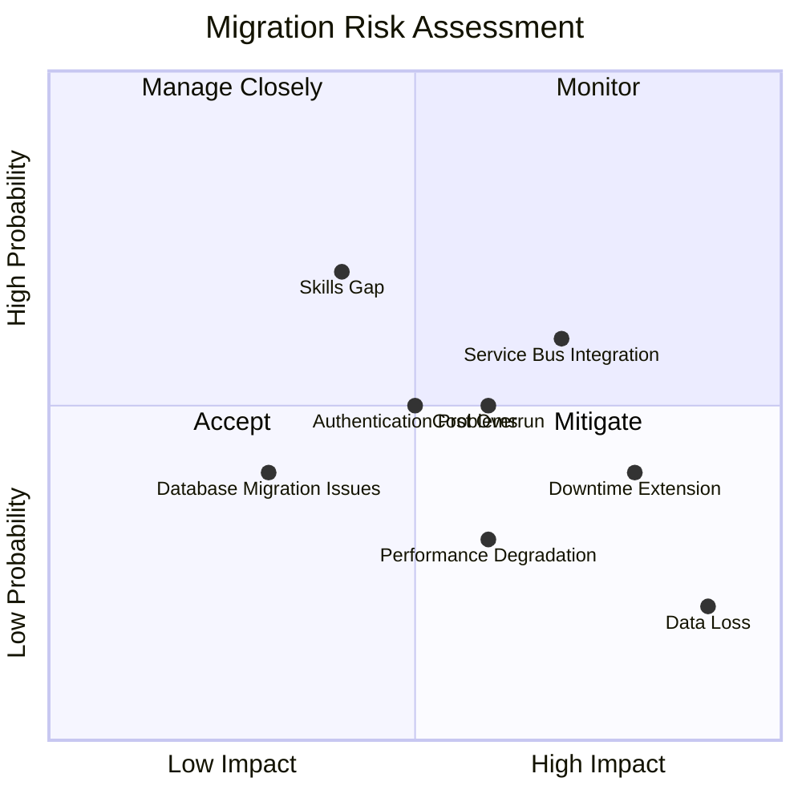

---

## Success Criteria and Validation Points

### Migration Validation Checkpoints
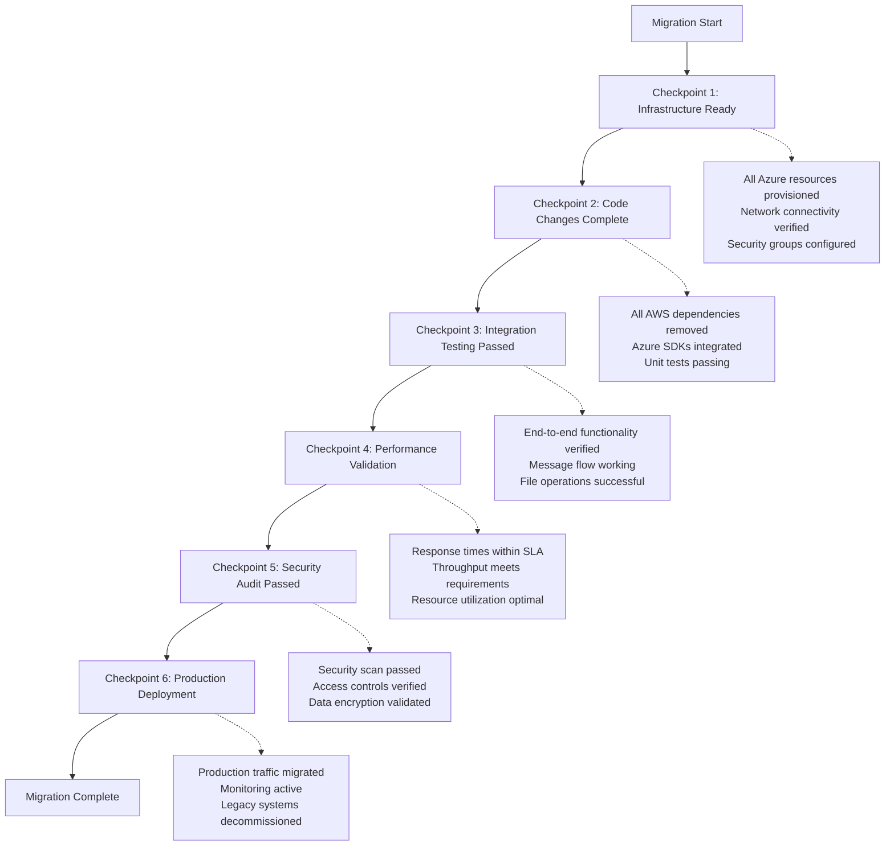

This migration sequence provides a comprehensive roadmap for transforming the Asset Manager application from its current AWS/on-premises hybrid architecture to a fully Azure-native solution, with clear dependencies, risk mitigation, and validation criteria at each step.