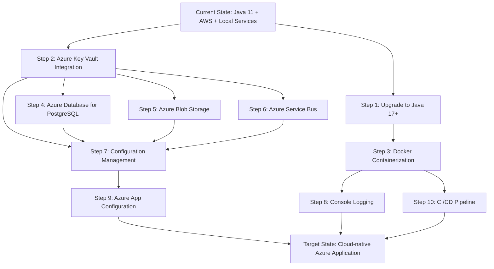

# Modernization Planning Template: Asset Manager Java Application to Azure

## Project Overview

**Current State**: Java Spring Boot application with AWS dependencies and local infrastructure
**Target State**: Cloud-native Azure application with managed services
**Application Type**: Multi-module Maven project for asset/image management with thumbnail processing

### Current Architecture Analysis

#### Technology Stack
- **Framework**: Spring Boot 3.4.3
- **Java Version**: Java 11 LTS
- **Build Tool**: Maven multi-module project
- **Modules**: 
  - `web` - REST API for file uploads/management (port 8080)
  - `worker` - Background thumbnail processing service (port 8081)

#### Current Dependencies and Services
- **Storage**: AWS S3 (using AWS SDK v2.25.13)
- **Database**: PostgreSQL (local instance)
- **Messaging**: RabbitMQ (AMQP)
- **Configuration**: Properties files with hardcoded credentials
- **Deployment**: Traditional deployment (no containerization detected)

#### Architecture Patterns
- Microservices pattern with separate web and worker services
- Event-driven architecture using message queues
- Repository pattern for data access
- Service abstraction for storage operations

## Modernization Sequencing

| Order | From (X) | To (Y) | Dependencies | Migration Type | Risk Level | Description | Necessity |
|-------|----------|--------|--------------|------------|------------|-------------|-------------|
| 1 | Java 11 | Java 17+ LTS | None | Upgrade | High | Upgrade to supported Java LTS version for Azure compatibility and long-term support | Mandatory |
| 2 | Hardcoded Credentials | Azure Key Vault | None | Environment Configuration | Low | Migrate plaintext credentials from application.properties to Azure Key Vault for security | Mandatory |
| 3 | No Containerization | Docker Containerization | Step 1 | Environment Configuration | Medium | Create Dockerfile and docker-compose for containerized deployment to Azure | Mandatory |
| 4 | Local PostgreSQL | Azure Database for PostgreSQL | Step 2 | Application Code Change | Medium | Migrate to managed PostgreSQL with Spring integration and managed identity | Mandatory |
| 5 | AWS S3 Storage | Azure Blob Storage | Step 2 | Application Code Change | High | Replace AWS S3 SDK with Azure Storage SDK, update service implementation | Mandatory |
| 6 | RabbitMQ AMQP | Azure Service Bus | Step 2 | Application Code Change | High | Replace RabbitMQ messaging with Azure Service Bus for reliable cloud messaging | Mandatory |
| 7 | Hardcoded IPs/URLs | Configuration Management | Step 2, 4, 5, 6 | Application Code Change | Low | Replace hardcoded connection strings with Azure App Configuration or Key Vault references | Mandatory |
| 8 | File-based Logging | Console Logging | Step 3 | Application Code Change | Medium | Update logging configuration for cloud-native Azure Monitor integration | Optional |
| 9 | Static Configuration | Azure App Configuration | Step 2, 7 | Environment Configuration | Low | Centralize application configuration using Azure App Configuration service | Optional |
| 10 | Manual Deployment | Azure DevOps/GitHub Actions | Step 3 | Deployment | Medium | Implement CI/CD pipeline for automated Azure deployment | Optional |



## Detailed Migration Steps

### Step 1: Upgrade to Java 17+ LTS
**Prerequisites**: None
**Implementation Approach**:
1. Update parent POM to use Java 17+ and Spring Boot 3.2+
2. Update Maven compiler plugin configuration
3. Review and update deprecated APIs
4. Test application functionality

**Validation Methods**:
- Compile and run unit tests
- Integration testing with all modules
- Performance benchmarking

**Risks and Mitigations**:
- **Risk**: Breaking changes in Java 17+
- **Mitigation**: Gradual migration with comprehensive testing
- **Risk**: Third-party library compatibility
- **Mitigation**: Update dependencies to compatible versions

### Step 2: Azure Key Vault Integration  
**Prerequisites**: Step 1 completed
**Implementation Approach**:
1. Create Azure Key Vault instance
2. Add Spring Boot starter for Azure Key Vault
3. Replace hardcoded credentials with Key Vault references
4. Configure managed identity for authentication

**Validation Methods**:
- Verify secret retrieval from Key Vault
- Test application startup with Key Vault integration
- Validate credential rotation capabilities

**Common Challenges**:
- Initial authentication setup
- Network connectivity from local development

### Step 3: Docker Containerization
**Prerequisites**: Steps 1-2 completed
**Implementation Approach**:
1. Create multi-stage Dockerfiles for web and worker modules
2. Create docker-compose.yml for local development
3. Optimize container images for Azure deployment
4. Configure health checks and proper shutdown handling

**Container Strategy**:
- Use lightweight base images (OpenJDK 17-alpine)
- Multi-stage builds for optimal image size
- Non-root user execution for security

### Step 4: Azure Database for PostgreSQL Migration
**Prerequisites**: Steps 2-3 completed
**Implementation Approach**:
1. Create Azure Database for PostgreSQL Flexible Server
2. Update Spring Boot configuration for Azure PostgreSQL
3. Implement connection pooling optimized for cloud
4. Configure managed identity authentication
5. Migrate data using Azure Database Migration Service

**Database Configuration Updates**:
```yaml
spring:
  datasource:
    url: jdbc:postgresql://${AZURE_POSTGRESQL_HOST}:5432/${AZURE_POSTGRESQL_DATABASE}?sslmode=require
    username: ${spring.datasource.azure.passwordless-enabled}
  jpa:
    properties:
      hibernate:
        connection:
          provider_disables_autocommit: true
        jdbc:
          batch_size: 25
```

### Step 5: AWS S3 to Azure Blob Storage Migration
**Prerequisites**: Step 2 completed
**Implementation Approach**:
1. Add Azure Storage SDK dependencies
2. Create Azure Storage Account and containers
3. Implement new service class using Azure Blob Storage SDK
4. Update configuration to use managed identity
5. Migrate existing data from S3 to Blob Storage
6. Update URL generation for Azure Blob Storage

**Code Changes Required**:
- Replace `AwsS3Service` with `AzureBlobStorageService`
- Update `StorageService` interface if needed
- Modify thumbnail processing logic in worker module
- Update URL structure for Azure Blob Storage

### Step 6: RabbitMQ to Azure Service Bus Migration  
**Prerequisites**: Step 2 completed
**Implementation Approach**:
1. Create Azure Service Bus namespace and queues
2. Add Azure Service Bus Spring Boot starter
3. Replace RabbitMQ configuration with Service Bus configuration
4. Update message producers and consumers
5. Implement retry policies and dead letter queues

**Configuration Updates**:
```yaml
spring:
  cloud:
    azure:
      servicebus:
        connection-string: ${AZURE_SERVICE_BUS_CONNECTION_STRING}
        processor:
          queue-name: image-processing
```

### Step 7: Configuration Management
**Prerequisites**: Steps 2, 4, 5, 6 completed  
**Implementation Approach**:
1. Identify all hardcoded IP addresses and URLs
2. Extract configuration values to external configuration
3. Use Azure Key Vault for sensitive configuration
4. Update application.properties with placeholder values
5. Configure environment-specific overrides

### Step 8: Console Logging Migration
**Prerequisites**: Step 3 completed
**Implementation Approach**:
1. Update logback/log4j2 configuration for console output
2. Configure structured logging with JSON format
3. Add correlation IDs for distributed tracing
4. Integrate with Azure Monitor Application Insights

**Logging Configuration**:
```yaml
logging:
  level:
    com.microsoft.migration.assets: INFO
  pattern:
    console: "%d{yyyy-MM-dd HH:mm:ss} - %logger{36} - %level - %msg%n"
```

### Step 9: Azure App Configuration (Optional)
**Prerequisites**: Steps 2, 7 completed
**Implementation Approach**:
1. Create Azure App Configuration store
2. Add Spring Cloud Azure Config starter
3. Migrate shared configuration from properties files
4. Implement configuration refresh capabilities
5. Set up feature flags for gradual rollouts

### Step 10: CI/CD Pipeline Implementation  
**Prerequisites**: Step 3 completed
**Implementation Approach**:
1. Create Azure Container Registry for container images
2. Set up GitHub Actions or Azure DevOps pipeline
3. Configure automated testing and security scanning
4. Implement infrastructure as code using ARM/Bicep templates
5. Set up staging and production deployment environments

## Azure Services Mapping

| Current Service | Azure Service | Configuration Notes |
|----------------|---------------|-------------------|
| AWS S3 | Azure Blob Storage | Hot tier for active files, Cool/Archive for thumbnails |
| RabbitMQ | Azure Service Bus | Standard tier with duplicate detection |
| Local PostgreSQL | Azure Database for PostgreSQL | Flexible Server with high availability |
| Hardcoded secrets | Azure Key Vault | Store connection strings and API keys |
| Local deployment | Azure Container Apps | Managed container hosting with auto-scaling |

## Cost Optimization Recommendations

1. **Storage Tiers**: Use appropriate Azure Blob Storage tiers based on access patterns
2. **Database Sizing**: Start with Burstable tier for PostgreSQL, scale based on usage
3. **Service Bus**: Use Standard tier initially, upgrade to Premium if high throughput needed
4. **Container Apps**: Leverage consumption pricing model for variable workloads
5. **Monitoring**: Use built-in Azure Monitor instead of third-party APM solutions

## Security Enhancements

1. **Managed Identity**: Eliminate credential management across all Azure services
2. **Network Security**: Implement Virtual Networks and private endpoints
3. **Data Encryption**: Enable encryption at rest and in transit for all services
4. **Access Control**: Implement RBAC for Azure resource management
5. **Secret Management**: Centralize all secrets in Azure Key Vault with rotation policies

## Post-Migration Validation

1. **Functionality Testing**: Comprehensive end-to-end testing of image upload and processing
2. **Performance Testing**: Validate response times and throughput meet requirements  
3. **Reliability Testing**: Test failover scenarios and message durability
4. **Security Testing**: Validate managed identity authentication and network security
5. **Monitoring Setup**: Configure alerts and dashboards in Azure Monitor

## Rollback Strategy

1. **Phase-based Approach**: Each migration step should be independently rollback-able
2. **Data Synchronization**: Maintain data sync between old and new systems during transition
3. **Feature Flags**: Use feature toggles to switch between old and new implementations
4. **Monitoring**: Implement comprehensive monitoring to detect issues early
5. **Communication Plan**: Clear communication with stakeholders about migration progress and any issues

This modernization plan provides a structured approach to migrate the Asset Manager application from its current AWS-dependent architecture to a cloud-native Azure solution while minimizing risk and ensuring operational continuity.