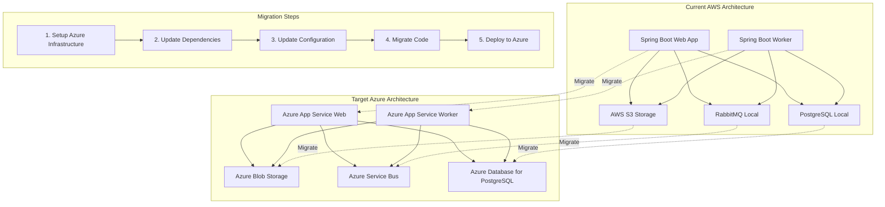

# Modernization Planning Template: AWS Services to Azure Services

## Project Overview

The Asset Manager application is a Spring Boot microservices architecture consisting of two modules:
- **Web Module**: Handles file uploads, viewing, and web interface
- **Worker Module**: Processes background image thumbnail generation

**Current Architecture:**
- Java 11 + Spring Boot 3.4.3
- AWS S3 for file storage
- RabbitMQ for message queuing
- PostgreSQL for metadata storage
- Maven for dependency management

**Target Architecture:**
- Azure Blob Storage for file storage
- Azure Service Bus for message queuing
- Azure Database for PostgreSQL for metadata storage
- Azure App Service for hosting

## Modernization Sequencing

| Order | From (X) | To (Y) | Dependencies | Migration Type | Risk Level | Description | Necessity |
|-------|----------|--------|--------------|------------|------------|-------------|-----------|
| 1 | Local PostgreSQL | Azure Database for PostgreSQL | None | Infrastructure Setup | Low | Create managed PostgreSQL database in Azure | Mandatory |
| 2 | Local RabbitMQ | Azure Service Bus | None | Infrastructure Setup | Low | Create Service Bus namespace and queues | Mandatory |
| 3 | AWS S3 Bucket | Azure Storage Account | None | Infrastructure Setup | Low | Create Azure Storage Account with blob containers | Mandatory |
| 4 | AWS SDK Dependencies | Azure SDK Dependencies | Steps 1-3 | Application Code Change | Medium | Update Maven dependencies from AWS SDK to Azure SDK | Mandatory |
| 5 | AWS S3 Configuration | Azure Blob Storage Configuration | Step 4 | Configuration | Medium | Update application properties and configuration classes | Mandatory |
| 6 | RabbitMQ Configuration | Azure Service Bus Configuration | Step 4 | Configuration | Medium | Update messaging configuration and connection settings | Mandatory |
| 7 | Database Connection Config | Azure Database Connection Config | Step 1 | Configuration | Low | Update database connection strings and SSL settings | Mandatory |
| 8 | AWS S3 Service Classes | Azure Blob Storage Service Classes | Step 5 | Application Code Change | High | Rewrite storage service implementations for Azure Blob Storage | Mandatory |
| 9 | RabbitMQ Message Processing | Azure Service Bus Message Processing | Step 6 | Application Code Change | High | Update message producers and consumers for Service Bus | Mandatory |
| 10 | Static AWS Credentials | Azure Managed Identity | Steps 8-9 | Configuration | Medium | Replace static credentials with Azure AD authentication | Optional |
| 11 | Local Development Setup | Azure Development Environment | Steps 1-9 | Environment Setup | Medium | Update development scripts and local testing setup | Optional |
| 12 | Application Deployment | Azure App Service Deployment | Steps 1-11 | Deployment | Medium | Deploy applications to Azure App Service with environment-specific configurations | Mandatory |

## Migration Path Visualization

## Detailed Migration Steps

### Step 1: Infrastructure Setup - Azure Database for PostgreSQL
**Prerequisites:** Azure subscription and resource group
**Implementation:**
1. Create Azure Database for PostgreSQL Flexible Server
2. Configure firewall rules for application access
3. Enable SSL enforcement
4. Create database schema and users
5. Test connectivity

**Validation:**
- Database server is accessible from development environment
- SSL connection works correctly
- Database schema matches current setup

**Risks:** 
- Network connectivity issues
- SSL certificate configuration problems

**Mitigation:**
- Use Azure Private Link for secure connectivity
- Test SSL settings thoroughly before migration

### Step 2: Infrastructure Setup - Azure Service Bus
**Prerequisites:** None
**Implementation:**
1. Create Service Bus namespace (Standard tier)
2. Create queue named "image-processing" 
3. Configure message retention and dead letter settings
4. Set up access policies and shared access keys

**Validation:**
- Queue is created and accessible
- Message TTL and retention configured correctly
- Connection strings are available

**Risks:**
- Message format compatibility issues
- Different message delivery guarantees

**Mitigation:**
- Test message serialization/deserialization thoroughly
- Use consistent JSON message format

### Step 3: Infrastructure Setup - Azure Storage Account
**Prerequisites:** None
**Implementation:**
1. Create Azure Storage Account (General Purpose v2)
2. Create blob containers for original files and thumbnails
3. Configure access tiers (Hot for frequently accessed files)
4. Set up CORS rules if needed for web access
5. Configure lifecycle management policies

**Validation:**
- Storage account is accessible
- Blob containers are created
- Upload/download operations work correctly

**Risks:**
- Different URL patterns for file access
- Access permission model differences

**Mitigation:**
- Implement URL generation helper methods
- Use Azure AD authentication where possible

### Step 4: Application Code Change - Update Dependencies
**Prerequisites:** Steps 1-3 completed
**Implementation:**
1. Remove AWS SDK dependencies from pom.xml files
2. Add Azure SDK dependencies:
   - azure-storage-blob
   - azure-messaging-servicebus
   - azure-identity (for authentication)
3. Update Spring Boot starter dependencies if needed
4. Resolve any version conflicts

**Files to modify:**
- `/web/pom.xml`
- `/worker/pom.xml`

**Validation:**
- Project compiles successfully
- No dependency conflicts
- All required Azure SDK classes are available

**Risks:**
- API compatibility issues between AWS and Azure SDKs
- Dependency version conflicts

**Mitigation:**
- Test compilation after each dependency change
- Use Azure SDK BOM for version management

### Step 5: Configuration - Azure Blob Storage
**Prerequisites:** Step 4 completed
**Implementation:**
1. Update application.properties files to use Azure configuration
2. Modify AwsS3Config classes to become AzureBlobConfig
3. Update connection string and authentication methods
4. Configure blob container names and access settings

**Files to modify:**
- `/web/src/main/resources/application.properties`
- `/worker/src/main/resources/application.properties`
- `/web/src/main/java/com/microsoft/migration/assets/config/AwsS3Config.java`
- `/worker/src/main/java/com/microsoft/migration/assets/worker/config/AwsS3Config.java`

**Validation:**
- Configuration loads without errors
- Connection to Azure Blob Storage succeeds
- Authentication works correctly

**Risks:**
- Configuration format differences
- Authentication method changes

**Mitigation:**
- Use Azure SDK configuration patterns
- Implement proper error handling for connection failures

### Step 6: Configuration - Azure Service Bus
**Prerequisites:** Step 4 completed
**Implementation:**
1. Update RabbitConfig classes for Azure Service Bus
2. Change connection factory and template configurations
3. Update queue names and message handling settings
4. Configure retry policies and error handling

**Files to modify:**
- `/web/src/main/java/com/microsoft/migration/assets/config/RabbitConfig.java`
- `/worker/src/main/java/com/microsoft/migration/assets/worker/config/RabbitConfig.java`

**Validation:**
- Service Bus connection established
- Message serialization works correctly
- Queue operations function as expected

**Risks:**
- Message format incompatibilities
- Different retry and error handling mechanisms

**Mitigation:**
- Maintain consistent message JSON format
- Implement proper exception handling

### Step 7: Configuration - Database Connection
**Prerequisites:** Step 1 completed
**Implementation:**
1. Update JDBC connection strings for Azure Database
2. Configure SSL settings for Azure PostgreSQL
3. Update authentication credentials (connection string format)
4. Configure connection pooling for Azure environment

**Files to modify:**
- `/web/src/main/resources/application.properties`
- `/worker/src/main/resources/application.properties`

**Validation:**
- Database connection succeeds with SSL
- JPA operations work correctly
- Connection pooling functions properly

**Risks:**
- SSL configuration issues
- Connection string format differences

**Mitigation:**
- Use Azure-recommended JDBC settings
- Test SSL connectivity thoroughly

### Step 8: Application Code Change - Azure Blob Storage Services
**Prerequisites:** Steps 5, 7 completed
**Implementation:**
1. Rewrite AwsS3Service to use Azure Blob Storage SDK
2. Update file upload, download, and delete operations
3. Modify URL generation for Azure blob URLs
4. Update thumbnail storage and retrieval logic
5. Maintain same interface for StorageService

**Files to modify:**
- `/web/src/main/java/com/microsoft/migration/assets/service/AwsS3Service.java`
- `/worker/src/main/java/com/microsoft/migration/assets/worker/service/S3FileProcessingService.java`

**Validation:**
- File upload/download operations work
- URL generation produces valid Azure blob URLs
- Thumbnail generation and storage functions correctly
- Database metadata updates work

**Risks:**
- API differences between AWS S3 and Azure Blob Storage
- Different error handling patterns
- URL format changes affecting frontend

**Mitigation:**
- Implement comprehensive error handling
- Test all file operations thoroughly
- Maintain consistent URL generation patterns

### Step 9: Application Code Change - Azure Service Bus Processing
**Prerequisites:** Step 6 completed
**Implementation:**
1. Update message publishing code to use Azure Service Bus
2. Modify message listeners to use Service Bus annotations
3. Update message serialization/deserialization
4. Implement proper error handling and retry logic
5. Update acknowledgment mechanisms

**Files to modify:**
- `/web/src/main/java/com/microsoft/migration/assets/service/AwsS3Service.java` (message publishing)
- `/worker/src/main/java/com/microsoft/migration/assets/worker/service/AbstractFileProcessingService.java`

**Validation:**
- Messages are sent and received correctly
- JSON serialization works as expected
- Error handling and retries function properly
- Message acknowledgment works correctly

**Risks:**
- Message delivery semantics differences
- Acknowledgment mechanism changes
- Serialization format incompatibilities

**Mitigation:**
- Test message flow end-to-end
- Implement proper error handling
- Use consistent JSON message format

### Step 10: Configuration - Azure Managed Identity (Optional)
**Prerequisites:** Steps 8-9 completed
**Implementation:**
1. Enable managed identity for Azure App Service
2. Grant storage and service bus permissions to managed identity
3. Update authentication code to use DefaultAzureCredential
4. Remove static connection strings where possible

**Files to modify:**
- Configuration files to remove static credentials
- Service classes to use managed identity authentication

**Validation:**
- Managed identity authentication works
- All Azure services accessible without static credentials
- No security vulnerabilities with credential management

**Risks:**
- Managed identity permission issues
- Authentication flow changes

**Mitigation:**
- Test managed identity setup in development environment
- Implement fallback authentication methods

### Step 11: Environment Setup - Azure Development Environment (Optional)
**Prerequisites:** Steps 1-9 completed
**Implementation:**
1. Update start.sh script to use Azure services instead of Docker
2. Create Azure-specific configuration profiles
3. Update development documentation
4. Create Azure development resource templates

**Files to modify:**
- `/scripts/start.sh`
- `/scripts/stop.sh`
- Development documentation

**Validation:**
- Development environment starts correctly with Azure services
- All application functions work in development mode
- Documentation is accurate and helpful

### Step 12: Deployment - Azure App Service
**Prerequisites:** Steps 1-11 completed
**Implementation:**
1. Create Azure App Service plans for web and worker modules
2. Configure application settings and environment variables
3. Set up deployment slots for staging/production
4. Configure scaling and monitoring
5. Deploy applications and verify functionality

**Validation:**
- Applications deploy successfully to Azure
- All functionality works in Azure environment
- Monitoring and logging are properly configured
- Performance meets requirements

**Risks:**
- Deployment configuration issues
- Environment-specific runtime problems
- Performance degradation in cloud environment

**Mitigation:**
- Test deployment in staging environment first
- Implement comprehensive monitoring and alerting
- Perform load testing before production deployment

## Risk Assessment and Mitigation Strategies

### High Risk Areas
1. **Storage Service Migration (Step 8)**
   - **Risk:** API differences causing functionality breaks
   - **Mitigation:** Extensive testing, maintain interface compatibility, implement feature flags

2. **Message Processing Migration (Step 9)**
   - **Risk:** Message loss or processing failures during transition
   - **Mitigation:** Implement dual processing during migration, comprehensive monitoring

### Medium Risk Areas
1. **Configuration Changes (Steps 5-7)**
   - **Risk:** Connection failures, authentication issues
   - **Mitigation:** Thorough testing in development environment, rollback procedures

2. **Deployment (Step 12)**
   - **Risk:** Runtime environment differences
   - **Mitigation:** Blue-green deployment, comprehensive testing in staging

### Low Risk Areas
1. **Infrastructure Setup (Steps 1-3)**
   - **Risk:** Service provisioning issues
   - **Mitigation:** Use Infrastructure as Code, test connectivity before application deployment

## Technical Roadmap

### Phase 1: Foundation (Weeks 1-2)
- Set up Azure infrastructure (Steps 1-3)
- Update project dependencies (Step 4)
- **Deliverable:** Azure services provisioned and accessible

### Phase 2: Configuration (Weeks 3-4)
- Update all configuration files (Steps 5-7)
- Test connectivity to Azure services
- **Deliverable:** Applications connect to Azure services successfully

### Phase 3: Core Migration (Weeks 5-8)
- Migrate storage services (Step 8)
- Migrate messaging services (Step 9)
- Comprehensive testing of core functionality
- **Deliverable:** Full application functionality using Azure services

### Phase 4: Security and Deployment (Weeks 9-10)
- Implement managed identity (Step 10)
- Set up deployment pipeline (Step 12)
- Performance testing and optimization
- **Deliverable:** Production-ready application deployed to Azure

### Phase 5: Optimization (Weeks 11-12)
- Update development environment (Step 11)
- Documentation updates
- Performance monitoring and tuning
- **Deliverable:** Complete modernized application with documentation

## Success Criteria and Validation Approach

### Functional Success Criteria
1. **File Upload/Download:** All file operations work correctly with Azure Blob Storage
2. **Thumbnail Generation:** Background processing continues to function with Azure Service Bus
3. **Data Persistence:** All metadata correctly stored in Azure Database for PostgreSQL
4. **Web Interface:** Frontend functionality remains unchanged for end users

### Performance Success Criteria
1. **Response Time:** No more than 10% degradation in response times
2. **Throughput:** Maintain same file processing throughput
3. **Availability:** 99.9% uptime in production environment

### Security Success Criteria
1. **Authentication:** All Azure services use appropriate authentication (preferably managed identity)
2. **Data Encryption:** All data encrypted in transit and at rest
3. **Access Control:** Proper RBAC implemented for Azure resources

### Validation Methods
1. **Unit Testing:** All service classes have comprehensive unit tests
2. **Integration Testing:** End-to-end testing of complete user workflows
3. **Load Testing:** Performance testing under expected production load
4. **Security Testing:** Penetration testing and security audit
5. **User Acceptance Testing:** Validation by end users that functionality is preserved

## Cost Optimization Recommendations

1. **Storage Tiers:** Use appropriate Azure Blob Storage tiers based on access patterns
2. **Database Sizing:** Right-size Azure Database for PostgreSQL based on actual usage
3. **Service Bus Tier:** Start with Standard tier, upgrade to Premium only if needed
4. **App Service Plans:** Use shared plans for development, dedicated for production
5. **Monitoring:** Implement Azure Cost Management for ongoing cost optimization

## Monitoring and Observability

1. **Application Insights:** Implement comprehensive application monitoring
2. **Azure Monitor:** Set up infrastructure monitoring and alerting
3. **Log Analytics:** Centralize application and system logs
4. **Health Checks:** Implement health endpoints for all services
5. **Performance Counters:** Monitor key performance metrics and set up alerts

This migration plan provides a comprehensive roadmap for modernizing the Asset Manager application from AWS to Azure services while minimizing risk and ensuring business continuity.