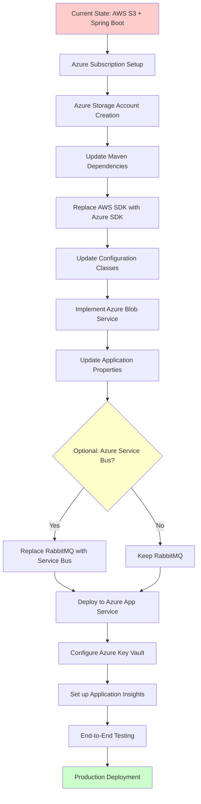

# Modernization Planning Template: AWS to Azure

## Executive Summary

This document outlines the comprehensive modernization plan to migrate the Asset Manager application from AWS services to Azure equivalents. The application is a Spring Boot-based multi-module system consisting of a web interface for file uploads and a background worker for image processing.

## Current Architecture Analysis

### Application Overview
- **Technology Stack**: Spring Boot 3.4.3, Java 11, Maven
- **Architecture**: Microservices with web and worker modules
- **Current Cloud Provider**: AWS
- **Storage**: AWS S3 for file storage
- **Messaging**: RabbitMQ for inter-service communication
- **Database**: PostgreSQL for metadata storage

### Current AWS Dependencies
1. **AWS S3**: File storage using AWS SDK v2 (2.25.13)
2. **AWS SDK Configuration**: Static credentials and region configuration
3. **S3 Operations**: PUT, GET, DELETE, LIST operations
4. **S3 URL Generation**: Direct S3 URL generation for file access

## Modernization Sequencing

| Order | From (AWS) | To (Azure) | Dependencies | Migration Type | Risk Level | Description | Necessity |
|-------|------------|------------|--------------|------------|------------|-------------|-----------|
| 1 | AWS Account Setup | Azure Subscription & Resource Group | None | Environment Setup | Low | Set up Azure subscription, resource group, and basic Azure CLI/PowerShell tools | Mandatory |
| 2 | AWS S3 Configuration | Azure Storage Account Creation | Step 1 | Infrastructure Setup | Low | Create Azure Storage Account with blob containers to replace S3 buckets | Mandatory |
| 3 | AWS SDK Dependencies | Azure Storage SDK Dependencies | Step 2 | Application Code Change | Medium | Replace AWS SDK dependencies with Azure Storage SDK in pom.xml files | Mandatory |
| 4 | AWS S3 Configuration Class | Azure Storage Configuration Class | Step 3 | Application Code Change | Medium | Replace AwsS3Config with Azure Storage configuration using connection strings | Mandatory |
| 5 | AWS S3 Service Implementation | Azure Blob Storage Service Implementation | Step 4 | Application Code Change | High | Replace AwsS3Service with Azure Blob Storage operations (upload, download, delete, list) | Mandatory |
| 6 | AWS Application Properties | Azure Application Properties | Step 5 | Configuration | Medium | Update application.properties to use Azure Storage connection strings instead of AWS credentials | Mandatory |
| 7 | RabbitMQ Messaging | Azure Service Bus | Step 6 | Application Code Change | High | Replace RabbitMQ with Azure Service Bus for message queuing between web and worker modules | Optional |
| 8 | PostgreSQL Database | Azure Database for PostgreSQL | Step 7 | Infrastructure Setup | Low | Migrate to Azure Database for PostgreSQL (optional, can keep existing) | Optional |
| 9 | Application Deployment | Azure App Service Deployment | Steps 1-8 | Deployment | Medium | Deploy web and worker modules to Azure App Service or Azure Container Instances | Mandatory |
| 10 | Environment Variables | Azure Key Vault Integration | Step 9 | Configuration | Medium | Move sensitive configuration to Azure Key Vault for security best practices | Optional |
| 11 | Monitoring Setup | Azure Application Insights | Step 10 | Infrastructure Setup | Low | Set up Application Insights for monitoring and logging | Optional |
| 12 | Testing & Validation | End-to-End Testing | Steps 1-11 | Manual Action | Medium | Comprehensive testing of file upload, processing, and retrieval workflows | Mandatory |

## Modernization Flow Diagram



## Detailed Migration Steps

### Step 1: Azure Environment Setup
**Prerequisites**: Azure subscription access
**Implementation**:
1. Create Azure subscription if not exists
2. Create resource group for the application
3. Install Azure CLI or Azure PowerShell
4. Set up proper RBAC permissions

**Validation**: Successful login to Azure portal and CLI access
**Risks**: None significant
**Timeline**: 1 day

### Step 2: Azure Storage Account Creation
**Prerequisites**: Step 1 completed
**Implementation**:
1. Create Azure Storage Account (General Purpose v2)
2. Create blob containers to replace S3 buckets
3. Configure appropriate access policies
4. Note connection strings and storage account keys

**Validation**: Ability to upload/download files via Azure portal
**Risks**: Storage performance tier selection impacts costs
**Timeline**: 0.5 days

### Step 3: Update Maven Dependencies
**Prerequisites**: Step 2 completed
**Implementation**:
1. Remove AWS SDK dependencies from web/pom.xml and worker/pom.xml
2. Add Azure Storage Blob SDK dependencies
3. Update dependency versions for compatibility

**Code Changes**:
```xml
<!-- Remove -->
<dependency>
    <groupId>software.amazon.awssdk</groupId>
    <artifactId>s3</artifactId>
</dependency>

<!-- Add -->
<dependency>
    <groupId>com.azure</groupId>
    <artifactId>azure-storage-blob</artifactId>
    <version>12.21.0</version>
</dependency>
```

**Validation**: Successful Maven compilation
**Risks**: Version compatibility issues with Spring Boot
**Timeline**: 0.5 days

### Step 4: Replace Configuration Classes
**Prerequisites**: Step 3 completed
**Implementation**:
1. Replace AwsS3Config.java with AzureStorageConfig.java
2. Use Azure Storage connection strings instead of access/secret keys
3. Configure BlobServiceClient bean

**Code Changes**:
```java
@Configuration
public class AzureStorageConfig {
    @Value("${azure.storage.connection-string}")
    private String connectionString;
    
    @Bean
    public BlobServiceClient blobServiceClient() {
        return new BlobServiceClientBuilder()
            .connectionString(connectionString)
            .buildClient();
    }
}
```

**Validation**: Application context loads successfully
**Risks**: Configuration property mismatch
**Timeline**: 1 day

### Step 5: Implement Azure Blob Storage Service
**Prerequisites**: Step 4 completed
**Implementation**:
1. Replace AwsS3Service.java with AzureBlobService.java
2. Implement equivalent methods for upload, download, delete, list operations
3. Maintain same interface for minimal impact on controllers

**Validation**: Unit tests for storage operations pass
**Risks**: Different API behaviors between AWS S3 and Azure Blob Storage
**Timeline**: 2-3 days

### Step 6: Update Application Properties
**Prerequisites**: Step 5 completed
**Implementation**:
1. Replace AWS-specific properties with Azure equivalents
2. Update connection strings and remove AWS credentials
3. Test configuration loading

**Code Changes**:
```properties
# Remove AWS properties
# aws.accessKey=your-access-key
# aws.secretKey=your-secret-key
# aws.region=us-east-1
# aws.s3.bucket=your-bucket-name

# Add Azure properties
azure.storage.connection-string=DefaultEndpointsProtocol=https;AccountName=...
azure.storage.container-name=assets-container
```

**Validation**: Application starts without AWS-related errors
**Risks**: Missing required properties causing startup failures
**Timeline**: 0.5 days

### Step 7-12: Optional and Deployment Steps
Details for Service Bus migration, database migration, deployment, and monitoring setup follow similar patterns with specific Azure service configurations.

## Risk Assessment and Mitigation

### High Risk Areas
1. **API Differences**: Azure Blob Storage APIs differ from S3
   - **Mitigation**: Implement adapter pattern to maintain interface compatibility
   - **Testing**: Comprehensive unit and integration tests

2. **Performance Characteristics**: Different latency and throughput patterns
   - **Mitigation**: Performance testing during migration
   - **Monitoring**: Set up Application Insights early

3. **Authentication Models**: Azure uses different authentication patterns
   - **Mitigation**: Use managed identities where possible
   - **Security**: Implement Azure Key Vault for secrets

### Medium Risk Areas
1. **Configuration Management**: Property name changes require careful mapping
   - **Mitigation**: Create configuration checklist and validation tests

2. **Deployment Process**: New deployment pipeline for Azure
   - **Mitigation**: Set up staging environment first

### Low Risk Areas
1. **Database Migration**: PostgreSQL can remain largely unchanged
2. **Business Logic**: Core application logic remains intact

## Success Criteria

1. **Functional Parity**: All current file operations work with Azure Blob Storage
2. **Performance**: Response times within 10% of current AWS performance
3. **Reliability**: 99.9% uptime maintained during and after migration
4. **Security**: Enhanced security with Azure Key Vault integration
5. **Cost Optimization**: Equal or lower monthly cloud costs
6. **Monitoring**: Comprehensive observability with Application Insights

## Implementation Timeline

- **Phase 1** (Days 1-3): Environment setup and infrastructure creation
- **Phase 2** (Days 4-8): Code changes and local testing
- **Phase 3** (Days 9-12): Deployment and integration testing
- **Phase 4** (Days 13-15): Performance testing and optimization
- **Phase 5** (Days 16-20): Production migration and validation

## Additional Considerations

### Azure-Specific Optimizations
1. **Blob Storage Tiers**: Implement lifecycle policies for cost optimization
2. **CDN Integration**: Use Azure CDN for better global performance
3. **Managed Identity**: Eliminate connection strings for enhanced security
4. **Application Insights**: Implement comprehensive monitoring

### Migration Strategy
1. **Blue-Green Deployment**: Maintain AWS environment during initial Azure deployment
2. **Data Synchronization**: Implement temporary sync between AWS S3 and Azure Blob Storage
3. **Rollback Plan**: Keep AWS environment available for quick rollback if needed
4. **Gradual Traffic Migration**: Use DNS/load balancer for gradual traffic shifting

This modernization plan provides a comprehensive roadmap for migrating from AWS to Azure while minimizing risks and ensuring business continuity.