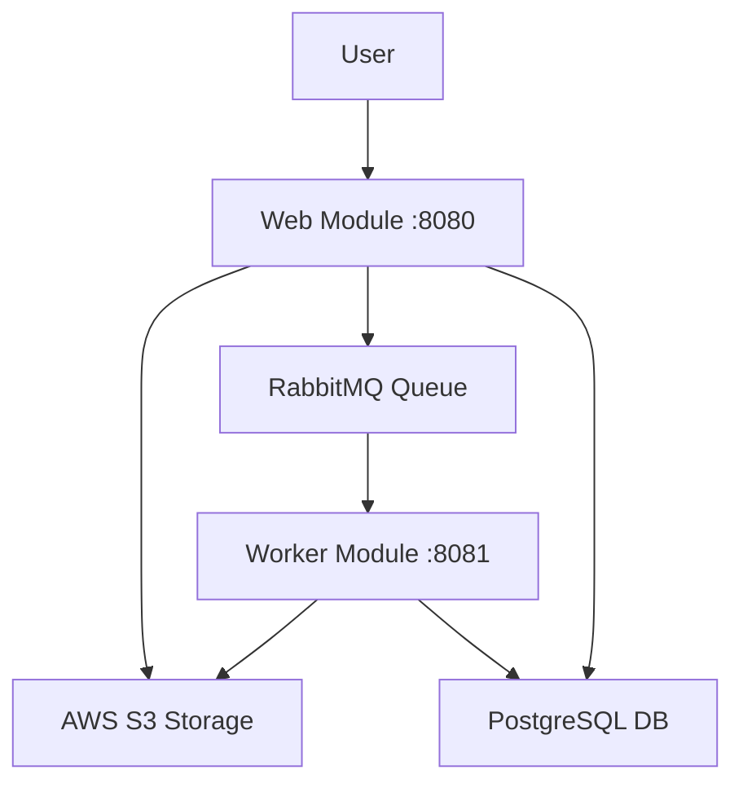
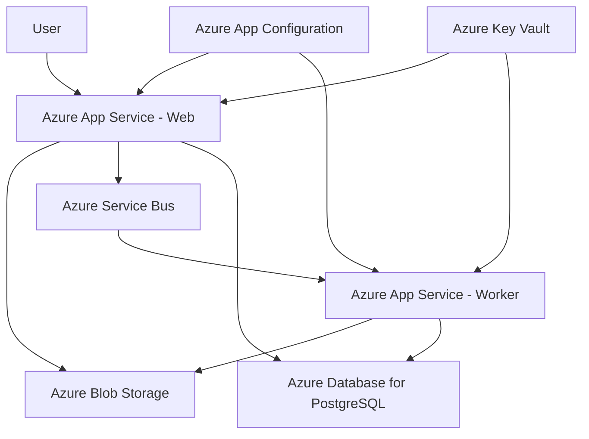
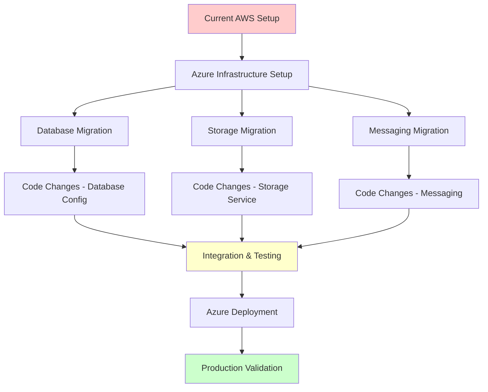

# Modernization Planning Template: AWS-based Asset Manager to Azure-native Asset Manager

## Executive Summary

This document outlines the comprehensive modernization plan for migrating the Asset Manager application from AWS-based infrastructure to Azure-native services. The application is currently a Java Spring Boot multi-module project that handles file uploads, storage, and thumbnail generation using AWS S3, RabbitMQ, and PostgreSQL.

## Current State Analysis

### Technology Stack
- **Language & Framework**: Java 11, Spring Boot 3.4.3
- **Build Tool**: Maven 
- **Database**: PostgreSQL
- **Message Queue**: RabbitMQ
- **File Storage**: AWS S3
- **Web Framework**: Spring MVC with Thymeleaf templates
- **Architecture**: Multi-module Maven project (web + worker modules)

### Current Dependencies
- AWS SDK for Java (S3 integration)
- Spring Boot AMQP (RabbitMQ integration)  
- PostgreSQL JDBC driver
- Spring Data JPA
- Thymeleaf templating engine

### Application Architecture


## Target Azure Architecture

### Azure Services Mapping
- **AWS S3** → **Azure Storage Account (Blob Storage)**
- **RabbitMQ** → **Azure Service Bus**
- **PostgreSQL** → **Azure Database for PostgreSQL**
- **Application Hosting** → **Azure App Service**
- **Configuration Management** → **Azure App Configuration**
- **Secrets Management** → **Azure Key Vault**

### Target Architecture


## Modernization Sequencing

| Order | From (Current) | To (Azure) | Dependencies | Migration Type | Risk Level | Description |
|-------|----------------|------------|--------------|------------|------------|-------------|
| 1 | Local Development | Azure Resource Group | None | Environment Setup | Low | Create Azure Resource Group and set up basic Azure CLI/PowerShell tooling |
| 2 | PostgreSQL Local | Azure Database for PostgreSQL | Step 1 | Infrastructure Setup | Medium | Provision Azure Database for PostgreSQL Flexible Server with appropriate SKU |
| 3 | RabbitMQ Local | Azure Service Bus | Step 1 | Infrastructure Setup | Medium | Create Azure Service Bus namespace with queues and topics |
| 4 | AWS S3 Bucket | Azure Storage Account | Step 1 | Infrastructure Setup | Low | Provision Azure Storage Account with Blob containers |
| 5 | None | Azure App Configuration | Step 1 | Infrastructure Setup | Low | Set up Azure App Configuration for centralized configuration management |
| 6 | None | Azure Key Vault | Step 1 | Infrastructure Setup | Low | Create Azure Key Vault for secrets and connection strings |
| 7 | AWS SDK Dependencies | Azure SDK Dependencies | Steps 2-4 | Application Code Change | High | Update pom.xml to replace AWS SDK with Azure SDK dependencies |
| 8 | AWS S3 Service Implementation | Azure Blob Storage Service | Step 7 | Application Code Change | High | Replace AwsS3Service with Azure Blob Storage implementation |
| 9 | RabbitMQ Configuration | Azure Service Bus Configuration | Step 7 | Application Code Change | Medium | Update messaging configuration from RabbitMQ to Azure Service Bus |
| 10 | Local PostgreSQL Config | Azure PostgreSQL Config | Step 2 | Configuration | Medium | Update database connection strings and SSL configuration |
| 11 | Local Application Properties | Azure App Configuration Integration | Steps 5,6 | Application Code Change | Medium | Integrate Azure App Configuration and Key Vault for settings |
| 12 | Local Deployment | Azure App Service Deployment | Steps 8-11 | Deployment | High | Deploy web and worker modules to Azure App Service instances |
| 13 | Manual Testing | Automated Testing & Monitoring | Step 12 | Manual Action | Medium | Set up Azure Application Insights and perform end-to-end testing |

## Detailed Migration Steps

### Phase 1: Azure Infrastructure Setup (Steps 1-6)

#### Step 1: Azure Environment Setup
```bash
# Create resource group
az group create --name asset-manager-rg --location eastus

# Set up service principal for automation
az ad sp create-for-rbac --name asset-manager-sp --role contributor
```

#### Step 2: Azure Database for PostgreSQL
```bash
# Create PostgreSQL server
az postgres flexible-server create \
  --resource-group asset-manager-rg \
  --name asset-manager-db \
  --admin-user dbadmin \
  --admin-password SecurePassword123! \
  --sku-name Standard_B1ms \
  --version 14
```

#### Step 3: Azure Service Bus
```bash
# Create Service Bus namespace
az servicebus namespace create \
  --resource-group asset-manager-rg \
  --name asset-manager-sb \
  --sku Standard

# Create queue
az servicebus queue create \
  --resource-group asset-manager-rg \
  --namespace-name asset-manager-sb \
  --name image-processing
```

#### Step 4: Azure Storage Account
```bash
# Create storage account
az storage account create \
  --resource-group asset-manager-rg \
  --name assetmanagerstorage \
  --sku Standard_LRS \
  --kind StorageV2

# Create blob container
az storage container create \
  --name assets \
  --account-name assetmanagerstorage
```

### Phase 2: Application Code Modernization (Steps 7-11)

#### Step 7: Update Maven Dependencies

**Remove AWS Dependencies:**
```xml
<!-- Remove these from pom.xml -->
<dependency>
    <groupId>software.amazon.awssdk</groupId>
    <artifactId>s3</artifactId>
</dependency>
```

**Add Azure Dependencies:**
```xml
<!-- Add these to pom.xml -->
<dependency>
    <groupId>com.azure</groupId>
    <artifactId>azure-storage-blob</artifactId>
    <version>12.25.0</version>
</dependency>
<dependency>
    <groupId>com.azure</groupId>
    <artifactId>azure-messaging-servicebus</artifactId>
    <version>7.15.0</version>
</dependency>
<dependency>
    <groupId>com.azure.spring</groupId>
    <artifactId>spring-cloud-azure-starter-storage-blob</artifactId>
    <version>5.8.0</version>
</dependency>
<dependency>
    <groupId>com.azure.spring</groupId>
    <artifactId>spring-cloud-azure-starter-servicebus</artifactId>
    <version>5.8.0</version>
</dependency>
```

#### Step 8: Replace Storage Service Implementation

**Create New Azure Blob Service:**
```java
@Service
@RequiredArgsConstructor
@Profile("azure")
public class AzureBlobStorageService implements StorageService {
    
    private final BlobServiceClient blobServiceClient;
    private final ServiceBusTemplate serviceBusTemplate;
    
    @Value("${azure.storage.container-name}")
    private String containerName;
    
    // Implementation with Azure Blob Storage SDK
}
```

#### Step 9: Update Messaging Configuration

**Replace RabbitMQ with Service Bus:**
```java
@Configuration
public class ServiceBusConfig {
    
    @Bean
    public ServiceBusProcessorClient processorClient() {
        return new ServiceBusClientBuilder()
            .connectionString(connectionString)
            .processor()
            .queueName("image-processing")
            .processMessage(this::processMessage)
            .buildProcessorClient();
    }
}
```

### Phase 3: Deployment and Validation (Steps 12-13)

#### Step 12: Azure App Service Deployment

**Create App Service Plans:**
```bash
# Create App Service plan
az appservice plan create \
  --resource-group asset-manager-rg \
  --name asset-manager-plan \
  --sku B1 \
  --is-linux

# Create web app for web module
az webapp create \
  --resource-group asset-manager-rg \
  --plan asset-manager-plan \
  --name asset-manager-web \
  --runtime "JAVA:11-java11"

# Create web app for worker module  
az webapp create \
  --resource-group asset-manager-rg \
  --plan asset-manager-plan \
  --name asset-manager-worker \
  --runtime "JAVA:11-java11"
```

## Migration Sequence Visualization



## Risk Assessment and Mitigation

### High Risk Items

1. **Storage Service Migration (Step 8)**
   - **Risk**: Data loss during S3 to Blob Storage migration
   - **Mitigation**: 
     - Implement data migration scripts with verification
     - Use parallel running approach during transition
     - Maintain AWS S3 as backup during initial deployment

2. **Application Code Changes (Steps 7-8)**
   - **Risk**: Breaking changes in API interfaces
   - **Mitigation**:
     - Maintain interface compatibility through adapter pattern
     - Comprehensive unit and integration testing
     - Feature flags for gradual rollout

3. **Deployment to Azure App Service (Step 12)**
   - **Risk**: Application startup failures or performance issues
   - **Mitigation**:
     - Thorough load testing in staging environment
     - Blue-green deployment strategy
     - Monitoring and alerting setup before production deployment

### Medium Risk Items

1. **Database Configuration Changes (Step 10)**
   - **Risk**: Connection timeouts or SSL configuration issues
   - **Mitigation**:
     - Test connection strings in development environment first
     - Configure connection pooling appropriately
     - Set up database monitoring

2. **Message Queue Migration (Step 9)**
   - **Risk**: Message loss during transition
   - **Mitigation**:
     - Implement message persistence and retry logic
     - Gradual migration with message replay capability
     - Monitor queue depths and processing rates

## Implementation Phases

### Phase 1: Foundation (Weeks 1-2)
- Azure infrastructure provisioning
- Basic connectivity testing
- Development environment setup

### Phase 2: Core Migration (Weeks 3-5) 
- Application code changes
- Storage and messaging service migration
- Unit and integration testing

### Phase 3: Deployment (Weeks 6-7)
- Azure App Service deployment
- End-to-end testing
- Performance optimization

### Phase 4: Production Release (Week 8)
- Production deployment
- Monitoring setup
- Post-deployment validation

## Success Criteria

1. **Functional Parity**: All existing features work identically in Azure environment
2. **Performance**: Response times within 10% of current AWS performance
3. **Reliability**: 99.9% uptime maintained during and after migration
4. **Cost Optimization**: Azure costs comparable or lower than current AWS costs
5. **Security**: Enhanced security through Azure Key Vault and managed identities
6. **Scalability**: Improved auto-scaling capabilities through Azure App Service

## Validation Approach

### Pre-Migration Testing
- Unit tests for all new Azure service integrations
- Integration tests for end-to-end workflows
- Load testing to establish performance baselines

### Migration Testing
- Parallel running of AWS and Azure environments
- Data integrity verification between systems
- Functional testing of all user workflows

### Post-Migration Validation
- Production smoke tests
- Performance monitoring for 30 days
- User acceptance testing
- Cost analysis and optimization

## Dependencies and Prerequisites

### Technical Prerequisites
- Azure subscription with appropriate permissions
- Azure CLI and PowerShell modules installed
- Development team training on Azure services
- Updated CI/CD pipelines for Azure deployment

### Business Prerequisites
- Migration budget approval
- Stakeholder buy-in for temporary service windows
- Updated disaster recovery procedures
- Security team review and approval

## Conclusion

This modernization plan provides a comprehensive roadmap for migrating the Asset Manager application from AWS to Azure. The phased approach minimizes risk while ensuring business continuity. Key success factors include thorough testing, gradual migration, and maintaining parallel systems during the transition period.

The migration will result in improved integration with Azure-native services, enhanced security through managed identities and Key Vault, and better scalability through Azure App Service auto-scaling capabilities.