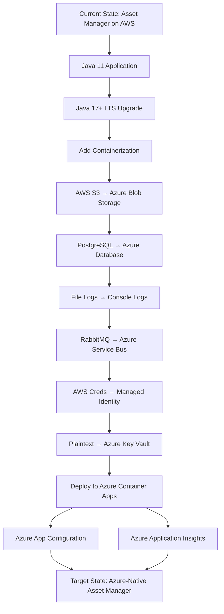

# Modernization Planning Template: Asset Manager Migration to Azure

## Executive Summary

The Asset Manager application is a Spring Boot microservices-based system consisting of web and worker modules that handle file asset management with image processing capabilities. The current architecture uses AWS services (S3 for storage), RabbitMQ for messaging, and PostgreSQL for metadata storage. This assessment outlines the comprehensive migration plan to Azure cloud services.

## Current Architecture Analysis

### Technology Stack
- **Framework**: Spring Boot 3.4.3 with Spring MVC and Thymeleaf
- **Java Version**: Java 11 (requires upgrade to LTS 17+)
- **Build Tool**: Maven multi-module project
- **Database**: PostgreSQL with Spring Data JPA
- **Messaging**: RabbitMQ with AMQP
- **Storage**: AWS S3 (production) / Local File System (development)
- **Architecture**: Microservices (web + worker modules)
- **UI**: Server-side rendering with Thymeleaf templates

### Current External Dependencies
1. **AWS S3**: Object storage for assets and thumbnails
2. **RabbitMQ**: Asynchronous message processing between web and worker
3. **PostgreSQL**: Metadata and application data storage
4. **Docker**: Local development infrastructure

### Application Modules
1. **Web Module** (`assets-manager-web`): 
   - File upload interface
   - Asset listing and viewing
   - REST endpoints for asset management
   - Profile-based storage abstraction (dev/prod)

2. **Worker Module** (`assets-manager-worker`):
   - Background thumbnail generation
   - Image processing with retry logic
   - RabbitMQ message consumers

## Azure Migration Assessment

### Cloud Readiness Assessment
- ✅ **Stateless Design**: Application follows stateless patterns
- ✅ **Configuration Externalization**: Uses Spring profiles and properties
- ✅ **Microservices Architecture**: Well-separated concerns
- ❌ **Containerization**: No Dockerfile or container deployment strategy
- ❌ **Cloud-Native Logging**: Uses local file logging instead of console
- ❌ **Modern Java**: Uses Java 11, needs upgrade to Java 17+ LTS
- ❌ **Credential Management**: Hardcoded credentials in configuration

### Migration Complexity Analysis
- **Storage Migration**: HIGH complexity - AWS S3 to Azure Blob Storage with SDK changes
- **Messaging Migration**: HIGH complexity - RabbitMQ to Azure Service Bus protocol changes  
- **Database Migration**: MEDIUM complexity - PostgreSQL to Azure Database for PostgreSQL
- **Authentication Migration**: MEDIUM complexity - AWS credentials to Azure Managed Identity
- **Deployment Migration**: MEDIUM complexity - Add containerization for Azure deployment

## Modernization Sequencing

### Phase 1: Foundation and Infrastructure (Weeks 1-2)
| Order | From (Current) | To (Target) | Dependencies | Migration Type | Risk Level | Description | Necessity |
|-------|----------------|-------------|--------------|------------|------------|-------------|-----------|
| 1 | Java 11 | Java 17+ LTS | None | Upgrade | Medium | Upgrade to supported Java LTS version for better Azure compatibility and security | Mandatory |
| 2 | Local Development Setup | Azure Development Environment | Step 1 | Environment Configuration | Low | Set up Azure development resources (Resource Group, Storage Account, Service Bus, PostgreSQL) | Mandatory |
| 3 | No Containerization | Docker Containerization | Step 1,2 | Environment Configuration | Medium | Create Dockerfiles for web and worker modules to enable Azure Container deployment | Mandatory |

### Phase 2: Core Service Migration (Weeks 3-4)
| Order | From (Current) | To (Target) | Dependencies | Migration Type | Risk Level | Description | Necessity |
|-------|----------------|-------------|--------------|------------|------------|-------------|-----------|
| 4 | AWS S3 SDK | Azure Blob Storage SDK | Step 1-3 | Application Code Change | High | Replace AWS S3 client with Azure Storage Blob SDK, update StorageService implementations | Mandatory |
| 5 | PostgreSQL Local | Azure Database for PostgreSQL | Step 2,4 | Application Code Change | Medium | Migrate to Azure Database for PostgreSQL with connection string updates | Mandatory |
| 6 | File-based Logging | Console Logging | Step 1,3 | Application Code Change | Medium | Update logging configuration for cloud-native console output and Azure Monitor integration | Mandatory |

### Phase 3: Messaging and Authentication (Weeks 5-6)  
| Order | From (Current) | To (Target) | Dependencies | Migration Type | Risk Level | Description | Necessity |
|-------|----------------|-------------|--------------|------------|------------|-------------|-----------|
| 7 | RabbitMQ AMQP | Azure Service Bus | Step 4,5,6 | Application Code Change | High | Replace RabbitMQ with Azure Service Bus, update message producers and consumers | Mandatory |
| 8 | AWS Credentials | Azure Managed Identity | Step 4,5,7 | Application Code Change | Medium | Implement DefaultAzureCredential for secure, credential-free authentication | Mandatory |
| 9 | Plaintext Credentials | Azure Key Vault | Step 8 | Application Code Change | Low | Store sensitive configuration in Azure Key Vault instead of application.properties | Optional |

### Phase 4: Deployment and Optimization (Weeks 7-8)
| Order | From (Current) | To (Target) | Dependencies | Migration Type | Risk Level | Description | Necessity |
|-------|----------------|-------------|--------------|------------|------------|-------------|-----------|
| 10 | Local Deployment | Azure Container Apps | Step 1-9 | Deployment | High | Deploy containerized applications to Azure Container Apps with proper scaling and networking | Mandatory |
| 11 | Manual Configuration | Azure App Configuration | Step 9,10 | Application Code Change | Low | Centralize shared configuration using Azure App Configuration service | Optional |
| 12 | Basic Monitoring | Azure Application Insights | Step 10 | Application Code Change | Medium | Implement comprehensive monitoring and APM with Application Insights | Optional |

## Migration Dependencies Visualization

## Detailed Migration Steps

### Step 1: Java Version Upgrade
**Prerequisites**: None
**Implementation Approach**:
1. Update parent POM `java.version` from 11 to 17
2. Update Maven compiler plugin target version
3. Test compilation and runtime compatibility
4. Update CI/CD pipelines for Java 17

**Validation**: Successful build and test execution on Java 17

**Risks**: Potential compatibility issues with dependencies
**Mitigation**: Thorough testing with all existing functionality

### Step 2: Azure Development Environment Setup  
**Prerequisites**: Step 1 completed
**Implementation Approach**:
1. Create Azure Resource Group for development
2. Provision Azure Storage Account with containers
3. Create Azure Service Bus namespace and queues
4. Set up Azure Database for PostgreSQL flexible server
5. Configure network security groups and access controls

**Validation**: Connectivity tests from development environment

### Step 3: Application Containerization
**Prerequisites**: Steps 1-2 completed  
**Implementation Approach**:
1. Create multi-stage Dockerfile for web module
2. Create multi-stage Dockerfile for worker module  
3. Add docker-compose.yml for local testing
4. Update build process for container image creation
5. Test container functionality locally

**Validation**: Successful container builds and local deployment

### Step 4: Storage Migration (AWS S3 → Azure Blob Storage)
**Prerequisites**: Steps 1-3 completed
**Implementation Approach**:
1. Add Azure Storage Blob SDK dependency
2. Create new AzureBlobStorageService implementing StorageService
3. Update configuration properties for Azure Storage
4. Implement container and blob operations
5. Update URL generation for Azure blob endpoints
6. Migrate existing data using Azure Data Factory or custom migration tool

**Validation**: File upload, download, and deletion operations working

**Common Challenges**: 
- Different URL patterns between S3 and Blob Storage
- Authentication model differences
- Error handling and retry logic updates

### Step 5: Database Migration 
**Prerequisites**: Steps 2, 4 completed
**Implementation Approach**:
1. Export data from current PostgreSQL instance
2. Update connection strings for Azure Database for PostgreSQL
3. Configure SSL and security settings
4. Import data to Azure Database
5. Update application properties with new connection details

**Validation**: Database connectivity and data integrity verification

### Step 6: Logging Migration
**Prerequisites**: Steps 1, 3 completed
**Implementation Approach**:
1. Update logback/log4j configuration to console output
2. Remove file-based logging appenders
3. Configure structured logging for Azure Monitor
4. Update log levels and formatting for cloud environments

**Validation**: Log output visible in container logs and Azure Monitor

### Step 7: Messaging Migration (RabbitMQ → Azure Service Bus)
**Prerequisites**: Steps 4-6 completed
**Implementation Approach**:
1. Replace Spring AMQP with Azure Service Bus SDK
2. Update RabbitConfig to ServiceBusConfig
3. Modify message producers to use Service Bus
4. Update message consumers with Service Bus annotations
5. Implement dead letter queue handling
6. Update retry and error handling logic

**Validation**: Message flow from web to worker module functioning

**Common Challenges**:
- Different message serialization formats
- Retry and dead letter queue configuration differences  
- Connection management and authentication changes

### Step 8: Authentication Migration
**Prerequisites**: Steps 4, 5, 7 completed
**Implementation Approach**:
1. Add Azure Identity SDK dependency
2. Implement DefaultAzureCredential configuration
3. Remove hardcoded credentials from application.properties
4. Configure managed identity for Azure services
5. Update service connections to use managed identity

**Validation**: Authentication to Azure services without explicit credentials

### Step 9: Azure Key Vault Integration (Optional)
**Prerequisites**: Step 8 completed  
**Implementation Approach**:
1. Add Azure Key Vault SDK dependency
2. Store sensitive configurations in Key Vault
3. Update application to retrieve secrets from Key Vault
4. Configure Key Vault access policies

**Validation**: Application retrieves secrets from Key Vault successfully

### Step 10: Azure Container Apps Deployment
**Prerequisites**: Steps 1-9 completed
**Implementation Approach**:
1. Create Container Apps environment
2. Configure container registries
3. Deploy web and worker applications
4. Set up networking and ingress rules
5. Configure auto-scaling policies
6. Implement health checks

**Validation**: Applications running successfully in Azure Container Apps

## Risk Assessment and Mitigation

### High-Risk Items
1. **Storage Migration Complexity**
   - **Risk**: API differences between S3 and Blob Storage
   - **Mitigation**: Thorough testing with abstraction layer, parallel deployment strategy

2. **Messaging Protocol Changes**  
   - **Risk**: RabbitMQ to Service Bus protocol differences
   - **Mitigation**: Extensive integration testing, message format compatibility validation

3. **Container Deployment**
   - **Risk**: New containerization introduces deployment complexity
   - **Mitigation**: Comprehensive container testing, gradual rollout strategy

### Medium-Risk Items
1. **Database Migration**
   - **Risk**: Data migration and connection changes
   - **Mitigation**: Database backup, connection string externalization, rollback plan

2. **Authentication Changes**
   - **Risk**: Managed identity configuration complexity  
   - **Mitigation**: Step-by-step credential migration, fallback authentication options

## Cost Considerations

### Azure Service Equivalents
- **AWS S3** → **Azure Blob Storage**: Comparable pricing, pay-per-use model
- **RabbitMQ** → **Azure Service Bus**: Managed service reduces operational overhead
- **PostgreSQL** → **Azure Database for PostgreSQL**: Managed service with built-in backup/monitoring
- **Container Hosting** → **Azure Container Apps**: Pay-per-use serverless container platform

### Estimated Timeline
- **Total Duration**: 8 weeks
- **Development Effort**: 4-5 full-time developers
- **Testing Phase**: 2 weeks parallel to development
- **Deployment Phase**: 1 week

## Success Criteria

1. ✅ All application functionality preserved post-migration
2. ✅ No data loss during storage and database migration  
3. ✅ Performance equivalent or improved compared to current system
4. ✅ Successful deployment to Azure Container Apps
5. ✅ Monitoring and logging functional in Azure Monitor
6. ✅ Cost optimization achieved through managed services
7. ✅ Security enhanced through managed identity and Key Vault

## Post-Migration Optimization Opportunities

1. **Auto-scaling Configuration**: Optimize container scaling based on load patterns
2. **CDN Integration**: Add Azure CDN for asset delivery optimization  
3. **Advanced Monitoring**: Implement custom dashboards and alerts
4. **Cost Optimization**: Regular review of resource utilization and right-sizing
5. **Security Enhancements**: Regular security assessments and compliance validation

## Conclusion

The Asset Manager application is well-architected for cloud migration with clear service boundaries and externalized configuration. The primary migration complexity lies in replacing AWS services with Azure equivalents, particularly storage and messaging components. With proper planning and phased approach, the migration can be completed successfully within the estimated timeline while maintaining system functionality and improving operational efficiency through Azure managed services.