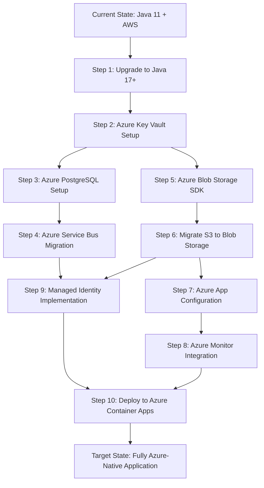

# Modernization Planning Template: Asset Manager Application to Azure

## Executive Summary

This document provides a comprehensive assessment and migration plan for migrating the Asset Manager Application from its current AWS-based architecture to Microsoft Azure. The application is a Spring Boot-based multi-module project that handles file uploads, storage, and thumbnail generation.

### Current Architecture Assessment

**Application Overview:**
- **Technology Stack**: Spring Boot 3.4.3, Java 11, Maven multi-module project
- **Modules**: 
  - `web` module: File upload/management REST API and web interface
  - `worker` module: Asynchronous thumbnail generation service
- **External Dependencies**:
  - AWS S3 for file storage
  - PostgreSQL database for metadata
  - RabbitMQ for inter-service messaging
  - Thymeleaf for web templates

**Current Cloud Services:**
- AWS S3 for object storage
- AWS SDK v2 (2.25.13)
- Hardcoded AWS credentials in application.properties

## Modernization Sequencing

Create a detailed AWS -> Azure modernization steps table showing the precise ordered sequence:

| Order | From (AWS/Current) | To (Azure) | Dependencies | Migration Type | Risk Level | Description | Necessity |
|-------|----------|--------|--------------|------------|------------|-------------|-------------|
| 1 | Java 11 | Java 17+ LTS | None | Upgrade | Low | Upgrade Java runtime to LTS version 17 or above for better Azure compatibility and security | Mandatory |
| 2 | AWS credentials in properties | Azure Key Vault | Step 1 | Configuration | Low | Migrate AWS access keys and secrets to Azure Key Vault for secure secret management | Mandatory |
| 3 | PostgreSQL (on-premises) | Azure Database for PostgreSQL | Step 1 | Infrastructure Setup | Medium | Migrate PostgreSQL database to Azure Database for PostgreSQL with managed identity | Mandatory |
| 4 | RabbitMQ | Azure Service Bus | Step 3 | Application Code Change | High | Replace RabbitMQ messaging with Azure Service Bus for cloud-native messaging | Mandatory |
| 5 | AWS S3 SDK | Azure Blob Storage SDK | Steps 2,4 | Application Code Change | High | Replace AWS S3 client with Azure Blob Storage SDK for file storage operations | Mandatory |
| 6 | AWS S3 Storage | Azure Blob Storage | Step 5 | Infrastructure Setup | Medium | Migrate existing files from AWS S3 to Azure Blob Storage | Mandatory |
| 7 | Spring Configuration | Azure App Configuration | Steps 2,6 | Configuration | Low | Migrate application configuration to Azure App Configuration service | Optional |
| 8 | Application Logging | Azure Monitor/Application Insights | Step 7 | Application Code Change | Low | Integrate Azure Monitor and Application Insights for observability | Optional |
| 9 | Authentication | Managed Identity | Steps 2,5 | Application Code Change | Medium | Implement Azure Managed Identity for secure authentication to Azure services | Mandatory |
| 10 | Container Deployment | Azure Container Apps | Steps 1-9 | Deployment | Medium | Deploy application to Azure Container Apps with auto-scaling capabilities | Mandatory |

The Migration Type categories used:
- Environment Setup: Setting up development and deployment environments
- Upgrade: Technology version updates
- Infrastructure Setup: Cloud infrastructure provisioning
- Application Code Change: Source code modifications
- Deployment: Application deployment processes
- Configuration: Configuration management changes

Create clear modernization sequences with dependencies visualized through Mermaid diagrams:

## Detailed Migration Steps

### Step 1: Java Version Upgrade (Java 11 → Java 17+)
**Prerequisites and Dependencies:** None
**Implementation Approach:**
1. Update parent POM to use Java 17
2. Update Spring Boot version to latest compatible version
3. Test application compatibility
4. Update CI/CD pipelines

**Validation Methods:**
- Unit and integration tests pass
- Application starts successfully
- All existing functionality works

**Risk Level:** Low
**Common Challenges:** Minor compatibility issues with dependencies

### Step 2: Credential Management (AWS Keys → Azure Key Vault)
**Prerequisites and Dependencies:** Step 1 completed
**Implementation Approach:**
1. Create Azure Key Vault instance
2. Store AWS credentials temporarily in Key Vault
3. Update application to use Azure Key Vault SDK
4. Implement secret rotation capabilities

**Validation Methods:**
- Application can retrieve secrets from Key Vault
- No credentials stored in code or configuration files
- Secret access logging works

**Risk Level:** Low
**Common Challenges:** Initial Key Vault permissions setup

### Step 3: Database Migration (PostgreSQL → Azure Database for PostgreSQL)
**Prerequisites and Dependencies:** Step 1 completed
**Implementation Approach:**
1. Provision Azure Database for PostgreSQL
2. Configure firewall rules and networking
3. Migrate database schema using pg_dump/pg_restore
4. Update connection strings to use Managed Identity
5. Test database connectivity and performance

**Validation Methods:**
- Data integrity verification
- Performance testing
- Backup and restore testing
- Connection pooling verification

**Risk Level:** Medium
**Common Challenges:** Network connectivity, performance optimization

### Step 4: Messaging Migration (RabbitMQ → Azure Service Bus)
**Prerequisites and Dependencies:** Step 3 completed
**Implementation Approach:**
1. Provision Azure Service Bus namespace
2. Create queues to replace RabbitMQ queues
3. Replace Spring AMQP with Azure Service Bus SDK
4. Update message handling logic
5. Test message processing workflows

**Validation Methods:**
- Message delivery confirmation
- Error handling and dead letter queue testing
- Performance and throughput testing
- Integration testing between web and worker modules

**Risk Level:** High
**Common Challenges:** Message format compatibility, error handling differences

### Step 5: Storage SDK Migration (AWS S3 SDK → Azure Blob Storage SDK)
**Prerequisites and Dependencies:** Steps 2, 4 completed
**Implementation Approach:**
1. Add Azure Storage Blob dependencies to POM
2. Create Azure Storage Account and container
3. Replace S3Client with BlobServiceClient
4. Update storage service interface implementations
5. Modify upload/download/delete operations

**Validation Methods:**
- File upload/download functionality testing
- Thumbnail generation workflow testing
- URL generation and access testing
- Performance comparison testing

**Risk Level:** High
**Common Challenges:** API differences, authentication methods, URL formats

### Step 6: Data Migration (AWS S3 → Azure Blob Storage)
**Prerequisites and Dependencies:** Step 5 completed
**Implementation Approach:**
1. Create data migration script using AzCopy or custom solution
2. Migrate existing files preserving metadata
3. Update database references to new Azure Blob URLs
4. Verify data integrity post-migration
5. Update application configuration

**Validation Methods:**
- File count and size verification
- Metadata preservation verification
- Application functionality testing with migrated data
- Performance testing

**Risk Level:** Medium
**Common Challenges:** Large data volume migration, downtime minimization

### Step 7: Configuration Management (Properties → Azure App Configuration)
**Prerequisites and Dependencies:** Steps 2, 6 completed
**Implementation Approach:**
1. Create Azure App Configuration service
2. Migrate configuration values from application.properties
3. Update application to use Azure App Configuration Spring Boot Starter
4. Implement configuration refresh capabilities
5. Set up feature flags if needed

**Validation Methods:**
- Configuration loading verification
- Dynamic configuration refresh testing
- Environment-specific configuration testing

**Risk Level:** Low
**Common Challenges:** Configuration key naming conventions

### Step 8: Observability (Local Logging → Azure Monitor)
**Prerequisites and Dependencies:** Step 7 completed
**Implementation Approach:**
1. Create Azure Monitor workspace and Application Insights
2. Add Application Insights Java agent
3. Configure custom metrics and telemetry
4. Set up alerting rules
5. Create monitoring dashboards

**Validation Methods:**
- Log aggregation verification
- Custom metrics collection
- Alert rule testing
- Dashboard functionality

**Risk Level:** Low
**Common Challenges:** Telemetry data correlation

### Step 9: Authentication (Credentials → Managed Identity)
**Prerequisites and Dependencies:** Steps 2, 5 completed
**Implementation Approach:**
1. Enable system-assigned managed identity
2. Grant managed identity permissions to Azure services
3. Update application code to use DefaultAzureCredential
4. Remove hardcoded credentials from configuration
5. Test authentication to all Azure services

**Validation Methods:**
- Service-to-service authentication testing
- Permission verification for all Azure resources
- Credential rotation testing

**Risk Level:** Medium
**Common Challenges:** Permission configuration, credential chain setup

### Step 10: Deployment (Local/VM → Azure Container Apps)
**Prerequisites and Dependencies:** Steps 1-9 completed
**Implementation Approach:**
1. Create Dockerfile for both web and worker modules
2. Set up Azure Container Registry
3. Create Azure Container Apps environment
4. Configure auto-scaling and networking
5. Set up CI/CD pipeline for automated deployment

**Validation Methods:**
- Application functionality testing in production
- Auto-scaling behavior verification
- Load testing
- Monitoring and alerting verification

**Risk Level:** Medium
**Common Challenges:** Container configuration, environment variables, networking

## Risk Assessment and Mitigation

### High-Risk Areas:
1. **Messaging System Migration (Step 4)**: Different message handling patterns between RabbitMQ and Service Bus
   - **Mitigation**: Implement comprehensive testing, use dual-write pattern during transition
   
2. **Storage API Migration (Step 5)**: Significant API differences between S3 and Blob Storage
   - **Mitigation**: Abstract storage operations behind interface, implement comprehensive integration tests

### Medium-Risk Areas:
1. **Database Migration (Step 3)**: Potential performance differences and connection handling
   - **Mitigation**: Performance testing, connection pool optimization
   
2. **Data Migration (Step 6)**: Large data volumes and potential downtime
   - **Mitigation**: Incremental migration, parallel sync strategies

## Success Criteria

1. **Functional Requirements**:
   - All existing application functionality preserved
   - File upload, storage, and thumbnail generation working
   - Web interface fully functional
   - No data loss during migration

2. **Non-Functional Requirements**:
   - Application performance maintained or improved
   - Auto-scaling capabilities enabled
   - Security enhanced with Managed Identity
   - Monitoring and observability improved
   - Cost optimization achieved

3. **Technical Requirements**:
   - No hardcoded credentials in code
   - All Azure services properly configured
   - CI/CD pipeline operational
   - Disaster recovery capabilities implemented

## Cost Considerations

**Current AWS Costs** (estimated):
- S3 storage and operations
- RDS PostgreSQL instance
- RabbitMQ hosting
- EC2 instances for application hosting

**Target Azure Costs** (estimated):
- Azure Blob Storage (typically 50-70% cost reduction)
- Azure Database for PostgreSQL (comparable pricing with better managed features)
- Azure Service Bus (pay-per-operation model)
- Azure Container Apps (pay-per-use with auto-scaling)

**Cost Optimization Opportunities**:
- Reserved instances for database
- Blob storage lifecycle management
- Auto-scaling to reduce idle costs
- Azure Monitor cost optimization

## Timeline Estimation

**Total Estimated Duration**: 8-12 weeks

**Phase 1 - Foundation (Weeks 1-3)**:
- Steps 1-3: Java upgrade, Key Vault setup, Database migration

**Phase 2 - Core Services (Weeks 4-7)**:
- Steps 4-6: Messaging, Storage SDK, and Data migration

**Phase 3 - Enhancement (Weeks 8-10)**:
- Steps 7-9: Configuration, Monitoring, Managed Identity

**Phase 4 - Deployment (Weeks 11-12)**:
- Step 10: Container Apps deployment and production validation

## Conclusion

This modernization plan provides a structured approach to migrating the Asset Manager Application to Azure. The sequential approach minimizes risk while ensuring each component is properly tested before proceeding to dependent steps. The plan emphasizes security improvements through Managed Identity and Key Vault, while also enhancing observability and scalability through Azure-native services.

The migration will result in a more secure, scalable, and maintainable application that takes full advantage of Azure's platform capabilities while maintaining all existing functionality.