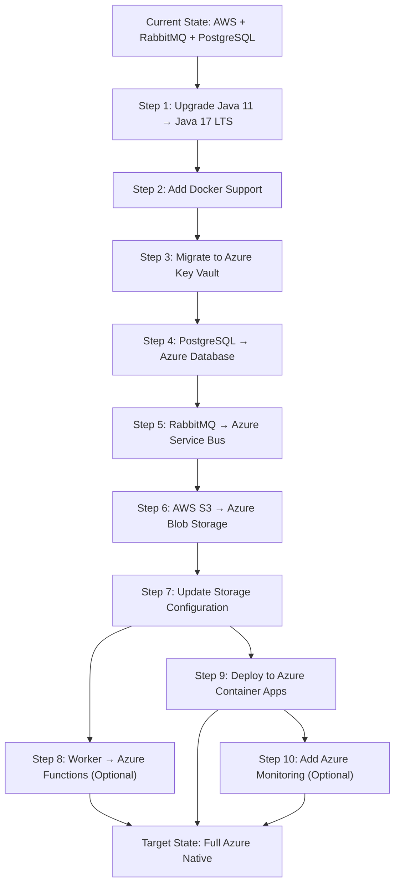

# Modernization Planning Template: Asset Manager Application to Azure

## Project Overview

**Application Name:** Asset Manager  
**Current Architecture:** Multi-module Spring Boot application with AWS S3 storage, RabbitMQ messaging, and PostgreSQL database  
**Target Platform:** Microsoft Azure Cloud  
**Migration Type:** Lift-and-shift with modernization  

### Current Technology Stack Analysis

| Component | Current Technology | Version | Cloud Readiness |
|-----------|-------------------|---------|----------------|
| **Application Framework** | Spring Boot | 3.4.3 | ✅ Cloud Ready |
| **Java Runtime** | Java | 11 | ⚠️ Needs Upgrade to LTS 17+ |
| **Build System** | Maven | Multi-module | ✅ Cloud Ready |
| **Object Storage** | AWS S3 | SDK 2.25.13 | ❌ Needs Migration |
| **Messaging Service** | RabbitMQ | AMQP Protocol | ❌ Needs Migration |
| **Database** | PostgreSQL | JDBC Connection | ⚠️ Needs Azure Migration |
| **Configuration** | Properties Files | Plain text credentials | ❌ Security Risk |
| **Container Support** | None | No Dockerfile | ⚠️ Needs Containerization |

### Application Architecture Analysis

**Web Module (`web/`):**
- Spring Boot web application with Thymeleaf templates
- REST API endpoints for storage operations
- File upload/download functionality
- Direct integration with AWS S3 and RabbitMQ
- PostgreSQL database for metadata storage

**Worker Module (`worker/`):**
- Background image processing service
- Listens to RabbitMQ queues for processing jobs
- Thumbnail generation capabilities
- Dual storage support (AWS S3 and local filesystem)

**Key Dependencies Requiring Migration:**
- `software.amazon.awssdk:s3` - AWS S3 SDK
- `spring-boot-starter-amqp` - RabbitMQ integration
- PostgreSQL JDBC driver
- AWS credential configuration

## Modernization Sequencing

| Order | From (Current) | To (Azure) | Dependencies | Migration Type | Risk Level | Description | Necessity |
|-------|---------------|------------|--------------|------------|------------|-------------|-----------|
| 1 | Java 11 | Java 17 LTS | None | Upgrade | Medium | Upgrade to Java 17 LTS for better security, performance, and Azure compatibility | Mandatory |
| 2 | Local Development | Docker Containers | Step 1 | Infrastructure Setup | Low | Create Dockerfile and docker-compose for consistent deployment | Mandatory |
| 3 | Plain Text Credentials | Azure Key Vault | Steps 1-2 | Configuration | High | Migrate AWS credentials and database passwords to Azure Key Vault | Mandatory |
| 4 | PostgreSQL Local | Azure Database for PostgreSQL | Steps 1-3 | Infrastructure Setup | Medium | Migrate database to Azure Database for PostgreSQL with managed identity | Mandatory |
| 5 | RabbitMQ | Azure Service Bus | Steps 1-4 | Application Code Change | High | Replace RabbitMQ AMQP with Azure Service Bus messaging | Mandatory |
| 6 | AWS S3 SDK | Azure Blob Storage SDK | Steps 1-5 | Application Code Change | High | Replace AWS S3 operations with Azure Blob Storage | Mandatory |
| 7 | AWS S3 Configuration | Azure Storage Account | Step 6 | Configuration | Medium | Update storage configuration for Azure Storage Account | Mandatory |
| 8 | Local File Processing | Azure Functions | Steps 5-7 | Application Code Change | Medium | Migrate background worker to Azure Functions for serverless processing | Optional |
| 9 | Spring Boot Deployment | Azure Container Apps | Steps 1-8 | Deployment | Medium | Deploy containerized application to Azure Container Apps | Mandatory |
| 10 | Application Monitoring | Azure Application Insights | Step 9 | Configuration | Low | Implement Azure Monitor and Application Insights for observability | Optional |

## Migration Dependencies Visualization



## Detailed Migration Tasks

### Task 1: Java Version Upgrade (java-version-upgrade)
**Category:** Upgrade  
**Effort:** HIGH  
**Risk Level:** Medium  

**Current State:** Java 11  
**Target State:** Java 17 LTS  

**Prerequisites:**
- Review application compatibility with Java 17
- Update Maven configuration
- Test application with Java 17

**Implementation Steps:**
1. Update `pom.xml` to specify Java 17:
   ```xml
   <properties>
       <java.version>17</java.version>
   </properties>
   ```
2. Update parent POM and child module POMs
3. Test compilation and runtime compatibility
4. Update CI/CD pipelines to use Java 17

**Validation Methods:**
- Compile and run tests on Java 17
- Performance testing to ensure no regression
- Security scan for Java 17 compatibility

**Risks and Mitigation:**
- **Risk:** Breaking changes in Java 17
- **Mitigation:** Thorough testing and gradual rollout

### Task 2: Docker Containerization (bare/docker-containerization)
**Category:** CodeChange  
**Effort:** MEDIUM  
**Risk Level:** Low  

**Current State:** No containerization  
**Target State:** Docker containers for both modules  

**Implementation Steps:**
1. Create Dockerfile for web module
2. Create Dockerfile for worker module  
3. Create docker-compose.yml for local development
4. Update build process to create container images

**Sample Dockerfile for Web Module:**
```dockerfile
FROM openjdk:17-jre-slim
COPY target/assets-manager-web-*.jar app.jar
EXPOSE 8080
ENTRYPOINT ["java", "-jar", "/app.jar"]
```

### Task 3: Credentials to Azure Key Vault (plaintext-credential-to-azure-keyvault)
**Category:** CodeChange  
**Effort:** LOW  
**Risk Level:** High  

**Current State:** Plain text credentials in properties files  
**Target State:** Azure Key Vault integration  

**Implementation Steps:**
1. Create Azure Key Vault instance
2. Add Azure Key Vault dependencies to Maven
3. Update application configuration to use Key Vault
4. Store secrets in Azure Key Vault
5. Configure managed identity for authentication

**Key Vault Secrets to Store:**
- Database connection strings
- Storage account access keys  
- Service Bus connection strings

### Task 4: PostgreSQL to Azure Database (managed-identity-spring/mi-postgresql-spring)
**Category:** CodeChange  
**Effort:** MEDIUM  
**Risk Level:** Medium  

**Current State:** Local PostgreSQL instance  
**Target State:** Azure Database for PostgreSQL with managed identity  

**Implementation Steps:**
1. Create Azure Database for PostgreSQL
2. Update connection strings in Key Vault
3. Configure managed identity authentication
4. Migrate database schema and data
5. Update application configuration

**Updated Configuration:**
```properties
spring.datasource.url=jdbc:postgresql://your-server.postgres.database.azure.com:5432/assets_manager
spring.datasource.azure.passwordless-enabled=true
```

### Task 5: RabbitMQ to Azure Service Bus (amqp-rabbitmq-servicebus)
**Category:** CodeChange  
**Effort:** HIGH  
**Risk Level:** High  

**Current State:** RabbitMQ with AMQP protocol  
**Target State:** Azure Service Bus  

**Code Changes Required:**
1. Replace RabbitMQ dependencies with Azure Service Bus
2. Update messaging configuration classes
3. Modify message producers and consumers
4. Update queue/topic definitions

**Before (RabbitMQ):**
```java
@Component
public class RabbitConfig {
    @Bean
    public Queue imageProcessingQueue() {
        return QueueBuilder.durable("image-processing").build();
    }
}
```

**After (Azure Service Bus):**
```java
@Component  
public class ServiceBusConfig {
    @Bean
    public ServiceBusTemplate serviceBusTemplate() {
        return new ServiceBusTemplate(serviceBusProcessorClient());
    }
}
```

### Task 6: AWS S3 to Azure Blob Storage (s3-to-azure-blob-storage)
**Category:** CodeChange  
**Effort:** HIGH  
**Risk Level:** High  

**Current State:** AWS S3 SDK integration  
**Target State:** Azure Blob Storage SDK  

**Major Code Changes:**
1. Replace AWS S3 SDK with Azure Blob Storage SDK
2. Update storage service implementations
3. Modify URL generation logic
4. Update file upload/download operations

**Dependencies to Replace:**
```xml
<!-- Remove AWS SDK -->
<dependency>
    <groupId>software.amazon.awssdk</groupId>
    <artifactId>s3</artifactId>
</dependency>

<!-- Add Azure Storage SDK -->
<dependency>
    <groupId>com.azure</groupId>
    <artifactId>azure-storage-blob</artifactId>
</dependency>
```

**Service Implementation Changes:**
- Replace `S3Client` with `BlobServiceClient`
- Update `AwsS3Service` to `AzureBlobStorageService`
- Modify file operations to use Blob Storage APIs

### Task 7: Storage Configuration Update
**Category:** Configuration  
**Effort:** MEDIUM  
**Risk Level:** Medium  

**Current State:** AWS S3 configuration  
**Target State:** Azure Storage Account configuration  

**Configuration Updates:**
```properties
# Replace AWS S3 config
azure.storage.account-name=your-storage-account
azure.storage.container-name=assets-container
azure.storage.connection-string=${AZURE_STORAGE_CONNECTION_STRING}
```

### Task 8: Worker to Azure Functions (Optional)
**Category:** Application Code Change  
**Effort:** MEDIUM  
**Risk Level:** Medium  

**Current State:** Spring Boot worker application  
**Target State:** Azure Functions for serverless processing  

**Benefits:**
- Automatic scaling based on message queue depth
- Pay-per-execution model
- Simplified deployment and maintenance

### Task 9: Deploy to Azure Container Apps
**Category:** Deployment  
**Effort:** MEDIUM  
**Risk Level:** Medium  

**Current State:** Local deployment  
**Target State:** Azure Container Apps deployment  

**Implementation Steps:**
1. Create Azure Container Registry
2. Push container images to registry
3. Create Azure Container Apps environment
4. Deploy web and worker applications
5. Configure ingress and scaling rules

### Task 10: Azure Application Insights (Optional)
**Category:** Configuration  
**Effort:** LOW  
**Risk Level:** Low  

**Current State:** Basic logging  
**Target State:** Comprehensive monitoring with Application Insights  

**Features:**
- Distributed tracing
- Performance monitoring
- Application metrics
- Log aggregation

## Risk Assessment and Mitigation Strategies

### High-Risk Areas

1. **Messaging Migration (RabbitMQ → Service Bus)**
   - **Risk:** Message loss during transition
   - **Mitigation:** Blue-green deployment with message replay capability

2. **Storage Migration (S3 → Blob Storage)**
   - **Risk:** Data corruption or loss
   - **Mitigation:** Parallel sync and validation processes

3. **Database Migration**
   - **Risk:** Downtime and data inconsistency  
   - **Mitigation:** Database replication and staged cutover

### Performance Considerations

- **Network Latency:** Azure services in same region to minimize latency
- **Throughput:** Right-size Azure services based on current usage patterns
- **Scaling:** Implement auto-scaling for Container Apps and Service Bus

## Testing Strategy

### Unit Testing
- Update unit tests for new Azure SDK integrations
- Mock Azure services for isolated testing
- Validate configuration changes

### Integration Testing  
- Test end-to-end workflows with Azure services
- Validate message processing with Service Bus
- Test file operations with Blob Storage

### Performance Testing
- Load testing with Azure services
- Compare performance metrics before and after migration
- Validate auto-scaling behavior

## Rollback Plan

1. **Database:** Maintain replica for quick fallback
2. **Storage:** Keep S3 buckets until migration validation
3. **Messaging:** Parallel processing during transition period
4. **Application:** Blue-green deployment for quick rollback

## Success Criteria

✅ **Application functionality maintained post-migration**  
✅ **Performance meets or exceeds current benchmarks**  
✅ **Security improved with managed identity and Key Vault**  
✅ **Cost optimization through Azure managed services**  
✅ **Improved scalability and reliability**  
✅ **Successful elimination of AWS dependencies**  

## Estimated Timeline

- **Phase 1 (Preparation):** 2-3 weeks (Java upgrade, containerization)
- **Phase 2 (Infrastructure):** 2-3 weeks (Key Vault, database migration) 
- **Phase 3 (Application Migration):** 4-6 weeks (Service Bus, Blob Storage)
- **Phase 4 (Deployment & Testing):** 2-3 weeks (Container Apps, monitoring)
- **Total Estimated Duration:** 10-15 weeks

## Post-Migration Optimization

### Cost Optimization
- Review Azure resource sizing and scaling policies
- Implement Azure Cost Management alerts
- Consider reserved instances for predictable workloads

### Security Enhancements  
- Enable Azure Security Center recommendations
- Implement network security groups
- Regular security assessments

### Operational Excellence
- Establish monitoring and alerting
- Implement automated backup strategies
- Create disaster recovery procedures

---

**Document Version:** 1.0  
**Last Updated:** 2024-12-19  
**Status:** Initial Assessment Complete