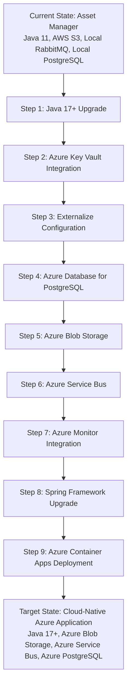

# Modernization Planning Template: Asset Manager Application to Azure

## Project Overview

The Asset Manager application is a Spring Boot 3.4.3 multi-module Java application that handles file uploads, storage, and thumbnail generation. The application consists of:

- **Web Module**: Handles file uploads and viewing via Thymeleaf web interface
- **Worker Module**: Background processing for thumbnail generation via message queues
- **Technology Stack**: Spring Boot, AWS S3, RabbitMQ, PostgreSQL, Maven

## Current Architecture Analysis

### Application Framework
- **JDK Version**: Java 11 (requires upgrade to Java 17+ LTS for optimal Azure support)
- **Framework**: Spring Boot 3.4.3 with Spring AMQP, Spring Data JPA, Thymeleaf
- **Build Tool**: Maven (compatible with Azure deployment)

### External Dependencies
- **File Storage**: AWS S3 (needs migration to Azure Blob Storage)
- **Message Queue**: RabbitMQ (local instance, needs migration to Azure Service Bus)
- **Database**: PostgreSQL (local instance, needs migration to Azure Database for PostgreSQL)
- **Monitoring**: No APM solution detected (needs Azure Monitor/Application Insights)

### Configuration Issues
- **Security**: Plaintext credentials in application.properties files
- **Networking**: Hardcoded localhost configurations
- **Scalability**: Local infrastructure dependencies prevent cloud scalability

## Modernization Sequencing

Create a detailed Current State -> Azure modernization steps table showing the precise ordered sequence:

| Order | From (Current) | To (Azure) | Dependencies | Migration Type | Risk Level | Description | Necessity |
|-------|----------------|------------|--------------|------------|------------|-------------|-----------|
| 1 | Java 11 | Java 17+ LTS | None | Upgrade | Medium | Upgrade to Java 17 or higher for better Azure support and security | Recommended |
| 2 | Plaintext AWS Credentials | Azure Key Vault | Java Upgrade | Environment Configuration | Low | Migrate hardcoded AWS credentials to Azure Key Vault secrets | Mandatory |
| 3 | Hardcoded localhost URLs | Environment Variables | Key Vault Setup | Environment Configuration | Low | Externalize all hardcoded localhost configurations to environment variables | Mandatory |
| 4 | Local PostgreSQL | Azure Database for PostgreSQL | Step 2, 3 | Application Code Change | Medium | Migrate local PostgreSQL database to Azure Database for PostgreSQL with managed identity | Mandatory |
| 5 | AWS S3 SDK | Azure Blob Storage SDK | Step 2, 4 | Application Code Change | High | Replace AWS S3 SDK with Azure Blob Storage SDK in both web and worker modules | Mandatory |
| 6 | Local RabbitMQ | Azure Service Bus | Step 4, 5 | Application Code Change | High | Migrate from RabbitMQ AMQP to Azure Service Bus for messaging between web and worker modules | Mandatory |
| 7 | File-based logging | Console logging + Azure Monitor | Step 6 | Application Code Change | Medium | Configure console logging and integrate Azure Application Insights for monitoring | Mandatory |
| 8 | Spring Framework | Latest Spring Boot | Step 7 | Upgrade | High | Upgrade to latest compatible Spring Boot version for optimal Azure integration | Recommended |
| 9 | Local Development | Azure Container Apps | All previous steps | Deployment | Medium | Deploy containerized application to Azure Container Apps with proper configuration | Mandatory |

Create clear modernization sequences with dependencies visualized through Mermaid diagrams:

## Detailed Migration Steps

### Step 1: Java Version Upgrade (Java 11 → Java 17+)

**Prerequisites**: None

**Implementation Approach**:
1. Update parent POM `java.version` property to 17 or 21 (LTS)
2. Update Maven compiler plugin to target Java 17+
3. Test application compilation and runtime compatibility
4. Update CI/CD pipelines to use Java 17+ runtime

**Validation Methods**:
- Run `mvn clean compile test` successfully
- Verify all Spring Boot features work with Java 17+
- Check for deprecated API usage warnings

**Risks and Mitigation**:
- **Risk**: Deprecated API usage in Java 17+
- **Mitigation**: Use static analysis tools to identify deprecated APIs before upgrade

**Common Challenges**:
- Module system compatibility issues
- Third-party library incompatibilities

### Step 2: Azure Key Vault Integration

**Prerequisites**: Java 17+ upgrade completed

**Implementation Approach**:
1. Add Azure Key Vault dependencies to POM files
2. Create Azure Key Vault instance
3. Store current credentials as secrets in Key Vault
4. Configure Spring Cloud Azure Key Vault integration
5. Replace plaintext credentials with Key Vault references

**Validation Methods**:
- Test application startup with Key Vault credentials
- Verify secure credential retrieval
- Validate managed identity authentication

**Risks and Mitigation**:
- **Risk**: Application startup failures if Key Vault is unavailable
- **Mitigation**: Implement fallback mechanisms and retry policies

### Step 3: Configuration Externalization

**Prerequisites**: Azure Key Vault integration

**Implementation Approach**:
1. Identify all hardcoded localhost URLs and configurations
2. Create environment-specific application profiles
3. Use Spring Boot's externalized configuration
4. Implement Azure App Configuration for shared settings

**Validation Methods**:
- Test application with different environment profiles
- Verify configuration injection works correctly
- Test with Azure App Configuration service

### Step 4: Azure Database for PostgreSQL Migration

**Prerequisites**: Key Vault and configuration externalization

**Implementation Approach**:
1. Create Azure Database for PostgreSQL instance
2. Configure managed identity authentication
3. Update Spring Data JPA configuration
4. Migrate database schema and data
5. Update connection strings to use Azure database

**Validation Methods**:
- Test database connectivity with managed identity
- Verify all CRUD operations work correctly
- Performance testing against Azure database

**Risks and Mitigation**:
- **Risk**: Data loss during migration
- **Mitigation**: Use Azure Database Migration Service with backup verification

### Step 5: Azure Blob Storage Migration

**Prerequisites**: Database migration completed

**Implementation Approach**:
1. Replace AWS S3 SDK with Azure Blob Storage SDK
2. Update `AwsS3Config` to `AzureBlobConfig`
3. Modify file upload/download methods in both modules
4. Implement Azure Blob Storage-specific features
5. Update file URL generation logic

**Validation Methods**:
- Test file upload functionality in web module
- Verify thumbnail generation in worker module
- Test file retrieval and serving

**Risks and Mitigation**:
- **Risk**: File access pattern differences between S3 and Blob Storage
- **Mitigation**: Thorough testing of all file operations and URL patterns

### Step 6: Azure Service Bus Migration

**Prerequisites**: Storage migration completed

**Implementation Approach**:
1. Replace Spring AMQP with Azure Service Bus SDK
2. Update `RabbitConfig` to `ServiceBusConfig`
3. Modify message producers and consumers
4. Implement Azure Service Bus topics and subscriptions
5. Update retry and error handling policies

**Validation Methods**:
- Test message sending from web to worker module
- Verify message processing and acknowledgment
- Test error handling and retry mechanisms

**Risks and Mitigation**:
- **Risk**: Message loss during transition
- **Mitigation**: Implement dual publishing during migration period

### Step 7: Azure Monitor Integration

**Prerequisites**: Service Bus migration completed

**Implementation Approach**:
1. Add Application Insights Java agent
2. Configure console logging for cloud deployment
3. Implement custom telemetry and metrics
4. Set up Azure Monitor dashboards
5. Configure alerting rules

**Validation Methods**:
- Verify telemetry data appears in Application Insights
- Test custom metrics and logging
- Validate dashboard functionality

### Step 8: Spring Framework Upgrade

**Prerequisites**: Azure Monitor integration

**Implementation Approach**:
1. Update to latest compatible Spring Boot version
2. Leverage Azure Spring Cloud integrations
3. Update deprecated Spring configurations
4. Optimize for Azure Container Apps

**Validation Methods**:
- Full regression testing
- Performance benchmarking
- Security scanning

### Step 9: Azure Container Apps Deployment

**Prerequisites**: All previous steps completed

**Implementation Approach**:
1. Create Dockerfile for both modules
2. Configure Azure Container Registry
3. Set up Azure Container Apps environment
4. Implement health checks and scaling policies
5. Configure ingress and networking

**Validation Methods**:
- End-to-end testing in Azure environment
- Load testing and performance validation
- Security and compliance verification

## Risk Assessment

### High-Risk Items
1. **AWS S3 to Azure Blob Storage**: Complex file handling logic changes
2. **RabbitMQ to Azure Service Bus**: Message processing pattern changes
3. **Spring Framework Upgrade**: Potential breaking changes in latest versions

### Medium-Risk Items
1. **Database Migration**: Data integrity and performance concerns
2. **Java Version Upgrade**: Compatibility with existing dependencies
3. **Azure Deployment**: Infrastructure and networking configuration

### Low-Risk Items
1. **Key Vault Integration**: Well-documented Azure service
2. **Configuration Externalization**: Standard Spring Boot practice
3. **Monitoring Integration**: Non-functional enhancement

## Success Criteria

1. **Functional Requirements**:
   - File upload and download functionality works seamlessly
   - Thumbnail generation process continues without interruption
   - All existing features maintain their functionality

2. **Non-Functional Requirements**:
   - Application startup time under 60 seconds
   - File processing latency within 10% of current performance
   - 99.9% availability SLA compliance

3. **Security Requirements**:
   - No plaintext credentials in configuration files
   - All communications encrypted in transit
   - Managed identity authentication for all Azure services

4. **Operational Requirements**:
   - Comprehensive monitoring and alerting
   - Automated deployment pipelines
   - Disaster recovery capabilities

## Timeline and Effort Estimation

- **Total Estimated Effort**: 6-8 weeks
- **Critical Path**: S3 → Blob Storage → Service Bus migration
- **Parallel Workstreams**: Java upgrade, Key Vault, and monitoring can be done in parallel
- **Testing Phase**: 2 weeks for comprehensive end-to-end testing

## Next Steps

1. **Immediate Actions**:
   - Set up Azure subscription and resource groups
   - Create Azure Key Vault and initial secrets
   - Begin Java 17+ compatibility testing

2. **Short-term Goals** (1-2 weeks):
   - Complete Java upgrade and Key Vault integration
   - Externalize all configuration
   - Set up Azure development environment

3. **Medium-term Goals** (3-6 weeks):
   - Execute database and storage migrations
   - Implement Service Bus messaging
   - Deploy to Azure Container Apps

4. **Long-term Goals** (6-8 weeks):
   - Complete monitoring and observability setup
   - Performance optimization and security hardening
   - Documentation and knowledge transfer