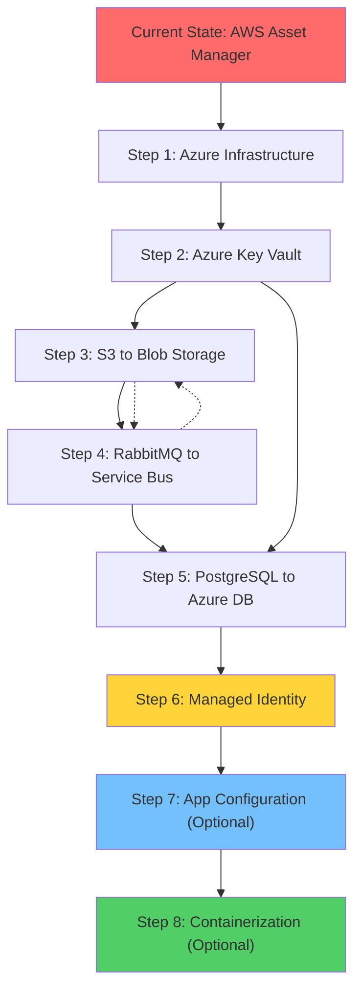

# Modernization Planning Template: AWS Asset Manager to Azure

## Executive Summary

This document outlines the migration strategy for the Asset Manager application from AWS to Azure. The application is a multi-module Spring Boot system (Java 11) that handles file uploads, processing, and thumbnail generation with the following current architecture:

- **Web Module**: REST API service for file management (port 8080)
- **Worker Module**: Background processing service for image thumbnails (port 8081)
- **Storage**: AWS S3 for file storage with local file fallback for dev
- **Messaging**: RabbitMQ (AMQP) for asynchronous image processing
- **Database**: PostgreSQL for metadata storage

## Current State Assessment

### Technology Stack
- **Framework**: Spring Boot 3.4.3 with Java 11
- **Build System**: Maven multi-module project
- **AWS Services Used**:
  - AWS S3 (SDK v2.25.13) for object storage
  - Basic credential authentication (Access Key/Secret Key)
- **Messaging**: RabbitMQ with AMQP protocol
- **Database**: PostgreSQL with Spring Data JPA
- **Profiles**: Environment-specific configuration (dev uses local storage, production uses S3)

### Dependencies Identified
1. **File Storage**: Direct AWS S3 SDK dependencies in both web and worker modules
2. **Authentication**: Plaintext AWS credentials in configuration files
3. **Messaging Infrastructure**: RabbitMQ server dependency
4. **Database**: PostgreSQL database server

## Modernization Sequencing

| Order | From (Current) | To (Azure) | Dependencies | Migration Type | Risk Level | Description | Necessity |
|-------|----------------|------------|--------------|------------|------------|-------------|-----------|
| 1 | Local Environment | Azure Infrastructure | None | Environment Setup | Low | Set up Azure resource group, storage account, and basic infrastructure | Mandatory |
| 2 | Plaintext AWS Credentials | Azure Key Vault | Step 1 | Configuration | Medium | Migrate credentials and sensitive configuration to Azure Key Vault | Mandatory |
| 3 | AWS S3 SDK | Azure Blob Storage SDK | Step 2 | Application Code Change | High | Replace AWS S3 SDK with Azure Blob Storage SDK in both web and worker modules | Mandatory |
| 4 | RabbitMQ AMQP | Azure Service Bus | Step 3 | Application Code Change | High | Replace RabbitMQ messaging with Azure Service Bus queues | Mandatory |
| 5 | PostgreSQL Local/VM | Azure Database for PostgreSQL | Step 4 | Infrastructure Setup | Medium | Migrate database to Azure Database for PostgreSQL with managed identity | Mandatory |
| 6 | Basic Auth Pattern | Managed Identity | Step 2,5 | Application Code Change | Medium | Implement DefaultAzureCredential for secure authentication | Mandatory |
| 7 | Environment Config | Azure App Configuration | Step 6 | Configuration | Low | Centralize configuration management using Azure App Configuration | Optional |
| 8 | Local Development | Container Deployment | Step 7 | Deployment | Medium | Containerize application for Azure Container Apps deployment | Optional |

## Migration Details by Component

### 1. Azure Infrastructure Setup (Step 1)
**Prerequisites**: Azure subscription and appropriate permissions
**Implementation**:
- Create Azure Resource Group
- Set up Azure Storage Account with Blob containers
- Configure Azure Service Bus namespace and queues
- Set up Azure Database for PostgreSQL
- Create Azure Key Vault for secrets management

**Validation**: Infrastructure resources accessible and properly configured
**Risk Level**: Low
**Common Challenges**: Region selection, naming conventions, RBAC setup

### 2. Azure Key Vault Integration (Step 2)
**Prerequisites**: Step 1 complete
**Implementation**:
- Store database connection strings in Key Vault
- Store storage account connection strings in Key Vault  
- Update application.properties to reference Key Vault
- Configure Azure Key Vault Spring Boot starter

**Code Changes Required**:
```xml
<!-- Add to pom.xml -->
<dependency>
    <groupId>com.azure.spring</groupId>
    <artifactId>spring-cloud-azure-starter-keyvault-secrets</artifactId>
</dependency>
```

**Validation**: Application can retrieve secrets from Key Vault
**Risk Level**: Medium - Configuration complexity

### 3. AWS S3 to Azure Blob Storage Migration (Step 3)
**Prerequisites**: Step 1, 2 complete
**Implementation**:
- Replace AWS S3 SDK with Azure Blob Storage SDK
- Update AwsS3Service → AzureBlobStorageService
- Update S3FileProcessingService → BlobFileProcessingService  
- Modify all S3-specific configurations and references

**Files to Modify**:
- `web/src/main/java/com/microsoft/migration/assets/service/AwsS3Service.java`
- `web/src/main/java/com/microsoft/migration/assets/config/AwsS3Config.java`
- `worker/src/main/java/com/microsoft/migration/assets/worker/service/S3FileProcessingService.java`
- `worker/src/main/java/com/microsoft/migration/assets/worker/config/AwsS3Config.java`

**Dependencies to Update**:
```xml
<!-- Remove AWS SDK -->
<!-- <dependency>
    <groupId>software.amazon.awssdk</groupId>
    <artifactId>s3</artifactId>
</dependency> -->

<!-- Add Azure Blob Storage -->
<dependency>
    <groupId>com.azure</groupId>
    <artifactId>azure-storage-blob</artifactId>
</dependency>
```

**Validation**: File upload, download, list, and delete operations work with Azure Blob Storage
**Risk Level**: High - Core functionality change
**Common Challenges**: API differences, URL generation patterns, metadata handling

### 4. RabbitMQ to Azure Service Bus Migration (Step 4)
**Prerequisites**: Step 3 complete
**Implementation**:
- Replace Spring AMQP with Azure Service Bus SDK
- Update RabbitConfig → ServiceBusConfig
- Modify message publishers and consumers
- Update retry and error handling mechanisms

**Files to Modify**:
- `web/src/main/java/com/microsoft/migration/assets/config/RabbitConfig.java`
- `worker/src/main/java/com/microsoft/migration/assets/worker/config/RabbitConfig.java`
- Message processing classes in both modules

**Dependencies to Update**:
```xml
<!-- Remove RabbitMQ -->
<!-- <dependency>
    <groupId>org.springframework.boot</groupId>
    <artifactId>spring-boot-starter-amqp</artifactId>
</dependency> -->

<!-- Add Azure Service Bus -->
<dependency>
    <groupId>com.azure.spring</groupId>
    <artifactId>spring-cloud-azure-starter-servicebus-jms</artifactId>
</dependency>
```

**Validation**: Message publishing and consuming works correctly between web and worker modules
**Risk Level**: High - Messaging pattern changes
**Common Challenges**: Message serialization differences, retry policies, connection management

### 5. PostgreSQL to Azure Database Migration (Step 5)
**Prerequisites**: Step 1, 2 complete
**Implementation**:
- Export existing PostgreSQL schema and data
- Create Azure Database for PostgreSQL instance
- Update connection strings in Key Vault
- Configure managed identity authentication
- Test database connectivity and performance

**Configuration Changes**:
```properties
# Update connection string format for Azure Database
spring.datasource.url=jdbc:postgresql://{server}.postgres.database.azure.com:5432/{database}?sslmode=require
```

**Validation**: All database operations function correctly with Azure Database
**Risk Level**: Medium - Data migration complexity
**Common Challenges**: SSL configuration, firewall rules, performance tuning

### 6. Managed Identity Implementation (Step 6)
**Prerequisites**: Steps 2, 5 complete
**Implementation**:
- Configure system-assigned managed identity
- Update Azure services to accept managed identity authentication
- Replace credential-based authentication with DefaultAzureCredential
- Remove plaintext credentials from configuration

**Code Changes**:
```java
// Replace credential providers with DefaultAzureCredential
DefaultAzureCredential credential = new DefaultAzureCredentialBuilder().build();
```

**Validation**: All Azure services authenticate successfully using managed identity
**Risk Level**: Medium - Authentication flow changes
**Common Challenges**: Permission assignment, credential scope management

### 7. Azure App Configuration (Step 7) - Optional
**Prerequisites**: Step 6 complete
**Implementation**:
- Create Azure App Configuration store
- Migrate environment-specific settings
- Configure feature flags if needed
- Update application startup to use App Configuration

**Validation**: Application loads configuration from Azure App Configuration
**Risk Level**: Low - Non-critical enhancement
**Benefits**: Centralized configuration management, dynamic configuration updates

### 8. Containerization for Azure Deployment (Step 8) - Optional
**Prerequisites**: Step 7 complete
**Implementation**:
- Create Dockerfiles for web and worker modules
- Set up container registry (Azure Container Registry)
- Configure Azure Container Apps or Azure Kubernetes Service
- Implement health checks and monitoring

**Files to Create**:
- `web/Dockerfile`
- `worker/Dockerfile`
- `docker-compose.yml` for local development

**Validation**: Containerized application runs correctly in Azure
**Risk Level**: Medium - Deployment model change
**Benefits**: Better scalability, consistency across environments

## Migration Dependencies Visualization



## Risk Assessment and Mitigation

### High Risk Items
1. **S3 to Blob Storage Migration**: 
   - Risk: Core functionality disruption
   - Mitigation: Comprehensive testing, gradual rollout, rollback plan

2. **RabbitMQ to Service Bus Migration**:
   - Risk: Message processing failures
   - Mitigation: Queue monitoring, message replay capabilities, parallel testing

### Medium Risk Items
3. **Database Migration**:
   - Risk: Data loss or corruption
   - Mitigation: Full backups, migration validation scripts, read-only testing

4. **Authentication Changes**:
   - Risk: Service access failures
   - Mitigation: Staged credential migration, fallback mechanisms

## Success Criteria

- ✅ All file upload/download operations work with Azure Blob Storage
- ✅ Image processing pipeline functions correctly with Azure Service Bus
- ✅ Database operations perform adequately on Azure Database for PostgreSQL
- ✅ Application authenticates securely using managed identity
- ✅ Configuration management works through Azure Key Vault
- ✅ Application maintains same functionality and performance levels
- ✅ Local development environment remains functional

## Post-Migration Recommendations

1. **Monitoring**: Implement Azure Monitor and Application Insights for observability
2. **Security**: Regular security audits and dependency updates
3. **Cost Optimization**: Monitor resource usage and optimize costs
4. **Backup Strategy**: Implement comprehensive backup and disaster recovery
5. **Documentation**: Update deployment and operational documentation
6. **Training**: Ensure team familiarity with Azure services and tooling

## Estimated Timeline

- **Phase 1** (Infrastructure Setup): 1-2 weeks
- **Phase 2** (Storage Migration): 2-3 weeks  
- **Phase 3** (Messaging Migration): 2-3 weeks
- **Phase 4** (Database Migration): 1-2 weeks
- **Phase 5** (Security & Configuration): 1-2 weeks
- **Phase 6** (Testing & Validation): 2-3 weeks
- **Total Estimated Duration**: 9-15 weeks

## Migration Task Summary

Based on the assessment, the following Azure migration tasks have been identified:

1. **s3-to-azure-blob-storage**: Migrate from AWS S3 to Azure Blob Storage (HIGH effort)
2. **amqp-rabbitmq-servicebus**: Migrate from RabbitMQ(AMQP) to Azure Service Bus (HIGH effort)
3. **managed-identity-spring/mi-postgresql-spring**: Migrate to Azure Database for PostgreSQL with Spring (MEDIUM effort)
4. **plaintext-credential-to-azure-keyvault**: Migrate from plaintext credentials to Azure Key Vault (LOW effort)
5. **bare/configuration-management/external-configuration**: Manage external configuration with Azure App Configuration (MEDIUM effort)
6. **bare/docker-containerization**: Containerize Java application for Azure deployment (MEDIUM effort)

All identified tasks are mandatory for a complete Azure migration, with optional enhancements for improved cloud-native operation.