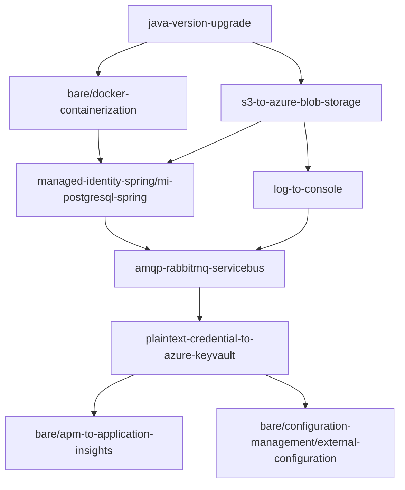

# Azure Migration Task Summary

## Identified Migration Tasks

Based on the analysis of the Asset Manager application, the following Azure migration tasks have been identified:

### High Priority Tasks (Mandatory)

1. **java-version-upgrade**
   - **Current**: Java 11
   - **Target**: Java 17+ LTS
   - **Effort**: HIGH
   - **Category**: Upgrade
   - **Description**: Upgrade to supported Java LTS version for better Azure compatibility and security

2. **s3-to-azure-blob-storage**
   - **Current**: AWS S3 with AWS SDK
   - **Target**: Azure Blob Storage with Azure SDK
   - **Effort**: HIGH
   - **Category**: CodeChange
   - **Description**: Migrate from AWS S3 to Azure Blob Storage for scalable and secure object storage in Azure

3. **amqp-rabbitmq-servicebus**
   - **Current**: RabbitMQ with AMQP
   - **Target**: Azure Service Bus
   - **Effort**: HIGH
   - **Category**: CodeChange
   - **Description**: Migrate from RabbitMQ with AMQP to Azure Service Bus for messaging

4. **managed-identity-spring/mi-postgresql-spring**
   - **Current**: PostgreSQL with connection strings
   - **Target**: Azure Database for PostgreSQL with Managed Identity
   - **Effort**: MEDIUM
   - **Category**: CodeChange
   - **Description**: Migrate from PostgreSQL with Spring to Azure Database for PostgreSQL with managed identity for secure, credential-free authentication

5. **bare/docker-containerization**
   - **Current**: No containerization
   - **Target**: Docker containerization for Azure deployment
   - **Effort**: MEDIUM
   - **Category**: CodeChange
   - **Description**: Containerize Java Application for Azure Deployment using services like Azure Container Apps or Azure Kubernetes Service

6. **log-to-console**
   - **Current**: File-based logging
   - **Target**: Console logging for cloud-native apps
   - **Effort**: MEDIUM
   - **Category**: CodeChange
   - **Description**: Migrate from file-based logging to console logging to support cloud-native apps and integration with Azure Monitor

### Medium Priority Tasks (Mandatory)

7. **plaintext-credential-to-azure-keyvault**
   - **Current**: Plaintext credentials in application.properties
   - **Target**: Azure Key Vault
   - **Effort**: LOW
   - **Category**: CodeChange
   - **Description**: Migrate from plaintext credentials in the code to Azure Key Vault for storage and access to sensitive information

8. **bare/configuration-management/environment-variables**
   - **Current**: Environment variables and system properties
   - **Target**: Azure-specific configuration management
   - **Effort**: LOW
   - **Category**: CodeChange
   - **Description**: Configure system environment variables for Azure deployment, use KeyVault for sensitive information

### Low Priority Tasks (Optional)

9. **bare/apm-to-application-insights**
   - **Current**: No APM solution
   - **Target**: Azure Application Insights
   - **Effort**: MEDIUM
   - **Category**: CodeChange
   - **Description**: Implement Azure Monitor or Application Insights for built-in tracing and auto-instrumentation support

10. **bare/configuration-management/external-configuration**
    - **Current**: External configuration files
    - **Target**: Azure App Configuration
    - **Effort**: LOW
    - **Category**: CodeChange
    - **Description**: Manage external configuration using Azure App Configuration service for shared configurations

## Task Dependencies

## Migration Phases

### Phase 1: Foundation (Weeks 1-2)
- Java version upgrade
- Azure development environment setup
- Application containerization

### Phase 2: Core Services (Weeks 3-4)
- Storage migration (S3 to Blob Storage)
- Database migration (PostgreSQL to Azure)
- Logging migration

### Phase 3: Messaging & Auth (Weeks 5-6)
- Messaging migration (RabbitMQ to Service Bus)
- Authentication migration (AWS to Azure Managed Identity)
- Key Vault integration

### Phase 4: Deployment & Monitoring (Weeks 7-8)
- Azure Container Apps deployment
- Application Insights integration
- Azure App Configuration setup

## Estimated Effort

- **Total Tasks**: 10 identified migration tasks
- **High Effort Tasks**: 4 tasks (Java upgrade, Storage, Messaging, Containerization)
- **Medium Effort Tasks**: 4 tasks (Database, Logging, APM, Configuration)
- **Low Effort Tasks**: 2 tasks (Key Vault, Environment Variables)

**Overall Timeline**: 8 weeks with 4-5 full-time developers
**Risk Level**: Medium to High due to service migration complexity