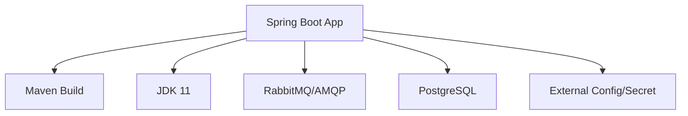
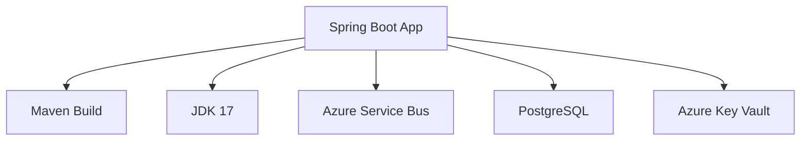

# Modernization Plan

## Summary

Customer requests to upgrade their Java project (assets-manager-parent), currently using JDK 11, Spring/Spring Boot, Maven build, and RabbitMQ/AMQP for messaging, to:
  - JDK 17
  - Migrate all messaging components to Azure Service Bus

This is for a future migration to Azure Container Apps.

## Modernization Goal

Migrate the app to be cloud-ready by upgrading JDK to 17 and replacing RabbitMQ/AMQP-based messaging with Azure Service Bus.

## Scope

1. Upgrade
   - JDK Upgrade (from 11 to 17)
2. Migration Code Change
   - Migrate from RabbitMQ/AMQP messaging system to Azure Service Bus

## Global Constitution

1) All apps will be migrated to Azure Container App
2) All JDK must be upgraded to 17
3) If there is messaging system used in the project, migrate to Azure Service Bus using an AMQP solution.
4) Use Azure Key Vault for secret management; do not use Managed Identity or mounted secrets.

## Roundtrip Constitution

- Customer requests only JDK upgrade and messaging migration in this iteration (other migration needs will be covered in future rounds).

## Application Information

### Current Architecture

#### Details:
- Frameworks: Spring, Spring Boot
- Build Tool: Maven
- Messaging System: RabbitMQ/AMQP
- Database: PostgreSQL
- Secrets: Stored in config files

## Clarification

(No open issues - all required data for plan is clear for this iteration)

## Migration Plan

### Target Architecture

- Messaging replaced by Azure Service Bus (using AMQP)
- All secrets handled via Azure Key Vault
- App now uses JDK 17

### Task Breakdown and Dependencies

1) Task name: Upgrade JDK to 17
   - Task Type: Java Upgrade
   - Issues Detail: Upgrade codebase and build config to JDK 17 compatibility
   - Solution Id: N/A
   - Depends on Task: NA
   - Status: Not Started

2) Task name: Migration from RabbitMQ/AMQP to Azure Service Bus
   - Task Type: Migration Code Change
   - Issues Detail: Refactor all messaging code/config from RabbitMQ/AMQP to use Azure Service Bus APIs and AMQP (Spring-specific code).
   - Solution Id: amqp-rabbitmq-servicebus
   - Depends on Task: Upgrade JDK to 17
   - Status: Not Started
