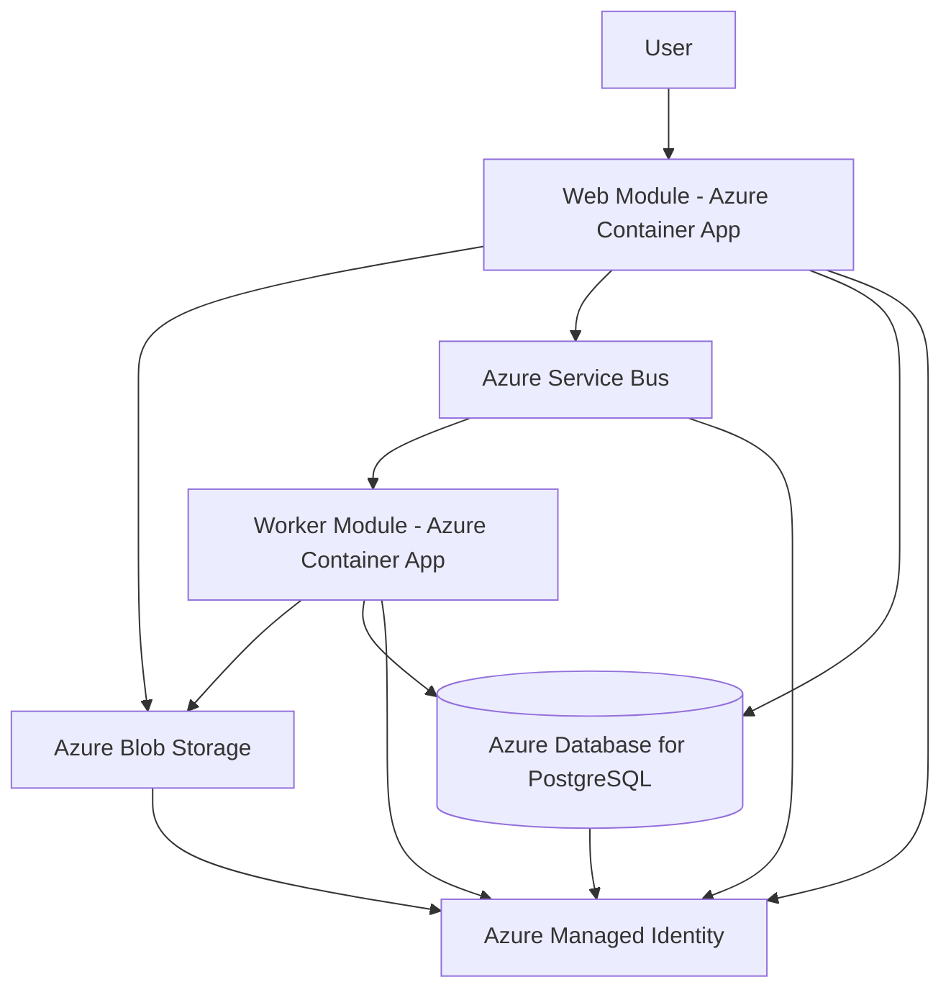
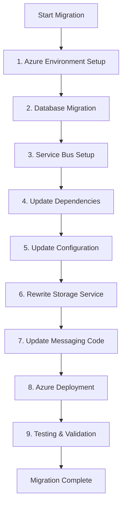

# Azure Migration Assessment Report
## Asset Manager Multi-Module Application

---

## Executive Summary

This document provides a comprehensive assessment for migrating the Asset Manager application from AWS-based infrastructure to Microsoft Azure. The application is a Spring Boot-based multi-module system that handles image asset management with file storage, metadata management, and background processing capabilities.

**Migration Complexity**: Medium-High  
**Estimated Timeline**: 4-6 weeks  
**Risk Level**: Medium  
**Business Disruption**: Low (with proper planning)

---

## Current State Analysis

### Application Architecture

The Asset Manager is a Java-based application with the following characteristics:

- **Framework**: Spring Boot 3.4.3
- **Java Version**: 11
- **Build Tool**: Maven (multi-module project)
- **Architecture**: Microservices-style with separate web and worker modules

### Module Breakdown

#### 1. Web Module (`assets-manager-web`)
- **Purpose**: File upload, viewing, and user interface
- **Technologies**: Spring Web, Thymeleaf, Spring AMQP, JPA
- **Port**: 8080 (default)
- **Key Features**:
  - File upload/download REST APIs
  - Thymeleaf-based UI
  - AWS S3 integration
  - RabbitMQ message publishing
  - PostgreSQL metadata storage

#### 2. Worker Module (`assets-manager-worker`)
- **Purpose**: Background image processing (thumbnail generation)
- **Technologies**: Spring Boot, Spring AMQP, JPA
- **Port**: 8081
- **Key Features**:
  - RabbitMQ message consumption
  - Image thumbnail generation
  - AWS S3 file processing
  - PostgreSQL metadata updates

### Current Technology Dependencies

| Component | Technology | Version | Purpose |
|-----------|------------|---------|---------|
| Cloud Storage | AWS S3 | SDK 2.25.13 | File storage and retrieval |
| Database | PostgreSQL | Runtime | Metadata persistence |
| Message Queue | RabbitMQ | Spring AMQP | Async communication |
| Authentication | AWS Basic Credentials | Access/Secret Key | S3 access |
| Container Runtime | Docker | Latest | Local development |
| Web Framework | Spring Boot | 3.4.3 | Application framework |

### Current Infrastructure Configuration

```yaml
# Current AWS Configuration
AWS S3:
  - Bucket: Configurable
  - Region: us-east-1
  - Authentication: Access Key/Secret Key
  - Operations: Upload, Download, Delete, List

PostgreSQL:
  - Host: localhost:5432
  - Database: assets_manager
  - Connection: JDBC

RabbitMQ:
  - Host: localhost:5672
  - Queue: image-processing
  - Message Format: JSON
```

---

## Azure Target Architecture

### Azure Service Mapping

| Current (AWS/On-Premises) | Azure Equivalent | Migration Type |
|---------------------------|------------------|----------------|
| AWS S3 | Azure Blob Storage | Application Code Change |
| AWS SDK | Azure Storage SDK | Dependency Update |
| AWS Credentials | Azure Managed Identity | Configuration |
| RabbitMQ | Azure Service Bus | Application Code Change |
| PostgreSQL (Local) | Azure Database for PostgreSQL | Configuration |
| Docker (Local) | Azure Container Apps | Deployment |

### Target Azure Architecture



### Azure Services Configuration

#### Azure Blob Storage
- **Service**: Azure Storage Account
- **Access Tier**: Hot (for frequently accessed images)
- **Authentication**: Azure Managed Identity
- **Features**: Container-based organization, SAS tokens for secure access

#### Azure Service Bus
- **Service**: Azure Service Bus Namespace
- **Entity Type**: Queue
- **Authentication**: Azure Managed Identity
- **Features**: Dead letter queues, message sessions

#### Azure Database for PostgreSQL
- **Service**: Azure Database for PostgreSQL Flexible Server
- **Version**: Compatible with current PostgreSQL version
- **Authentication**: Azure AD integration
- **Features**: Automated backups, high availability

#### Azure Container Apps
- **Service**: Azure Container Apps
- **Scaling**: Auto-scaling based on load
- **Networking**: Internal communication between containers
- **Configuration**: Environment variables for Azure service endpoints

---

## Migration Sequencing Plan

| Order | From (Current) | To (Azure) | Dependencies | Migration Type | Risk Level | Description |
|-------|----------------|------------|--------------|----------------|------------|-------------|
| 1 | Local Development Setup | Azure Development Environment | None | Environment Setup | Low | Set up Azure subscription, resource groups, and development tools |
| 2 | PostgreSQL (Local) | Azure Database for PostgreSQL | Step 1 | Infrastructure Setup | Low | Migrate database to Azure managed service |
| 3 | RabbitMQ | Azure Service Bus | Step 2 | Infrastructure Setup | Medium | Create Service Bus namespace and queues |
| 4 | AWS S3 Dependencies | Azure Blob Storage Dependencies | Step 3 | Application Code Change | Medium | Update Maven dependencies and import statements |
| 5 | AWS S3 Configuration | Azure Storage Configuration | Step 4 | Configuration | Medium | Update application properties and configuration classes |
| 6 | AWS S3 Service Implementation | Azure Blob Storage Implementation | Step 5 | Application Code Change | High | Rewrite storage service implementation |
| 7 | RabbitMQ Configuration | Azure Service Bus Configuration | Step 6 | Application Code Change | Medium | Update messaging configuration and annotations |
| 8 | Local Docker Deployment | Azure Container Apps | Step 7 | Deployment | Medium | Containerize and deploy to Azure |
| 9 | Testing and Validation | Production Readiness | Step 8 | Manual Action | Medium | End-to-end testing and performance validation |

### Migration Sequence Visualization



---

## Technical Implementation Guidance

### Phase 1: Environment Setup and Dependencies

#### Update Maven Dependencies

**Current Dependencies to Replace:**
```xml
<!-- Remove AWS SDK -->
<dependency>
    <groupId>software.amazon.awssdk</groupId>
    <artifactId>s3</artifactId>
    <version>${aws-sdk.version}</version>
</dependency>
```

**New Azure Dependencies:**
```xml
<!-- Add Azure Storage and Service Bus -->
<dependency>
    <groupId>com.azure</groupId>
    <artifactId>azure-storage-blob</artifactId>
    <version>12.29.0</version>
</dependency>
<dependency>
    <groupId>com.azure</groupId>
    <artifactId>azure-identity</artifactId>
    <version>1.15.4</version>
</dependency>
<dependency>
    <groupId>com.azure.spring</groupId>
    <artifactId>spring-cloud-azure-dependencies</artifactId>
    <version>5.22.0</version>
    <scope>import</scope>
    <type>pom</type>
</dependency>
<dependency>
    <groupId>com.azure.spring</groupId>
    <artifactId>spring-cloud-azure-starter</artifactId>
</dependency>
<dependency>
    <groupId>com.azure.spring</groupId>
    <artifactId>spring-messaging-azure-servicebus</artifactId>
</dependency>
```

### Phase 2: Configuration Updates

#### Azure Configuration Properties

**Replace Current Configuration:**
```properties
# Remove AWS Configuration
aws.accessKey=your-access-key
aws.secretKey=your-secret-key
aws.region=us-east-1
aws.s3.bucket=your-bucket-name

# Remove RabbitMQ Configuration
spring.rabbitmq.host=localhost
spring.rabbitmq.port=5672
spring.rabbitmq.username=guest
spring.rabbitmq.password=guest
```

**New Azure Configuration:**
```properties
# Azure Storage Configuration
azure.storage.account-name=${AZURE_STORAGE_ACCOUNT_NAME}
azure.storage.container-name=${AZURE_STORAGE_CONTAINER_NAME}

# Azure Service Bus Configuration
spring.cloud.azure.credential.managed-identity-enabled=true
spring.cloud.azure.credential.client-id=${AZURE_CLIENT_ID}
spring.cloud.azure.servicebus.entity-type=queue
spring.cloud.azure.servicebus.namespace=${SERVICE_BUS_NAMESPACE}

# Database Configuration (minimal changes)
spring.datasource.url=jdbc:postgresql://${AZURE_DB_HOST}:5432/assets_manager
spring.datasource.username=${AZURE_DB_USERNAME}
spring.datasource.password=${AZURE_DB_PASSWORD}
```

### Phase 3: Storage Service Implementation

#### New Azure Blob Storage Service

**Replace:** `AwsS3Service.java`  
**With:** `AzureBlobStorageService.java`

```java
@Service
@RequiredArgsConstructor
@Profile("!dev")
public class AzureBlobStorageService implements StorageService {

    private final BlobServiceClient blobServiceClient;
    private final ServiceBusTemplate serviceBusTemplate;
    private final ImageMetadataRepository imageMetadataRepository;

    @Value("${azure.storage.container-name}")
    private String containerName;

    @Override
    public List<S3StorageItem> listObjects() {
        BlobContainerClient containerClient = blobServiceClient.getBlobContainerClient(containerName);
        return containerClient.listBlobs().stream()
                .map(this::convertToStorageItem)
                .collect(Collectors.toList());
    }

    @Override
    public void uploadObject(MultipartFile file) throws IOException {
        String blobName = generateBlobName(file.getOriginalFilename());
        BlobClient blobClient = blobServiceClient
                .getBlobContainerClient(containerName)
                .getBlobClient(blobName);
        
        blobClient.upload(file.getInputStream(), file.getSize(), true);
        
        // Send message to Service Bus for processing
        ImageProcessingMessage message = new ImageProcessingMessage(
            blobName, file.getContentType(), getStorageType(), file.getSize()
        );
        Message<ImageProcessingMessage> serviceBusMessage = MessageBuilder
                .withPayload(message)
                .build();
        serviceBusTemplate.send("image-processing", serviceBusMessage);
        
        saveMetadata(file, blobName);
    }
    
    // Additional methods...
}
```

#### Azure Blob Storage Configuration

**Replace:** `AwsS3Config.java`  
**With:** `AzureBlobStorageConfig.java`

```java
@Configuration
public class AzureBlobStorageConfig {

    @Value("${azure.storage.account-name}")
    private String accountName;

    @Bean
    public BlobServiceClient blobServiceClient() {
        String endpoint = String.format("https://%s.blob.core.windows.net", accountName);
        return new BlobServiceClientBuilder()
                .endpoint(endpoint)
                .credential(new DefaultAzureCredentialBuilder().build())
                .buildClient();
    }
    
    @Bean
    public BlobContainerClient blobContainerClient(
            BlobServiceClient blobServiceClient,
            @Value("${azure.storage.container-name}") String containerName) {
        BlobContainerClient containerClient = blobServiceClient.getBlobContainerClient(containerName);
        containerClient.createIfNotExists();
        return containerClient;
    }
}
```

### Phase 4: Messaging Service Implementation

#### Azure Service Bus Configuration

**Replace:** `RabbitConfig.java`  
**With:** `ServiceBusConfig.java`

```java
@Configuration
@EnableAzureMessaging
public class ServiceBusConfig {

    @Bean
    public ServiceBusAdministrationClient adminClient(
            AzureServiceBusProperties properties, 
            TokenCredential credential) {
        return new ServiceBusAdministrationClientBuilder()
                .credential(properties.getFullyQualifiedNamespace(), credential)
                .buildClient();
    }

    @Bean
    public QueueProperties imageProcessingQueue(
            ServiceBusAdministrationClient adminClient) {
        String queueName = "image-processing";
        try {
            return adminClient.getQueue(queueName);
        } catch (ResourceNotFoundException e) {
            return adminClient.createQueue(queueName);
        }
    }
}
```

#### Message Listener Updates

**Update Worker Module Message Listener:**

```java
@Component
public class ImageProcessingListener {

    @ServiceBusListener(destination = "image-processing")
    public void processImageMessage(
            ImageProcessingMessage message,
            @Header(ServiceBusMessageHeaders.RECEIVED_MESSAGE_CONTEXT) ServiceBusReceivedMessageContext context) {
        try {
            // Process the image
            processImage(message);
            context.complete();
        } catch (Exception e) {
            log.error("Error processing image: {}", e.getMessage());
            context.abandon();
        }
    }
}
```

---

## Risk Assessment and Mitigation Strategies

### High-Risk Areas

#### 1. File Storage Migration (AWS S3 → Azure Blob Storage)
**Risk Level**: High  
**Impact**: Core functionality disruption  
**Mitigation Strategies**:
- Implement feature flags to switch between AWS and Azure
- Create comprehensive integration tests
- Perform parallel testing with both storage systems
- Implement data migration scripts for existing files

#### 2. Message Queue Migration (RabbitMQ → Azure Service Bus)
**Risk Level**: Medium-High  
**Impact**: Background processing disruption  
**Mitigation Strategies**:
- Implement dual-publishing during transition
- Create message format compatibility layer
- Monitor message processing rates during migration
- Implement circuit breaker patterns

### Medium-Risk Areas

#### 3. Configuration Management
**Risk Level**: Medium  
**Impact**: Application startup and runtime issues  
**Mitigation Strategies**:
- Use Azure Key Vault for sensitive configuration
- Implement configuration validation
- Create environment-specific configuration profiles
- Document all configuration changes

#### 4. Authentication and Authorization
**Risk Level**: Medium  
**Impact**: Security and access control  
**Mitigation Strategies**:
- Test Azure Managed Identity thoroughly
- Implement fallback authentication mechanisms
- Monitor access patterns and permissions
- Conduct security audits

### Low-Risk Areas

#### 5. Database Migration
**Risk Level**: Low  
**Impact**: Minimal application changes required  
**Mitigation Strategies**:
- Use Azure Database Migration Service
- Perform data validation after migration
- Implement connection pooling optimization
- Monitor performance metrics

---

## Cost Analysis and Estimation

### Development Effort Estimation

| Phase | Task | Effort (Days) | Complexity |
|-------|------|---------------|------------|
| 1 | Environment Setup | 2-3 | Low |
| 2 | Dependencies Update | 1-2 | Low |
| 3 | Storage Service Rewrite | 5-7 | High |
| 4 | Messaging Service Update | 3-4 | Medium |
| 5 | Configuration Updates | 2-3 | Medium |
| 6 | Testing and Debugging | 5-8 | High |
| 7 | Deployment Setup | 3-4 | Medium |
| 8 | Documentation and Training | 2-3 | Low |

**Total Estimated Effort**: 23-34 days (4.6-6.8 weeks)

### Azure Service Costs (Monthly Estimates)

| Service | Configuration | Estimated Cost |
|---------|---------------|----------------|
| Azure Blob Storage | 100GB Hot tier | $20-25 |
| Azure Service Bus | Standard tier | $10-15 |
| Azure Database for PostgreSQL | General Purpose, 2 vCores | $150-200 |
| Azure Container Apps | 2 container apps, basic scaling | $50-100 |
| Azure Key Vault | Standard tier | $5-10 |
| **Total Monthly Cost** | | **$235-350** |

*Note: Costs may vary based on actual usage, region, and specific configuration requirements.*

---

## Success Criteria and Validation Approach

### Technical Success Criteria

1. **Functional Completeness**
   - All file upload/download operations work correctly
   - Background image processing functions as expected
   - User interface operates without degradation
   - All existing API endpoints remain functional

2. **Performance Benchmarks**
   - File upload times within 110% of current performance
   - Background processing throughput maintained
   - Database query performance within acceptable limits
   - Overall application response times meet SLA requirements

3. **Reliability and Availability**
   - 99.9% uptime during normal operations
   - Graceful error handling and recovery
   - Monitoring and alerting functionality
   - Automated deployment and rollback capabilities

### Business Success Criteria

1. **Zero Data Loss**
   - All existing files successfully migrated
   - Metadata integrity maintained
   - No corruption during migration process

2. **Minimal Business Disruption**
   - Planned downtime limited to agreed maintenance windows
   - User workflow continuity maintained
   - Feature parity with existing system

### Validation and Testing Approach

#### Unit Testing
- Test coverage minimum 80% for new Azure-specific code
- Mock Azure services for isolated testing
- Validate error handling and edge cases

#### Integration Testing
- End-to-end workflow testing
- Azure service integration validation
- Performance testing under load
- Security and authentication testing

#### User Acceptance Testing
- Business workflow validation
- User interface functionality testing
- Performance acceptance criteria
- Data integrity verification

---

## Implementation Timeline and Milestones

### Milestone 1: Foundation Setup (Week 1)
- Azure subscription and resource group setup
- Development environment configuration
- Database migration to Azure Database for PostgreSQL
- Basic connectivity testing

### Milestone 2: Core Migration (Weeks 2-3)
- Dependencies and configuration updates
- Storage service implementation with Azure Blob Storage
- Messaging service migration to Azure Service Bus
- Unit and integration testing

### Milestone 3: Deployment and Testing (Weeks 4-5)
- Azure Container Apps deployment setup
- End-to-end testing and validation
- Performance testing and optimization
- Security and compliance validation

### Milestone 4: Go-Live Preparation (Week 6)
- Production deployment preparation
- Data migration and synchronization
- Monitoring and alerting setup
- Documentation and knowledge transfer

---

## Conclusion and Recommendations

### Key Recommendations

1. **Phased Migration Approach**
   - Implement migration in clearly defined phases
   - Maintain backward compatibility during transition
   - Use feature flags for gradual rollout

2. **Risk Mitigation Focus**
   - Prioritize comprehensive testing of storage and messaging components
   - Implement monitoring and alerting from day one
   - Prepare detailed rollback procedures

3. **Team Preparation**
   - Provide Azure-specific training for development team
   - Establish Azure support channels and expertise
   - Document all architectural decisions and changes

4. **Long-term Benefits**
   - Improved scalability with Azure managed services
   - Enhanced security with Azure Managed Identity
   - Reduced operational overhead with PaaS services
   - Better integration with Microsoft ecosystem

### Migration Readiness Assessment

**Current Readiness Level**: Medium-High

**Strengths**:
- Well-structured, modular application architecture
- Modern Spring Boot framework facilitates cloud migration
- Clear separation of concerns between modules
- Existing containerization support

**Areas for Improvement**:
- Need Azure-specific expertise and training
- Configuration management needs enhancement
- Monitoring and observability require setup
- Security model needs Azure-specific implementation

### Next Steps

1. **Immediate Actions** (Next 2 weeks)
   - Set up Azure development environment
   - Begin team training on Azure services
   - Create proof-of-concept for critical components

2. **Short-term Goals** (Next 4 weeks)
   - Complete Phase 1-2 of migration plan
   - Establish CI/CD pipeline for Azure deployment
   - Implement monitoring and logging strategy

3. **Long-term Objectives** (Next 3 months)
   - Complete full migration to Azure
   - Optimize costs and performance
   - Establish Azure best practices and governance

This migration assessment provides a comprehensive roadmap for successfully transitioning the Asset Manager application from AWS to Azure while minimizing risks and ensuring business continuity.