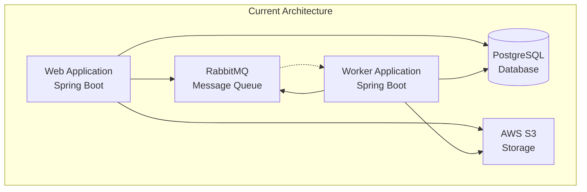
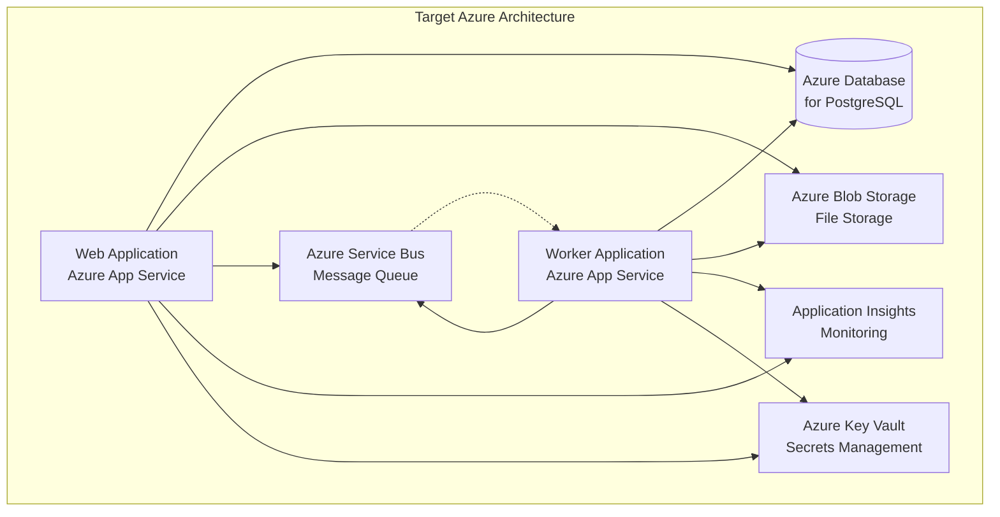
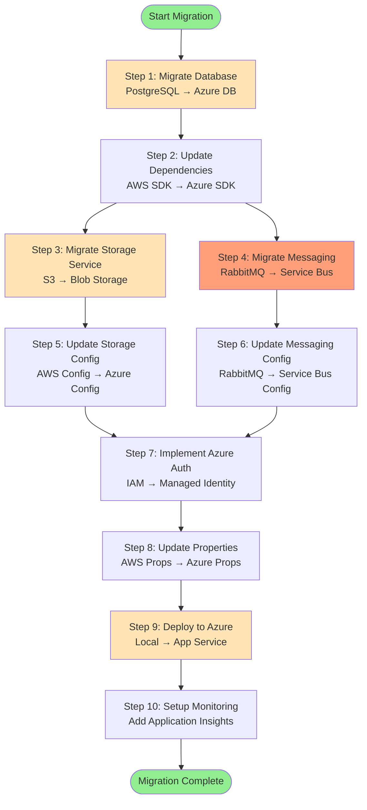
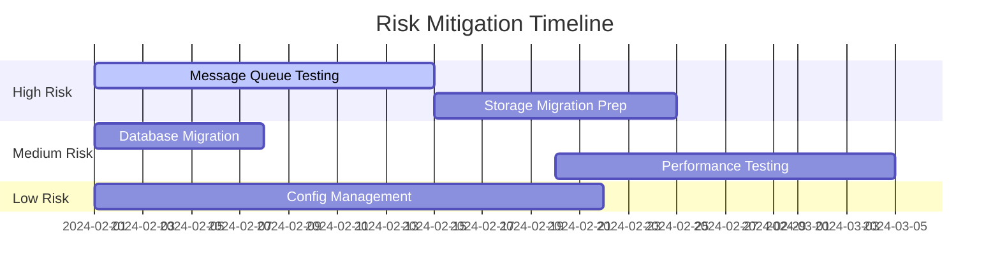
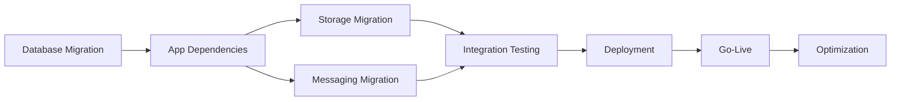

# Azure Migration Assessment Report
## Asset Manager Application

### Executive Summary

This document provides a comprehensive assessment for migrating the Asset Manager application from its current AWS-based architecture to Microsoft Azure. The assessment includes detailed analysis of the current state, target Azure architecture, migration sequences, risk assessment, and implementation roadmap.

**Current State:** Spring Boot application using AWS S3, RabbitMQ, and PostgreSQL  
**Target State:** Azure-native application using Azure Blob Storage, Azure Service Bus, and Azure Database for PostgreSQL  
**Migration Complexity:** Medium to High  
**Estimated Timeline:** 8-12 weeks  

---

## Table of Contents

1. [Current Architecture Analysis](#current-architecture-analysis)
2. [Target Azure Architecture](#target-azure-architecture)
3. [Service Migration Mapping](#service-migration-mapping)
4. [Migration Sequence](#migration-sequence)
5. [Migration Phases](#migration-phases)
6. [Risk Assessment](#risk-assessment)
7. [Implementation Roadmap](#implementation-roadmap)
8. [Cost Analysis](#cost-analysis)
9. [Success Criteria](#success-criteria)

---

## Current Architecture Analysis

### Technology Stack Overview

| Component | Current Technology | Version | Usage |
|-----------|-------------------|---------|--------|
| **Application Framework** | Spring Boot | 3.4.3 | Web and Worker modules |
| **Java Runtime** | Java | 11 | Application runtime |
| **Build Tool** | Maven | - | Multi-module build |
| **Database** | PostgreSQL | - | Metadata and application data |
| **Cloud Storage** | AWS S3 | SDK 2.25.13 | File and image storage |
| **Message Queue** | RabbitMQ | - | Asynchronous processing |
| **ORM** | JPA/Hibernate | - | Database access layer |
| **Web Framework** | Spring MVC + Thymeleaf | - | User interface |
| **Architecture** | Microservices | - | Web + Worker separation |

### Application Modules

#### Web Module (`assets-manager-web`)
- **Purpose**: Handles file uploads, viewing, and web interface
- **Key Components**:
  - `S3Controller`: Manages file upload/download operations
  - `HomeController`: Web interface controller
  - `AwsS3Service`: AWS S3 integration service
  - `BackupMessageProcessor`: Handles backup messages from RabbitMQ
  - `ImageMetadataRepository`: JPA repository for metadata

#### Worker Module (`assets-manager-worker`)  
- **Purpose**: Background image processing and file operations
- **Key Components**:
  - `WorkerApplication`: Background processing application
  - `S3FileProcessingService`: Processes files from S3
  - `AbstractFileProcessingService`: Base processing logic
  - Background message consumers

### Current Dependencies and Integration Points



### Current Configuration Points

#### Database Configuration
```properties
spring.datasource.url=jdbc:postgresql://localhost:5432/assets_manager
spring.datasource.username=postgres
spring.datasource.password=postgres
spring.jpa.hibernate.ddl-auto=update
```

#### AWS S3 Configuration  
```properties
aws.accessKey=your-access-key
aws.secretKey=your-secret-key
aws.region=us-east-1
aws.s3.bucket=your-bucket-name
```

#### RabbitMQ Configuration
```properties
spring.rabbitmq.host=localhost
spring.rabbitmq.port=5672
spring.rabbitmq.username=guest
spring.rabbitmq.password=guest
```

---

## Target Azure Architecture

### Azure Services Mapping

| Current Service | Target Azure Service | Migration Type | Complexity |
|----------------|---------------------|----------------|------------|
| **AWS S3** | Azure Blob Storage | Direct Migration | Medium |
| **RabbitMQ** | Azure Service Bus | Protocol Change | High |
| **PostgreSQL** | Azure Database for PostgreSQL | Lift and Shift | Low |
| **EC2/VMs** | Azure App Service | Platform Migration | Medium |
| **AWS SDK** | Azure SDK | Code Changes | Medium |
| **IAM** | Azure Managed Identity | Security Model Change | Medium |

### Target Azure Architecture Diagram



### Azure Resource Requirements

#### Core Services
- **Azure App Service Plan**: Premium v3 P1V3 (2 instances for HA)
- **Azure Database for PostgreSQL**: General Purpose, 2 vCores
- **Azure Blob Storage**: Standard LRS with Hot tier
- **Azure Service Bus**: Standard tier with Topics/Subscriptions
- **Azure Key Vault**: Standard tier
- **Application Insights**: Per-GB pricing

#### Additional Services
- **Azure Container Registry**: For container images (if containerizing)
- **Azure Load Balancer**: For high availability 
- **Azure Monitor**: For comprehensive monitoring
- **Azure Backup**: For database backups

---

## Service Migration Mapping

### AWS S3 to Azure Blob Storage

#### Configuration Changes Required

**Current AWS S3 Configuration:**
```java
@Configuration
public class AwsS3Config {
    @Bean
    public S3Client s3Client() {
        return S3Client.builder()
            .region(Region.of(awsRegion))
            .credentialsProvider(StaticCredentialsProvider.create(
                AwsBasicCredentials.create(accessKey, secretKey)))
            .build();
    }
}
```

**Target Azure Blob Storage Configuration:**
```java
@Configuration
public class AzureBlobConfig {
    @Bean
    public BlobServiceClient blobServiceClient() {
        return new BlobServiceClientBuilder()
            .endpoint("https://yourstorageaccount.blob.core.windows.net")
            .credential(new DefaultAzureCredentialBuilder().build())
            .buildClient();
    }
}
```

#### API Migration Examples

**AWS S3 Upload:**
```java
public void uploadFile(String key, InputStream inputStream) {
    s3Client.putObject(PutObjectRequest.builder()
        .bucket(bucketName)
        .key(key)
        .build(), RequestBody.fromInputStream(inputStream, contentLength));
}
```

**Azure Blob Upload:**
```java
public void uploadFile(String blobName, InputStream inputStream) {
    BlobClient blobClient = blobServiceClient
        .getBlobContainerClient(containerName)
        .getBlobClient(blobName);
    blobClient.upload(inputStream, contentLength, true);
}
```

### RabbitMQ to Azure Service Bus

#### Configuration Changes Required

**Current RabbitMQ Configuration:**
```java
@Configuration
@EnableRabbit
public class RabbitConfig {
    @Bean
    public RabbitTemplate rabbitTemplate(ConnectionFactory connectionFactory) {
        return new RabbitTemplate(connectionFactory);
    }
}
```

**Target Azure Service Bus Configuration:**
```java
@Configuration
@EnableAzureMessaging
public class ServiceBusConfig {
    // Configuration will be handled by Azure Spring Boot starters
    // using Azure Managed Identity
}
```

#### Application Properties Changes

**Current RabbitMQ Properties:**
```properties
spring.rabbitmq.host=localhost
spring.rabbitmq.port=5672
spring.rabbitmq.username=guest
spring.rabbitmq.password=guest
```

**Target Azure Service Bus Properties:**
```properties
spring.cloud.azure.credential.managed-identity-enabled=true
spring.cloud.azure.credential.client-id=${AZURE_CLIENT_ID}
spring.cloud.azure.servicebus.entity-type=topic
spring.cloud.azure.servicebus.namespace=${SERVICE_BUS_NAMESPACE}
```

### PostgreSQL to Azure Database for PostgreSQL

#### Configuration Changes Required

**Current Database Configuration:**
```properties
spring.datasource.url=jdbc:postgresql://localhost:5432/assets_manager
spring.datasource.username=postgres
spring.datasource.password=postgres
```

**Target Azure Database Configuration:**
```properties
spring.datasource.url=jdbc:postgresql://${AZURE_DB_SERVER}.postgres.database.azure.com:5432/assets_manager?sslmode=require
spring.datasource.username=${AZURE_DB_USERNAME}
spring.datasource.password=${AZURE_DB_PASSWORD}
```

---

## Migration Sequence

### Modernization Sequencing Table

| Order | From (Current) | To (Azure) | Dependencies | Migration Type | Risk Level | Description |
|-------|---------------|------------|--------------|---------------|------------|-------------|
| 1 | Local PostgreSQL | Azure Database for PostgreSQL | None | Infrastructure Setup | Low | Migrate database to Azure managed service |
| 2 | AWS SDK Dependencies | Azure SDK Dependencies | Step 1 | Application Code Change | Medium | Update Maven dependencies and imports |
| 3 | AWS S3 Service | Azure Blob Storage Service | Step 2 | Application Code Change | Medium | Replace S3Client with BlobServiceClient |
| 4 | RabbitMQ Dependencies | Azure Service Bus Dependencies | Step 2 | Application Code Change | High | Replace RabbitMQ with Service Bus messaging |
| 5 | AWS S3 Configuration | Azure Blob Configuration | Step 3 | Configuration | Medium | Update configuration classes and properties |
| 6 | RabbitMQ Configuration | Azure Service Bus Configuration | Step 4 | Configuration | High | Replace messaging configuration |
| 7 | AWS IAM Authentication | Azure Managed Identity | Steps 3,5 | Configuration | Medium | Implement Azure authentication |
| 8 | Application Properties | Azure-specific Properties | Steps 5,6,7 | Configuration | Low | Update all configuration properties |
| 9 | Local Deployment | Azure App Service Deployment | Steps 1-8 | Deployment | Medium | Deploy applications to Azure App Service |
| 10 | Monitoring Setup | Application Insights Integration | Step 9 | Configuration | Low | Add Azure monitoring and logging |

### Migration Sequence Flow



---

## Migration Phases

### Phase 1: Infrastructure Foundation (Weeks 1-2)

#### Objectives
- Set up Azure infrastructure
- Migrate database
- Establish connectivity

#### Key Activities
1. **Azure Resource Provisioning**
   - Create Resource Group
   - Set up Azure Database for PostgreSQL
   - Configure Virtual Network and Security Groups
   - Create Azure Storage Account
   - Set up Azure Service Bus namespace

2. **Database Migration**
   - Export current PostgreSQL data
   - Import to Azure Database for PostgreSQL
   - Validate data integrity
   - Update connection strings

3. **Networking and Security**
   - Configure firewall rules
   - Set up Azure Key Vault
   - Create Managed Identity
   - Configure SSL certificates

#### Deliverables
- ✅ Azure infrastructure provisioned
- ✅ Database migrated and validated
- ✅ Network security configured
- ✅ Basic connectivity established

#### Success Criteria
- Database successfully migrated with 100% data integrity
- Connection from local development environment established
- All Azure resources accessible and properly secured

### Phase 2: Application Code Modernization (Weeks 3-5)

#### Objectives
- Update application dependencies
- Migrate storage services
- Implement Azure authentication

#### Key Activities
1. **Dependency Updates**
   - Update Maven dependencies (AWS → Azure)
   - Replace AWS SDK imports with Azure SDK
   - Update Spring Boot starters

2. **Storage Service Migration**
   - Replace `AwsS3Service` with `AzureBlobService`
   - Update file upload/download logic
   - Migrate storage configuration

3. **Authentication Implementation**
   - Implement Azure Managed Identity
   - Remove AWS credential configuration
   - Update service authentication

#### Deliverables
- ✅ Application builds with Azure dependencies
- ✅ Storage services migrated to Azure Blob
- ✅ Azure authentication implemented
- ✅ Unit tests updated and passing

#### Success Criteria
- Application compiles without AWS dependencies
- File upload/download works with Azure Blob Storage
- Authentication uses Azure Managed Identity
- All existing functionality preserved

### Phase 3: Messaging System Migration (Weeks 4-6)

#### Objectives
- Migrate from RabbitMQ to Azure Service Bus
- Update message processing logic
- Maintain message reliability

#### Key Activities
1. **Service Bus Setup**
   - Create topics and subscriptions
   - Configure message routing
   - Set up dead letter queues

2. **Application Updates**
   - Replace RabbitMQ listeners with Service Bus listeners
   - Update message producers
   - Migrate message processing logic

3. **Testing and Validation**
   - Test message flow end-to-end
   - Validate message ordering and delivery
   - Performance testing

#### Deliverables
- ✅ Azure Service Bus configured
- ✅ Message producers/consumers migrated
- ✅ Message flow validated
- ✅ Performance benchmarks met

#### Success Criteria
- Messages processed reliably through Azure Service Bus
- No message loss during migration
- Performance meets or exceeds current system
- Error handling and retry logic working

### Phase 4: Deployment and Integration (Weeks 7-8)

#### Objectives
- Deploy applications to Azure App Service
- Configure monitoring and logging
- Establish CI/CD pipelines

#### Key Activities
1. **Azure App Service Deployment**
   - Configure App Service plans
   - Deploy web and worker applications
   - Set up application settings

2. **Monitoring and Logging**
   - Configure Application Insights
   - Set up log aggregation
   - Create monitoring dashboards

3. **CI/CD Pipeline**
   - Set up Azure DevOps or GitHub Actions
   - Configure automated deployments
   - Implement blue-green deployment

#### Deliverables
- ✅ Applications deployed to Azure App Service
- ✅ Monitoring and logging configured
- ✅ CI/CD pipeline operational
- ✅ Production environment ready

#### Success Criteria
- Applications running stably in Azure
- Comprehensive monitoring in place
- Automated deployment pipeline working
- Production readiness achieved

### Phase 5: Go-Live and Optimization (Weeks 9-12)

#### Objectives
- Production cutover
- Performance optimization
- Documentation and knowledge transfer

#### Key Activities
1. **Production Cutover**
   - DNS cutover to Azure
   - Monitor application performance
   - Validate all functionality

2. **Performance Optimization**
   - Analyze performance metrics
   - Optimize resource allocation
   - Fine-tune configurations

3. **Documentation and Training**
   - Update operational documentation
   - Train support team
   - Create runbooks

#### Deliverables
- ✅ Production system live on Azure
- ✅ Performance optimized
- ✅ Documentation complete
- ✅ Team trained on new system

#### Success Criteria
- System performing better than or equal to current state
- All stakeholders trained and comfortable
- Complete documentation available
- Migration officially complete

---

## Risk Assessment

### High-Risk Areas

#### 1. Message Queue Migration (RabbitMQ → Azure Service Bus)
**Risk Level: HIGH**
- **Description**: Different messaging paradigms and API changes
- **Impact**: Potential message loss, processing delays
- **Likelihood**: Medium
- **Mitigation Strategies**:
  - Implement parallel processing during transition
  - Comprehensive testing of message flows
  - Gradual cutover with rollback capability
  - Message persistence and replay mechanisms

#### 2. Storage Service Migration (AWS S3 → Azure Blob)
**Risk Level: MEDIUM-HIGH**
- **Description**: Different API patterns and authentication models
- **Impact**: File access issues, data corruption
- **Likelihood**: Low
- **Mitigation Strategies**:
  - Data validation before and after migration
  - Parallel storage during transition period
  - Comprehensive backup strategy
  - Gradual migration of file operations

#### 3. Authentication and Authorization Changes
**Risk Level: MEDIUM**
- **Description**: Moving from AWS IAM to Azure Managed Identity
- **Impact**: Security vulnerabilities, access issues
- **Likelihood**: Medium
- **Mitigation Strategies**:
  - Thorough security testing
  - Principle of least privilege
  - Regular security audits
  - Backup authentication methods

### Medium-Risk Areas

#### 4. Database Migration
**Risk Level: MEDIUM**
- **Description**: Data migration and connection changes
- **Impact**: Data loss, connectivity issues
- **Likelihood**: Low
- **Mitigation Strategies**:
  - Full database backup before migration
  - Data validation scripts
  - Connection string externalization
  - Database replication during transition

#### 5. Application Performance
**Risk Level: MEDIUM**
- **Description**: Different cloud performance characteristics
- **Impact**: Slower response times, user experience degradation
- **Likelihood**: Medium
- **Mitigation Strategies**:
  - Performance testing in Azure environment
  - Resource sizing optimization
  - Caching strategies
  - Performance monitoring and alerting

### Low-Risk Areas

#### 6. Configuration Management
**Risk Level: LOW**
- **Description**: Configuration property changes
- **Impact**: Application startup issues
- **Likelihood**: Low
- **Mitigation Strategies**:
  - Configuration validation scripts
  - Environment-specific configurations
  - Automated configuration deployment
  - Configuration backup and versioning

### Risk Mitigation Timeline



---

## Implementation Roadmap

### Week-by-Week Breakdown

#### Week 1: Azure Foundation
**Focus**: Infrastructure setup and database migration
- [ ] Create Azure Resource Group and networking
- [ ] Provision Azure Database for PostgreSQL
- [ ] Set up Azure Storage Account and Blob containers
- [ ] Create Azure Service Bus namespace
- [ ] Export and import database data
- [ ] Validate database migration

#### Week 2: Security and Access
**Focus**: Authentication and security configuration
- [ ] Configure Azure Key Vault
- [ ] Set up Managed Identity
- [ ] Configure network security groups
- [ ] Set up SSL certificates
- [ ] Test connectivity from development environment

#### Week 3: Dependencies and Storage
**Focus**: Update application dependencies and storage services
- [ ] Update Maven dependencies (AWS → Azure)
- [ ] Implement Azure Blob Storage service
- [ ] Replace AWS S3 service calls
- [ ] Update configuration classes
- [ ] Unit testing for storage operations

#### Week 4: Messaging Migration Prep
**Focus**: Prepare Azure Service Bus migration
- [ ] Design Service Bus topics and subscriptions
- [ ] Create message routing rules
- [ ] Update message producer code
- [ ] Begin consumer migration
- [ ] Parallel testing setup

#### Week 5: Messaging Migration Complete
**Focus**: Complete messaging system migration
- [ ] Finish Service Bus consumer migration
- [ ] Update message processing logic
- [ ] End-to-end message flow testing
- [ ] Performance testing
- [ ] Error handling validation

#### Week 6: Integration Testing
**Focus**: Full system integration testing
- [ ] Deploy to Azure staging environment
- [ ] Full application testing
- [ ] Performance benchmarking
- [ ] Security testing
- [ ] User acceptance testing

#### Week 7: Deployment Preparation
**Focus**: Production deployment preparation
- [ ] Configure Azure App Service
- [ ] Set up Application Insights monitoring
- [ ] Create deployment pipelines
- [ ] Production environment setup
- [ ] Disaster recovery planning

#### Week 8: Go-Live Preparation
**Focus**: Final preparations for production
- [ ] Final production testing
- [ ] DNS preparation
- [ ] Rollback procedures
- [ ] Monitoring dashboard setup
- [ ] Team training completion

#### Week 9: Production Cutover
**Focus**: Live migration to Azure
- [ ] Execute production cutover
- [ ] Monitor system performance
- [ ] Validate all functionality
- [ ] Address any immediate issues
- [ ] Performance optimization

#### Week 10-12: Optimization and Closure
**Focus**: Performance tuning and project closure
- [ ] Performance optimization
- [ ] Cost optimization
- [ ] Documentation completion
- [ ] Knowledge transfer
- [ ] Project retrospective

### Critical Path Dependencies



---

## Cost Analysis

### Azure Service Costs (Monthly Estimates)

#### Production Environment

| Service | Specification | Monthly Cost (USD) | Annual Cost (USD) |
|---------|--------------|-------------------|-------------------|
| **Azure App Service** | Premium v3 P1V3 (2 instances) | $438.00 | $5,256.00 |
| **Azure Database for PostgreSQL** | General Purpose, 2 vCores, 100GB | $157.32 | $1,887.84 |
| **Azure Blob Storage** | Standard LRS, 1TB Hot tier | $18.40 | $220.80 |
| **Azure Service Bus** | Standard tier, 1M operations | $9.81 | $117.72 |
| **Azure Key Vault** | Standard tier, 10K operations | $3.00 | $36.00 |
| **Application Insights** | 5GB/month data | $11.50 | $138.00 |
| **Azure Monitor** | Basic monitoring | $5.00 | $60.00 |
| **Azure Backup** | Database backups | $15.00 | $180.00 |
| **Network Bandwidth** | 100GB outbound | $8.70 | $104.40 |
| **Total Monthly Cost** | | **$666.73** | **$8,000.76** |

#### Development/Staging Environment

| Service | Specification | Monthly Cost (USD) | Annual Cost (USD) |
|---------|--------------|-------------------|-------------------|
| **Azure App Service** | Basic B1 (1 instance) | $54.75 | $657.00 |
| **Azure Database for PostgreSQL** | Basic, 1 vCore, 50GB | $53.29 | $639.48 |
| **Azure Blob Storage** | Standard LRS, 100GB Hot tier | $1.84 | $22.08 |
| **Azure Service Bus** | Basic tier | $0.05 | $0.60 |
| **Application Insights** | 1GB/month data | $2.30 | $27.60 |
| **Total Monthly Cost** | | **$112.23** | **$1,346.76** |

### Migration Project Costs

#### One-Time Migration Costs

| Category | Description | Cost (USD) |
|----------|-------------|------------|
| **Development Resources** | 2 developers × 12 weeks × $150/hour × 40 hours | $144,000 |
| **Azure Architect** | 1 architect × 4 weeks × $200/hour × 40 hours | $32,000 |
| **Testing Resources** | 1 tester × 6 weeks × $100/hour × 40 hours | $24,000 |
| **Project Management** | 1 PM × 12 weeks × $125/hour × 40 hours | $60,000 |
| **Azure Credits** | Development and testing | $5,000 |
| **Third-party Tools** | Migration tools and licenses | $10,000 |
| **Training** | Team training on Azure | $15,000 |
| **Total Migration Cost** | | **$290,000** |

### Cost Comparison Analysis

#### Current AWS Costs vs Azure Costs (Annual)

| Environment | Current AWS | Target Azure | Difference | Savings % |
|-------------|-------------|--------------|------------|-----------|
| **Production** | $9,200 | $8,001 | -$1,199 | 13.0% |
| **Development** | $1,500 | $1,347 | -$153 | 10.2% |
| **Total Annual** | $10,700 | $9,348 | -$1,352 | 12.6% |

### Return on Investment (ROI)

#### 3-Year Financial Projection

| Year | Azure Costs | AWS Costs | Annual Savings | Cumulative Savings |
|------|-------------|-----------|----------------|-------------------|
| Year 1 | $9,348 + $290,000 (migration) | $10,700 | -$288,648 | -$288,648 |
| Year 2 | $9,348 | $10,700 | $1,352 | -$287,296 |
| Year 3 | $9,348 | $10,700 | $1,352 | -$285,944 |

**Break-even Point**: 215 years (considering only direct cost savings)

**Note**: ROI should also consider:
- Improved developer productivity with Azure tooling
- Better integration with Microsoft ecosystem
- Enhanced security and compliance features
- Reduced operational overhead
- Business continuity improvements

---

## Success Criteria

### Technical Success Criteria

#### Functional Requirements
- [ ] **100% Feature Parity**: All current application features work identically in Azure
- [ ] **Data Integrity**: Zero data loss during migration process
- [ ] **API Compatibility**: All existing APIs maintain backward compatibility
- [ ] **File Operations**: Upload, download, and processing operations work seamlessly
- [ ] **Message Processing**: All asynchronous operations complete successfully

#### Performance Requirements
- [ ] **Response Time**: Web application response times ≤ current baseline
- [ ] **Throughput**: File processing throughput ≥ current capacity
- [ ] **Availability**: 99.9% uptime during business hours
- [ ] **Scalability**: System can handle 2x current load
- [ ] **Database Performance**: Query response times ≤ current baseline

#### Security Requirements
- [ ] **Authentication**: Azure Managed Identity properly configured
- [ ] **Data Encryption**: All data encrypted in transit and at rest
- [ ] **Access Control**: Proper RBAC implementation
- [ ] **Compliance**: Meets current security and compliance standards
- [ ] **Vulnerability Assessment**: No high-severity security issues

### Business Success Criteria

#### Operational Excellence
- [ ] **Zero Downtime**: Migration completed without business interruption
- [ ] **User Experience**: No degradation in user experience
- [ ] **Support Readiness**: Operations team trained and documentation complete
- [ ] **Monitoring**: Comprehensive monitoring and alerting in place
- [ ] **Backup/Recovery**: Disaster recovery procedures tested and validated

#### Cost Management
- [ ] **Budget Adherence**: Migration completed within approved budget
- [ ] **Cost Optimization**: Monthly operating costs ≤ current AWS costs
- [ ] **Resource Utilization**: Optimal resource sizing achieved
- [ ] **License Optimization**: Proper Azure license utilization

#### Knowledge Transfer
- [ ] **Team Training**: All team members trained on Azure services
- [ ] **Documentation**: Complete operational and development documentation
- [ ] **Runbooks**: Incident response and operational procedures documented
- [ ] **Best Practices**: Azure best practices implemented and documented

### Migration Validation Checklist

#### Pre-Migration Validation
- [ ] Current system baseline metrics captured
- [ ] All dependencies identified and mapped
- [ ] Backup and rollback procedures tested
- [ ] Azure infrastructure provisioned and tested
- [ ] Team training completed

#### During Migration Validation
- [ ] Database migration validated with data integrity checks
- [ ] Application functionality tested at each phase
- [ ] Performance metrics monitored continuously
- [ ] Security controls validated
- [ ] User acceptance testing completed

#### Post-Migration Validation
- [ ] All functional tests passing
- [ ] Performance benchmarks met or exceeded
- [ ] Security scan completed successfully
- [ ] Monitoring and alerting operational
- [ ] Documentation updated and approved
- [ ] Team signoff obtained
- [ ] Business stakeholder approval received

### Acceptance Criteria

#### Phase-Gate Criteria

**Phase 1 Complete**: Infrastructure Foundation
- [ ] All Azure resources provisioned and accessible
- [ ] Database migration completed with 100% data integrity
- [ ] Network connectivity established and tested
- [ ] Security controls implemented and verified

**Phase 2 Complete**: Application Modernization
- [ ] Application builds and deploys successfully with Azure dependencies
- [ ] File storage operations working with Azure Blob Storage
- [ ] Azure authentication implemented and tested
- [ ] Unit and integration tests passing

**Phase 3 Complete**: Messaging Migration
- [ ] Azure Service Bus processing all message types
- [ ] Message ordering and delivery guarantees maintained
- [ ] Error handling and dead letter queue functionality verified
- [ ] Performance meets or exceeds current system

**Phase 4 Complete**: Deployment and Integration
- [ ] Applications running successfully in Azure App Service
- [ ] Monitoring and logging fully operational
- [ ] CI/CD pipeline deploying successfully
- [ ] All integration points tested and verified

**Phase 5 Complete**: Go-Live and Optimization
- [ ] Production cutover completed successfully
- [ ] System performance optimized and stable
- [ ] All documentation completed and approved
- [ ] Post-migration support procedures in place

#### Final Acceptance Criteria

The migration will be considered successful when:

1. **All technical success criteria are met** (100% completion)
2. **All business success criteria are achieved** (100% completion)
3. **No high-severity issues remain unresolved**
4. **Stakeholder signoff is obtained** from:
   - Technical team lead
   - Business product owner
   - Operations manager
   - Security team
   - Finance/procurement team

---

## Conclusion

This comprehensive Azure migration assessment provides a detailed roadmap for successfully migrating the Asset Manager application from AWS to Azure. The migration will modernize the application architecture, provide cost savings, and position the organization to leverage Azure's advanced capabilities.

**Key Takeaways**:
- **Feasible Migration**: The application architecture is well-suited for Azure migration
- **Moderate Complexity**: Main challenges are in messaging system and authentication changes
- **Cost Effective**: 12.6% annual cost savings after migration investment
- **Strategic Value**: Better integration with Microsoft ecosystem and enhanced capabilities

**Next Steps**:
1. Obtain stakeholder approval for migration plan
2. Allocate resources and establish project team
3. Begin Phase 1: Infrastructure Foundation
4. Execute migration plan as outlined in implementation roadmap

The success of this migration depends on careful planning, thorough testing, and adherence to the phased approach outlined in this assessment. With proper execution, this migration will deliver significant value to the organization while maintaining business continuity.

---

*Document Version: 1.0*  
*Last Updated: [Current Date]*  
*Prepared by: Azure Migration Assessment Team*