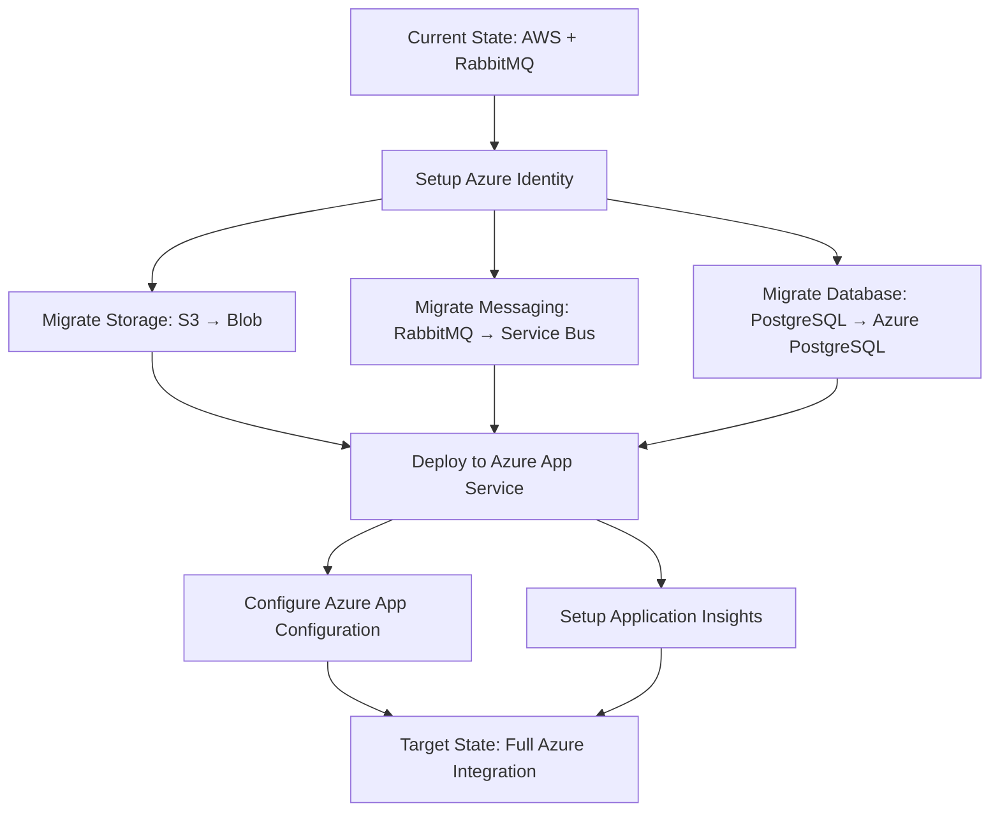
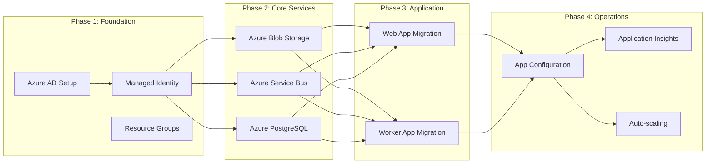
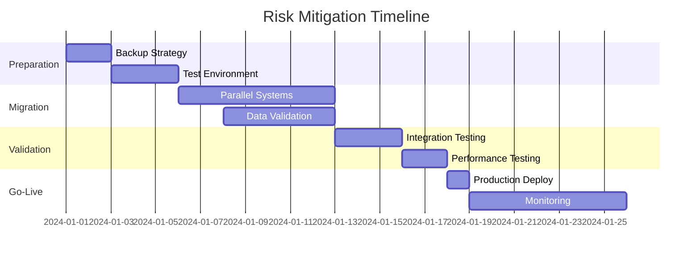
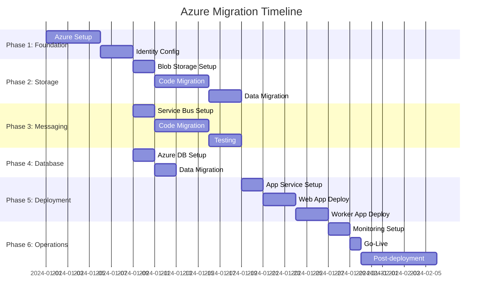

# Azure Migration Assessment Report
## Asset Manager Microservices Application

### Executive Summary

This document provides a comprehensive assessment for migrating the Asset Manager application from AWS-based infrastructure to Microsoft Azure. The application is a Spring Boot-based microservices system that handles file uploads, storage, and thumbnail generation with asynchronous processing.

---

## Current Architecture Assessment

### Application Overview
- **Application Type**: Multi-module Spring Boot microservices
- **Framework Version**: Spring Boot 3.4.3
- **Java Version**: Java 11
- **Build Tool**: Maven
- **Architecture Pattern**: Microservices with async messaging

### Current Technology Stack

| Component | Current Technology | Version | Purpose |
|-----------|-------------------|---------|---------|
| Web Framework | Spring Boot | 3.4.3 | REST API and web interface |
| Frontend | Thymeleaf | Latest | Server-side templating |
| Storage | AWS S3 | SDK 2.25.13 | File and thumbnail storage |
| Messaging | RabbitMQ | Latest | Async message processing |
| Database | PostgreSQL | Latest | Metadata storage |
| Authentication | AWS IAM | N/A | Service authentication |
| Build | Maven | Latest | Dependency management |

### Application Modules

1. **Web Module** (`assets-manager-web`)
   - Handles HTTP requests and file uploads
   - Stores file metadata in PostgreSQL
   - Publishes messages to RabbitMQ queue
   - Serves uploaded files and thumbnails

2. **Worker Module** (`assets-manager-worker`)
   - Processes thumbnail generation requests
   - Consumes messages from RabbitMQ
   - Generates and stores thumbnails in S3

### Current Dependencies
```xml
<!-- Storage -->
<dependency>
    <groupId>software.amazon.awssdk</groupId>
    <artifactId>s3</artifactId>
    <version>2.25.13</version>
</dependency>

<!-- Messaging -->
<dependency>
    <groupId>org.springframework.boot</groupId>
    <artifactId>spring-boot-starter-amqp</artifactId>
</dependency>

<!-- Database -->
<dependency>
    <groupId>org.springframework.boot</groupId>
    <artifactId>spring-boot-starter-data-jpa</artifactId>
</dependency>
<dependency>
    <groupId>org.postgresql</groupId>
    <artifactId>postgresql</artifactId>
</dependency>
```

---

## Azure Target Architecture

### Target Azure Services Mapping

| Current AWS Service | Target Azure Service | Migration Complexity |
|-------------------|---------------------|-------------------|
| AWS S3 | Azure Blob Storage | Medium |
| RabbitMQ | Azure Service Bus | Medium |
| PostgreSQL | Azure Database for PostgreSQL | Low |
| AWS IAM | Azure Managed Identity | Medium |
| EC2/On-Premises | Azure App Service / Container Instances | Medium |

### Target Technology Stack

| Component | Target Technology | Purpose | Benefits |
|-----------|------------------|---------|----------|
| Storage | Azure Blob Storage | File and thumbnail storage | Cost-effective, scalable |
| Messaging | Azure Service Bus | Async message processing | Managed service, high reliability |
| Database | Azure Database for PostgreSQL | Metadata storage | Managed, backup, scaling |
| Identity | Azure Managed Identity | Service authentication | Secure, keyless authentication |
| Hosting | Azure App Service | Application hosting | PaaS, auto-scaling, CI/CD |

---

## Migration Sequence and Dependencies

### Modernization Sequencing Table

| Order | From (Current) | To (Azure) | Dependencies | Migration Type | Risk Level | Description |
|-------|---------------|------------|--------------|------------|------------|-------------|
| 1 | Manual AWS Credentials | Azure Managed Identity | None | Environment Setup | Low | Setup Azure AD, Managed Identity, and RBAC |
| 2 | AWS S3 SDK | Azure Storage Blob SDK | Step 1 | Application Code Change | Medium | Replace S3 client with Azure Blob client |
| 3 | RabbitMQ | Azure Service Bus | Step 1 | Application Code Change | Medium | Replace RabbitMQ with Service Bus messaging |
| 4 | PostgreSQL (Self-hosted) | Azure Database for PostgreSQL | Step 1 | Infrastructure Setup | Low | Migrate database to Azure managed service |
| 5 | Local/AWS Deployment | Azure App Service | Steps 2,3,4 | Deployment | Medium | Deploy applications to Azure App Service |
| 6 | Properties Configuration | Azure App Configuration | Step 5 | Configuration | Low | Externalize configuration management |
| 7 | Local Logging | Azure Application Insights | Step 5 | Configuration | Low | Implement Azure-native monitoring |
| 8 | Manual Scaling | Azure Auto-scaling | Step 5 | Configuration | Low | Configure auto-scaling policies |

### Migration Flow Diagram



### Dependencies Visualization



---

## Detailed Migration Implementation

### Phase 1: Azure Foundation Setup (Risk: Low, Duration: 3-5 days)

#### Tasks:
1. **Create Azure Resource Group**
   ```bash
   az group create --name asset-manager-rg --location eastus
   ```

2. **Setup Managed Identity**
   ```bash
   az identity create --resource-group asset-manager-rg --name asset-manager-identity
   ```

3. **Create Azure Service Principal** (if needed for CI/CD)

#### Validation:
- [ ] Azure subscription accessible
- [ ] Resource group created
- [ ] Managed identity configured
- [ ] RBAC permissions assigned

### Phase 2: Storage Migration - AWS S3 to Azure Blob Storage (Risk: Medium, Duration: 5-7 days)

#### Code Changes Required:

1. **Update Maven Dependencies**
   ```xml
   <!-- Remove AWS S3 -->
   <!-- Add Azure Blob Storage -->
   <dependency>
       <groupId>com.azure</groupId>
       <artifactId>azure-storage-blob</artifactId>
       <version>12.29.0</version>
   </dependency>
   <dependency>
       <groupId>com.azure</groupId>
       <artifactId>azure-identity</artifactId>
       <version>1.15.4</version>
   </dependency>
   ```

2. **Replace S3 Configuration Class**
   ```java
   // From: AwsS3Config.java
   @Configuration
   public class AzureBlobConfig {
       @Value("${azure.storage.account.name}")
       private String storageAccountName;
       
       @Bean
       public BlobServiceClient blobServiceClient() {
           String endpoint = String.format("https://%s.blob.core.windows.net", storageAccountName);
           return new BlobServiceClientBuilder()
               .endpoint(endpoint)
               .credential(new DefaultAzureCredentialBuilder().build())
               .buildClient();
       }
   }
   ```

3. **Replace S3 Service Implementation**
   ```java
   // Replace AwsS3Service with AzureBlobStorageService
   @Service
   @RequiredArgsConstructor
   @Profile("!dev")
   public class AzureBlobStorageService implements StorageService {
       private final BlobServiceClient blobServiceClient;
       // Implementation details...
   }
   ```

#### Configuration Changes:
```properties
# Replace AWS S3 configuration
azure.storage.account.name=${AZURE_STORAGE_ACCOUNT_NAME}
azure.storage.container.name=${AZURE_STORAGE_CONTAINER_NAME}
```

#### Data Migration Strategy:
1. **Create Azure Storage Account and Container**
2. **Use Azure Data Factory or AzCopy for bulk data transfer**
3. **Implement parallel read/write during transition**
4. **Validate data integrity post-migration**

### Phase 3: Messaging Migration - RabbitMQ to Azure Service Bus (Risk: Medium, Duration: 5-7 days)

#### Code Changes Required:

1. **Update Maven Dependencies**
   ```xml
   <!-- Remove RabbitMQ -->
   <!-- Add Azure Service Bus -->
   <dependency>
       <groupId>com.azure.spring</groupId>
       <artifactId>spring-cloud-azure-starter</artifactId>
   </dependency>
   <dependency>
       <groupId>com.azure.spring</groupId>
       <artifactId>spring-messaging-azure-servicebus</artifactId>
   </dependency>
   ```

2. **Replace RabbitMQ Configuration**
   ```java
   @Configuration
   @EnableAzureMessaging
   public class AzureServiceBusConfig {
       
       @Bean
       public ServiceBusAdministrationClient adminClient(
           AzureServiceBusProperties properties, 
           TokenCredential credential) {
           return new ServiceBusAdministrationClientBuilder()
               .credential(properties.getFullyQualifiedNamespace(), credential)
               .buildClient();
       }
       
       @Bean
       public QueueProperties imageProcessingQueue(
           ServiceBusAdministrationClient adminClient) {
           try {
               return adminClient.getQueue("image-processing");
           } catch (ResourceNotFoundException e) {
               return adminClient.createQueue("image-processing");
           }
       }
   }
   ```

3. **Update Message Publishers**
   ```java
   @Service
   @RequiredArgsConstructor
   public class ImageProcessingMessagePublisher {
       private final ServiceBusTemplate serviceBusTemplate;
       
       public void publishMessage(ImageProcessingMessage message) {
           Message<ImageProcessingMessage> busMessage = 
               MessageBuilder.withPayload(message).build();
           serviceBusTemplate.send("image-processing", busMessage);
       }
   }
   ```

4. **Update Message Consumers**
   ```java
   @Component
   public class ImageProcessingMessageConsumer {
       
       @ServiceBusListener(destination = "image-processing")
       public void processImageMessage(ImageProcessingMessage message) {
           // Process thumbnail generation
       }
   }
   ```

#### Configuration Changes:
```properties
spring.cloud.azure.credential.managed-identity-enabled=true
spring.cloud.azure.credential.client-id=${AZURE_CLIENT_ID}
spring.cloud.azure.servicebus.namespace=${SERVICE_BUS_NAMESPACE}
spring.cloud.azure.servicebus.entity-type=queue
```

### Phase 4: Database Migration - PostgreSQL to Azure Database (Risk: Low, Duration: 2-3 days)

#### Infrastructure Setup:
```bash
az postgres server create \
  --resource-group asset-manager-rg \
  --name asset-manager-db \
  --location eastus \
  --admin-user dbadmin \
  --admin-password <secure-password> \
  --sku-name GP_Gen5_2
```

#### Configuration Changes:
```properties
spring.datasource.url=jdbc:postgresql://asset-manager-db.postgres.database.azure.com:5432/assets_manager?sslmode=require
spring.datasource.username=dbadmin@asset-manager-db
spring.datasource.password=${AZURE_POSTGRES_PASSWORD}
```

#### Migration Strategy:
1. **Create Azure PostgreSQL instance**
2. **Export current database schema and data**
3. **Import to Azure PostgreSQL**
4. **Update connection strings**
5. **Test application connectivity**

### Phase 5: Application Deployment to Azure App Service (Risk: Medium, Duration: 3-5 days)

#### Create App Service Plans:
```bash
# Web App
az appservice plan create --name web-plan --resource-group asset-manager-rg --sku P1V2 --is-linux
az webapp create --resource-group asset-manager-rg --plan web-plan --name asset-manager-web --runtime "JAVA|11-java11"

# Worker App  
az appservice plan create --name worker-plan --resource-group asset-manager-rg --sku P1V2 --is-linux
az webapp create --resource-group asset-manager-rg --plan worker-plan --name asset-manager-worker --runtime "JAVA|11-java11"
```

#### Application Configuration:
```properties
# Azure App Service specific settings
server.port=8080
spring.profiles.active=azure

# Enable Azure integration
spring.cloud.azure.tenant-id=${AZURE_TENANT_ID}
spring.cloud.azure.subscription-id=${AZURE_SUBSCRIPTION_ID}
```

#### Deployment Pipeline:
```yaml
# GitHub Actions or Azure DevOps pipeline
name: Deploy to Azure App Service
on:
  push:
    branches: [ main ]
jobs:
  deploy:
    runs-on: ubuntu-latest
    steps:
    - uses: actions/checkout@v2
    - name: Set up JDK 11
      uses: actions/setup-java@v2
      with:
        java-version: '11'
    - name: Build with Maven
      run: mvn clean package
    - name: Deploy to Azure Web App
      uses: azure/webapps-deploy@v2
      with:
        app-name: asset-manager-web
        package: web/target/*.jar
```

---

## Risk Assessment and Mitigation

### High-Risk Areas

| Risk Category | Risk Description | Impact | Probability | Mitigation Strategy |
|---------------|------------------|---------|-------------|-------------------|
| **Data Loss** | Data corruption during storage migration | High | Low | • Implement parallel read/write<br>• Full backup before migration<br>• Incremental validation |
| **Downtime** | Extended service unavailability | High | Medium | • Blue-green deployment<br>• Rollback plan<br>• Feature flags |
| **Integration** | Service communication failures | Medium | Medium | • Comprehensive testing<br>• Circuit breakers<br>• Monitoring alerts |
| **Performance** | Degraded response times | Medium | Low | • Load testing<br>• Performance baselines<br>• Auto-scaling configuration |

### Medium-Risk Areas

| Risk Category | Mitigation Strategy |
|---------------|-------------------|
| **Authentication** | • Test managed identity thoroughly<br>• Fallback authentication method |
| **Configuration** | • Environment-specific validation<br>• Configuration management tools |
| **Dependencies** | • Version compatibility testing<br>• Dependency security scanning |

### Risk Mitigation Timeline



---

## Testing and Validation Strategy

### Pre-Migration Testing

1. **Unit Tests**
   - Update existing unit tests for Azure services
   - Mock Azure services for testing
   - Achieve >80% code coverage

2. **Integration Tests**
   - Test Azure service integrations
   - End-to-end workflow validation
   - Database connectivity tests

3. **Performance Tests**
   - Baseline current performance
   - Load testing with Azure services
   - Stress testing under peak loads

### Migration Validation

1. **Data Integrity Validation**
   ```bash
   # Example validation script
   #!/bin/bash
   echo "Validating file count and sizes..."
   aws s3 ls s3://source-bucket --recursive --summarize
   az storage blob list --container-name target-container --output table
   ```

2. **Functional Testing**
   - File upload and download workflows
   - Thumbnail generation process
   - Database operations

3. **Performance Comparison**
   - Response time measurements
   - Throughput comparisons
   - Resource utilization metrics

### Post-Migration Monitoring

1. **Application Insights Setup**
   ```java
   @Configuration
   public class TelemetryConfiguration {
       @Bean
       public TelemetryClient telemetryClient() {
           return new TelemetryClient();
       }
   }
   ```

2. **Custom Metrics**
   - File upload success rate
   - Thumbnail generation time
   - Storage operation latency

3. **Alerting Rules**
   - Error rate thresholds
   - Performance degradation alerts
   - Resource utilization warnings

---

## Success Criteria and KPIs

### Technical Success Metrics

| Metric | Baseline | Target | Measurement Method |
|--------|----------|--------|--------------------|
| **Upload Success Rate** | 99.5% | ≥99.5% | Application logs |
| **Thumbnail Generation Time** | <30s | <30s | Processing metrics |
| **API Response Time** | <2s | <2s | APM tools |
| **Storage Availability** | 99.9% | ≥99.9% | Azure metrics |
| **Database Connection Pool** | 95% | ≥95% | Connection metrics |

### Business Success Metrics

| Metric | Target | Benefit |
|--------|--------|---------|
| **Cost Reduction** | 20-30% | Lower infrastructure costs |
| **Deployment Frequency** | 2x increase | Faster feature delivery |
| **Recovery Time** | <1 hour | Improved reliability |
| **Scalability** | Auto-scaling | Handle traffic spikes |

### Operational Success Metrics

| Metric | Target | Implementation |
|--------|--------|---------------|
| **Mean Time to Recovery** | <30 minutes | Azure auto-recovery |
| **Monitoring Coverage** | 100% | Application Insights |
| **Security Compliance** | Azure standards | Managed identity, encryption |
| **Backup Recovery** | <4 hours | Azure backup services |

---

## Cost Analysis

### Current AWS Costs (Estimated Monthly)

| Service | Estimated Cost | Usage |
|---------|---------------|-------|
| S3 Storage | $50 | 1TB storage, 10K requests |
| RabbitMQ (Self-hosted) | $200 | EC2 instance + maintenance |
| PostgreSQL (RDS) | $150 | db.t3.medium instance |
| **Total Current** | **$400** | |

### Projected Azure Costs (Monthly)

| Service | Estimated Cost | Usage |
|---------|---------------|-------|
| Blob Storage | $40 | 1TB storage, 10K requests |
| Service Bus | $30 | Standard tier, 10K operations |
| PostgreSQL | $120 | 2 vCores, 100GB storage |
| App Service | $150 | 2x P1V2 instances |
| **Total Azure** | **$340** | |

### Cost Savings: **15% reduction** ($60/month, $720/year)

---

## Implementation Timeline

### Detailed Project Schedule



### Milestones and Deliverables

| Phase | Duration | Key Deliverables |
|-------|----------|------------------|
| **Phase 1: Foundation** | 8 days | Azure subscription, resource groups, managed identity |
| **Phase 2: Storage** | 10 days | Azure Blob Storage integration, data migration |
| **Phase 3: Messaging** | 10 days | Service Bus integration, queue migration |
| **Phase 4: Database** | 4 days | Azure PostgreSQL, data migration |
| **Phase 5: Deployment** | 8 days | App Service deployment, CI/CD pipeline |
| **Phase 6: Operations** | 10 days | Monitoring, go-live, validation |

**Total Project Duration: 50 days (10 weeks)**

---

## Team and Resource Requirements

### Required Skills and Roles

| Role | Responsibilities | Time Commitment |
|------|------------------|----------------|
| **Azure Architect** | Architecture design, service selection | 50% |
| **Java Developer** | Code migration, testing | 100% |
| **DevOps Engineer** | CI/CD, infrastructure setup | 75% |
| **Database Administrator** | Database migration, optimization | 25% |
| **QA Engineer** | Testing, validation | 50% |
| **Project Manager** | Coordination, timeline management | 25% |

### Training Requirements

1. **Azure Fundamentals** - All team members (2 days)
2. **Azure Developer Track** - Development team (5 days)
3. **Azure DevOps** - DevOps engineer (3 days)

---

## Conclusion

The migration from AWS to Azure presents a strategic opportunity to modernize the Asset Manager application while achieving cost savings and improved operational efficiency. The recommended phased approach minimizes risk while ensuring business continuity.

### Key Benefits:
- **15% cost reduction** through Azure's competitive pricing
- **Improved security** with Azure Managed Identity
- **Better scalability** with Azure App Service auto-scaling
- **Enhanced monitoring** with Application Insights
- **Reduced operational overhead** with managed services

### Next Steps:
1. **Approve migration plan** and allocate resources
2. **Setup Azure subscription** and initial services
3. **Begin Phase 1** foundation setup
4. **Establish monitoring** and communication protocols
5. **Execute phased migration** according to timeline

This assessment provides a comprehensive roadmap for successful migration to Azure while maintaining application reliability and performance standards.