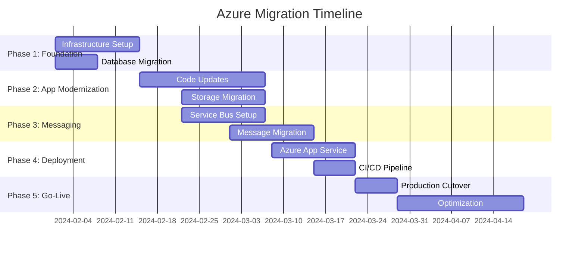
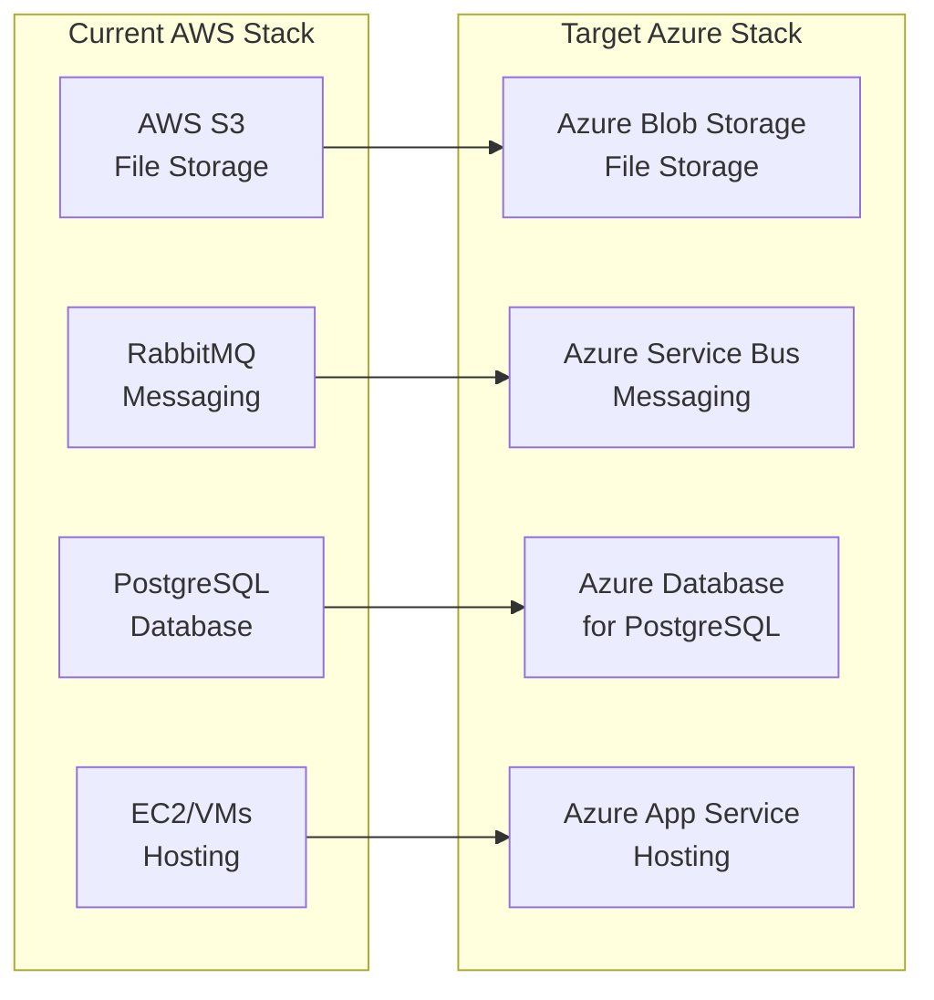

# Azure Migration Assessment - Document Index

This repository contains a comprehensive Azure migration assessment for the Asset Manager application. Below is the complete documentation structure and quick access guide.

## 📋 Document Overview

### Core Assessment Documents

| Document | Purpose | Audience | Key Content |
|----------|---------|----------|-------------|
| **[EXECUTIVE_SUMMARY.md](./EXECUTIVE_SUMMARY.md)** | High-level overview and business case | Executives, Stakeholders | Business benefits, costs, timeline |
| **[AZURE_MIGRATION_ASSESSMENT.md](./AZURE_MIGRATION_ASSESSMENT.md)** | Comprehensive migration analysis | Technical Leaders, Architects | Detailed migration plan, architecture |
| **[TECHNICAL_IMPLEMENTATION_GUIDE.md](./TECHNICAL_IMPLEMENTATION_GUIDE.md)** | Code-level migration details | Developers, Engineers | Code examples, API changes |
| **[MIGRATION_VALIDATION_CHECKLIST.md](./MIGRATION_VALIDATION_CHECKLIST.md)** | Testing and validation procedures | QA, Operations | Validation steps, testing procedures |
| **[AZURE_INFRASTRUCTURE_TEMPLATES.md](./AZURE_INFRASTRUCTURE_TEMPLATES.md)** | Infrastructure automation | DevOps, Infrastructure | ARM templates, deployment scripts |

## 🎯 Quick Start Guide

### For Executives
- Start with: **[EXECUTIVE_SUMMARY.md](./EXECUTIVE_SUMMARY.md)**
- Key insights: Cost savings (12.6%), timeline (12 weeks), strategic benefits

### For Technical Leaders
- Start with: **[AZURE_MIGRATION_ASSESSMENT.md](./AZURE_MIGRATION_ASSESSMENT.md)**
- Focus areas: Migration sequence, risk assessment, implementation roadmap

### For Development Teams
- Start with: **[TECHNICAL_IMPLEMENTATION_GUIDE.md](./TECHNICAL_IMPLEMENTATION_GUIDE.md)**
- Key sections: Code migration examples, dependency updates, testing approaches

### For Operations Teams
- Start with: **[MIGRATION_VALIDATION_CHECKLIST.md](./MIGRATION_VALIDATION_CHECKLIST.md)**
- Focus areas: Infrastructure validation, testing procedures, go-live checklist

### For Infrastructure Teams
- Start with: **[AZURE_INFRASTRUCTURE_TEMPLATES.md](./AZURE_INFRASTRUCTURE_TEMPLATES.md)**
- Key resources: ARM templates, deployment scripts, RBAC configuration

## 📊 Migration Summary

### Current State
- **Framework**: Spring Boot 3.4.3 with Java 11
- **Architecture**: Multi-module Maven (web + worker)
- **Cloud Services**: AWS S3, RabbitMQ, PostgreSQL
- **Deployment**: Traditional server-based

### Target State
- **Storage**: Azure Blob Storage
- **Messaging**: Azure Service Bus
- **Database**: Azure Database for PostgreSQL
- **Hosting**: Azure App Service
- **Security**: Azure Managed Identity

### Key Metrics
- **Timeline**: 12 weeks (5 phases)
- **Cost Savings**: 12.6% annually ($1,352/year)
- **Risk Level**: Medium (manageable with proper planning)
- **Team Size**: 2 developers, 1 architect, 1 tester, 1 PM

## 📈 Migration Phases



## 🔄 Service Migration Map



## 📋 Validation Checklist Summary

### Pre-Migration
- [ ] Azure infrastructure provisioned
- [ ] Database migration validated
- [ ] Security configuration complete
- [ ] Team training completed

### During Migration
- [ ] Code changes validated
- [ ] Storage migration verified
- [ ] Messaging system tested
- [ ] Performance benchmarks met

### Post-Migration
- [ ] Full functionality verified
- [ ] Performance optimized
- [ ] Monitoring operational
- [ ] Documentation complete

## 🚀 Next Steps

### Immediate (Week 1)
1. **Executive Review**: Present assessment to leadership
2. **Budget Approval**: Secure funding for migration project
3. **Team Assignment**: Allocate dedicated migration team
4. **Azure Setup**: Provision development environment

### Short-term (Weeks 2-4)
1. **Pilot Project**: Execute small proof-of-concept
2. **Infrastructure**: Deploy staging environment
3. **Training**: Complete Azure certification for team
4. **Planning**: Finalize detailed project plan

### Long-term (Weeks 5-12)
1. **Execution**: Follow phased migration approach
2. **Testing**: Comprehensive validation at each phase
3. **Go-Live**: Execute production cutover
4. **Optimization**: Performance tuning and cost optimization

## 📞 Support and Resources

### Documentation Structure
```
📁 Azure Migration Assessment
├── 📄 EXECUTIVE_SUMMARY.md           # Business overview
├── 📄 AZURE_MIGRATION_ASSESSMENT.md  # Technical deep-dive
├── 📄 TECHNICAL_IMPLEMENTATION_GUIDE.md # Code migration
├── 📄 MIGRATION_VALIDATION_CHECKLIST.md # Testing procedures
├── 📄 AZURE_INFRASTRUCTURE_TEMPLATES.md # Infrastructure automation
└── 📄 README.md                      # This document
```

### Key Contacts
- **Technical Lead**: [Assign technical lead]
- **Azure Architect**: [Assign Azure expert]
- **Project Manager**: [Assign PM]
- **Business Sponsor**: [Assign executive sponsor]

---

*This assessment provides a comprehensive roadmap for successfully migrating the Asset Manager application to Azure. For questions or clarifications, please refer to the detailed documentation or contact the migration team.*