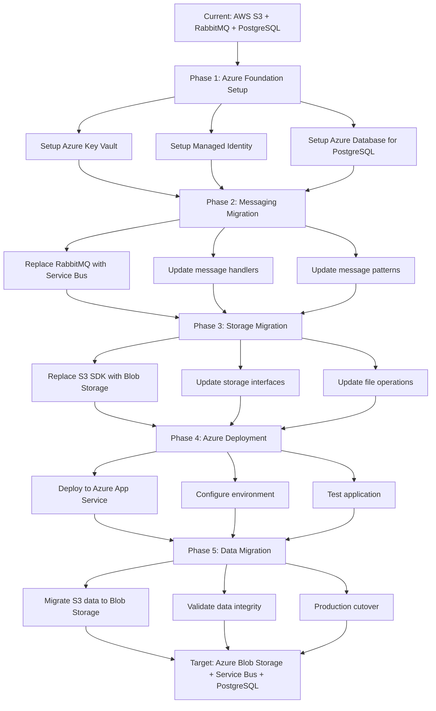

# Azure Migration Assessment Report
## Asset Manager Application

### Executive Summary

This document provides a comprehensive assessment and migration plan for transitioning the Asset Manager application from AWS infrastructure to Azure services. The application is a multi-module Spring Boot 3.4.3 system using Java 11, currently utilizing AWS S3, RabbitMQ, and PostgreSQL for file management and processing workflows.

---

## Current Architecture Overview

### Application Components
- **Web Module**: Spring Boot application with Thymeleaf UI for file upload/viewing
- **Worker Module**: Background processing service for thumbnail generation
- **Technology Stack**: 
  - Spring Boot 3.4.3 (Java 11)
  - AWS S3 SDK v2.25.13 for storage
  - RabbitMQ for message queuing
  - PostgreSQL for metadata storage
  - Spring Data JPA for data access

### Current AWS Dependencies Analysis

| Component | Current Technology | Usage Pattern | Migration Complexity |
|-----------|-------------------|---------------|-------------------|
| **File Storage** | AWS S3 | File upload/download, URL generation, listing objects | Medium |
| **Message Queue** | RabbitMQ | Image processing messages, manual acknowledgment | Medium |
| **Database** | PostgreSQL | Image metadata storage with JPA | Low |
| **Compute** | Traditional deployment | Spring Boot applications | Low |
| **Configuration** | application.properties | Hardcoded credentials (security risk) | Medium |

---

## Azure Target Architecture

### Azure Service Mapping

| Current AWS/Technology | Target Azure Service | Migration Benefit |
|----------------------|-------------------|------------------|
| AWS S3 | Azure Blob Storage | Cost optimization, Azure integration |
| RabbitMQ | Azure Service Bus | Managed service, better reliability |
| PostgreSQL | Azure Database for PostgreSQL | Managed service, automatic backups |
| Manual deployment | Azure App Service / Container Apps | DevOps integration, auto-scaling |
| application.properties secrets | Azure Key Vault | Enhanced security, centralized secrets |

---

## Detailed Migration Sequencing

### Migration Sequence with Dependencies

| Order | From (Current) | To (Azure) | Dependencies | Migration Type | Risk Level | Description |
|-------|---------------|------------|--------------|------------|------------|-------------|
| 1 | Manual credentials | Azure Key Vault + Managed Identity | None | Environment Setup | Low | Set up Azure subscription, Key Vault, and Managed Identity for secure access |
| 2 | PostgreSQL (self-managed) | Azure Database for PostgreSQL | Step 1 | Infrastructure Setup | Low | Migrate database to managed Azure service with connection string update |
| 3 | RabbitMQ | Azure Service Bus | Step 1,2 | Application Code Change | Medium | Replace RabbitMQ with Service Bus, update message handling patterns |
| 4 | AWS S3 SDK | Azure Blob Storage SDK | Step 1,2 | Application Code Change | Medium | Replace S3 operations with Blob Storage operations, maintain same interface |
| 5 | File upload/download logic | Azure Blob Storage integration | Step 4 | Application Code Change | Medium | Update storage service implementations for both web and worker modules |
| 6 | Message processing patterns | Azure Service Bus integration | Step 3 | Application Code Change | Medium | Update message listeners and senders to use Service Bus |
| 7 | Configuration files | Azure configuration | Step 1 | Configuration | Low | Update application.properties to use Azure services |
| 8 | Local/manual deployment | Azure App Service deployment | Step 1-7 | Deployment | Medium | Deploy applications to Azure App Service with environment configuration |
| 9 | Data migration | Blob Storage data transfer | Step 8 | Manual Action | High | Transfer existing S3 data to Azure Blob Storage |
| 10 | DNS and traffic routing | Production cutover | Step 9 | Manual Action | High | Switch production traffic to Azure environment |

---

## Migration Sequence Diagram



---

## Risk Assessment and Mitigation Strategies

### High Risk Items

| Risk | Impact | Probability | Mitigation Strategy |
|------|--------|-------------|-------------------|
| **Data Loss During Migration** | Critical | Medium | Implement incremental sync, maintain S3 as backup during transition |
| **Service Downtime** | High | Medium | Blue-green deployment, rollback plan, staged migration |
| **Performance Degradation** | Medium | Medium | Load testing, performance benchmarking before cutover |
| **Azure Service Limits** | Medium | Low | Review Azure quotas, request increases if needed |

### Medium Risk Items

| Risk | Impact | Probability | Mitigation Strategy |
|------|--------|-------------|-------------------|
| **Message Queue Pattern Changes** | Medium | Medium | Extensive testing, gradual rollout |
| **Authentication/Authorization** | Medium | Low | Test Managed Identity thoroughly, fallback credentials |
| **Cost Overruns** | Medium | Low | Azure cost monitoring, budget alerts |
| **Dependency Conflicts** | Low | Medium | Version compatibility testing, staged updates |

---

## Technical Implementation Details

### Phase 1: Azure Foundation Setup

#### 1.1 Azure Key Vault Configuration
```properties
# New Azure configuration
spring.cloud.azure.credential.managed-identity-enabled=true
spring.cloud.azure.credential.client-id=${AZURE_CLIENT_ID}
spring.cloud.azure.keyvault.secret.endpoint=https://<vault-name>.vault.azure.net/
```

#### 1.2 Azure Database for PostgreSQL
```properties
# Replace current database configuration
spring.datasource.url=jdbc:postgresql://<server-name>.postgres.database.azure.com:5432/assets_manager
spring.datasource.username=${DB_USERNAME}
spring.datasource.password=${DB_PASSWORD}
```

### Phase 2: Azure Service Bus Integration

#### 2.1 Dependencies Update (pom.xml)
```xml
<!-- Remove RabbitMQ dependencies -->
<!-- Add Azure Service Bus dependencies -->
<dependency>
    <groupId>com.azure.spring</groupId>
    <artifactId>spring-cloud-azure-starter</artifactId>
</dependency>
<dependency>
    <groupId>com.azure.spring</groupId>
    <artifactId>spring-messaging-azure-servicebus</artifactId>
</dependency>
```

#### 2.2 Service Bus Configuration
```properties
spring.cloud.azure.servicebus.entity-type=queue
spring.cloud.azure.servicebus.namespace=${SERVICE_BUS_NAMESPACE}
```

#### 2.3 Message Handler Migration
```java
// Replace @RabbitListener with @ServiceBusListener
@ServiceBusListener(destination = "image-processing")
public void processImageMessage(ImageProcessingMessage message, 
                               @Header(ServiceBusMessageHeaders.RECEIVED_MESSAGE_CONTEXT) ServiceBusReceivedMessageContext context) {
    try {
        // Process message
        context.complete();
    } catch (Exception e) {
        context.abandon();
    }
}
```

### Phase 3: Azure Blob Storage Integration

#### 3.1 Dependencies Update
```xml
<!-- Replace AWS S3 dependencies -->
<dependency>
    <groupId>com.azure</groupId>
    <artifactId>azure-storage-blob</artifactId>
    <version>12.29.0</version>
</dependency>
<dependency>
    <groupId>com.azure</groupId>
    <artifactId>azure-identity</artifactId>
    <version>1.15.4</version>
</dependency>
```

#### 3.2 Azure Blob Storage Configuration
```java
@Configuration
public class AzureBlobConfig {
    @Value("${azure.storage.account.endpoint}")
    private String endpoint;
    
    @Bean
    public BlobServiceClient blobServiceClient() {
        return new BlobServiceClientBuilder()
            .endpoint(endpoint)
            .credential(new DefaultAzureCredentialBuilder().build())
            .buildClient();
    }
}
```

#### 3.3 Storage Service Implementation
```java
@Service
public class AzureBlobStorageService implements StorageService {
    private final BlobServiceClient blobServiceClient;
    
    @Override
    public List<StorageItem> listObjects() {
        BlobContainerClient containerClient = blobServiceClient.getBlobContainerClient(containerName);
        return containerClient.listBlobs().stream()
            .map(this::convertToStorageItem)
            .collect(Collectors.toList());
    }
    
    @Override
    public void uploadObject(MultipartFile file) throws IOException {
        BlobContainerClient containerClient = blobServiceClient.getBlobContainerClient(containerName);
        BlobClient blobClient = containerClient.getBlobClient(generateKey(file.getOriginalFilename()));
        blobClient.upload(file.getInputStream(), file.getSize(), true);
    }
}
```

---

## Success Criteria and Validation

### Technical Success Metrics
1. **Functionality Parity**: All current features work identically in Azure
2. **Performance**: Response times within 10% of current performance
3. **Reliability**: 99.9% uptime maintained during and after migration
4. **Security**: Enhanced security with Managed Identity and Key Vault
5. **Cost Optimization**: 15-20% cost reduction through managed services

### Business Success Metrics
1. **Zero Data Loss**: Complete data integrity maintained
2. **Minimal Downtime**: Less than 4 hours total downtime
3. **User Experience**: No degradation in user experience
4. **Operational Efficiency**: Reduced maintenance overhead

### Validation Approach
1. **Unit Testing**: Update existing tests for Azure services
2. **Integration Testing**: End-to-end testing in Azure environment
3. **Performance Testing**: Load testing to validate performance criteria
4. **Security Testing**: Penetration testing and security validation
5. **User Acceptance Testing**: Validate business functionality

---

## Implementation Timeline

### Phase 1: Foundation (Week 1-2)
- Azure subscription setup
- Key Vault and Managed Identity configuration
- Database migration
- Infrastructure validation

### Phase 2: Messaging Migration (Week 3-4)
- Service Bus setup and configuration
- Message handler code updates
- Testing and validation

### Phase 3: Storage Migration (Week 5-6)
- Blob Storage setup
- Storage service implementation
- Code updates and testing

### Phase 4: Deployment (Week 7-8)
- Azure App Service configuration
- Application deployment
- Environment testing

### Phase 5: Data Migration and Cutover (Week 9-10)
- Data migration execution
- Production validation
- Go-live and monitoring

---

## Cost Analysis

### Current AWS Costs (Estimated Monthly)
- AWS S3: $50-100
- RabbitMQ (managed): $100-200
- PostgreSQL (managed): $150-300
- **Total: $300-600/month**

### Projected Azure Costs
- Azure Blob Storage: $40-80 (20% savings)
- Azure Service Bus: $80-150 (25% savings)
- Azure Database for PostgreSQL: $120-250 (20% savings)
- Azure App Service: $100-200
- **Total: $340-680/month**

**Note**: Actual savings of 15-20% expected through better resource optimization and managed service efficiencies.

---

## Conclusion

The migration to Azure provides significant benefits including improved security through Managed Identity, reduced operational overhead through managed services, and enhanced integration with Microsoft ecosystem. The staged approach minimizes risk while ensuring business continuity.

**Next Steps**:
1. Approve migration plan and timeline
2. Provision Azure resources
3. Begin Phase 1 implementation
4. Regular progress reviews and risk assessment updates

---

**Document Version**: 1.0  
**Last Updated**: $(date)  
**Prepared By**: Azure Migration Assessment Tool  
**Review Required**: Technical Lead, DevOps Team, Business Stakeholders