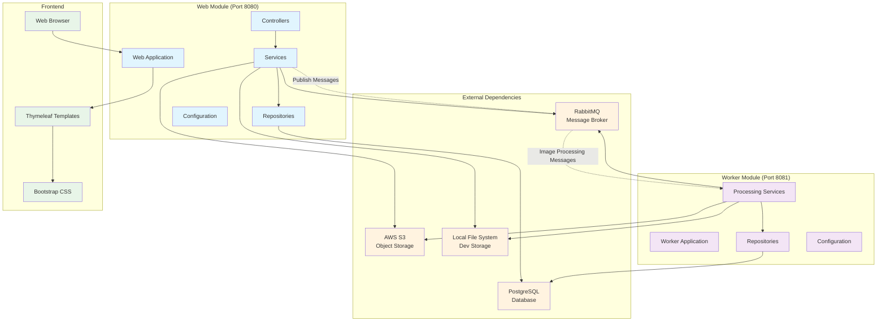

# Framework Analysis - Asset Manager Microservices Application

## Project Overview

The Asset Manager is a **multi-module Maven project** built with **Spring Boot** that provides image asset management capabilities with thumbnail generation. The application follows a **microservices architecture** with two main modules communicating via message queues.

## Architecture Pattern

### Multi-Module Structure
```
assets-manager-parent/
├── web/           # Frontend and API module
└── worker/        # Background processing module
```

The project implements a **Producer-Consumer pattern** where:
- **Web module** acts as the producer (handles uploads and publishes processing messages)
- **Worker module** acts as the consumer (processes images and generates thumbnails)

## Technology Stack

### Core Framework
- **Spring Boot 3.4.3** - Main application framework
- **Java 11** - Runtime platform
- **Maven** - Build tool and dependency management

### Web Technologies
- **Spring Web MVC** - REST API and web controller framework
- **Thymeleaf** - Server-side templating engine
- **Bootstrap 5.3.0** - Frontend CSS framework (CDN)
- **HTML5** - Frontend markup

### Messaging & Communication
- **Spring AMQP** - RabbitMQ integration
- **RabbitMQ** - Message broker for asynchronous processing
- **Jackson** - JSON serialization/deserialization

### Data Persistence
- **Spring Data JPA** - Object-relational mapping
- **Hibernate** - JPA implementation
- **PostgreSQL** - Primary database

### Cloud & Storage
- **AWS SDK for Java 2.25.13** - AWS S3 integration
- **AWS S3** - Cloud object storage
- **Local File System** - Development storage option

### Development & Utilities
- **Lombok** - Code generation (getters, setters, etc.)
- **Spring DevTools** - Development-time features
- **Spring Boot Configuration Processor** - Configuration metadata

## Module Dependencies Diagram



## Framework Dependencies Analysis

### Parent POM Dependencies
```xml
<parent>
    <groupId>org.springframework.boot</groupId>
    <artifactId>spring-boot-starter-parent</artifactId>
    <version>3.4.3</version>
</parent>
```

### Web Module Dependencies
| Dependency | Purpose | Scope |
|------------|---------|-------|
| spring-boot-starter-thymeleaf | Server-side templating | Runtime |
| spring-boot-starter-web | Web MVC framework | Runtime |
| spring-boot-starter-amqp | RabbitMQ integration | Runtime |
| spring-boot-starter-data-jpa | JPA/Hibernate ORM | Runtime |
| software.amazon.awssdk:s3 | AWS S3 client | Runtime |
| postgresql | PostgreSQL JDBC driver | Runtime |
| lombok | Code generation | Compile |
| spring-boot-devtools | Development tools | Runtime (optional) |

### Worker Module Dependencies
| Dependency | Purpose | Scope |
|------------|---------|-------|
| spring-boot-starter | Core Spring Boot | Runtime |
| spring-boot-starter-amqp | RabbitMQ integration | Runtime |
| spring-boot-starter-data-jpa | JPA/Hibernate ORM | Runtime |
| software.amazon.awssdk:s3 | AWS S3 client | Runtime |
| postgresql | PostgreSQL JDBC driver | Runtime |
| jackson-databind | JSON processing | Runtime |
| lombok | Code generation | Compile |

## Design Patterns Implemented

### 1. Strategy Pattern
**Location**: `worker/service/AbstractFileProcessingService.java`
- **Abstract Class**: `AbstractFileProcessingService`
- **Concrete Implementations**:
  - `LocalFileProcessingService` (Profile: dev)
  - `S3FileProcessingService` (Profile: !dev)

**Purpose**: Allows switching between local file storage and AWS S3 based on Spring profiles.

### 2. Template Method Pattern
**Location**: `AbstractFileProcessingService.java`
- **Template Method**: `processImage()`
- **Hook Methods**: `downloadOriginal()`, `uploadThumbnail()`, `generateUrl()`

### 3. Publisher-Subscriber Pattern
**Implementation**: RabbitMQ message queuing
- **Publisher**: Web module services
- **Subscriber**: Worker module services
- **Message**: `ImageProcessingMessage`

### 4. Repository Pattern
**Implementation**: Spring Data JPA
- **Interface**: `ImageMetadataRepository extends JpaRepository`
- **Entity**: `ImageMetadata`

## Configuration Management

### Profile-Based Configuration
- **Development Profile (`dev`)**: 
  - Uses `LocalFileProcessingService`
  - Local file system storage
- **Production Profile** (default):
  - Uses `S3FileProcessingService`
  - AWS S3 cloud storage

### Configuration Classes
1. **AWS S3 Configuration**
   - `web/config/AwsS3Config.java`
   - `worker/config/AwsS3Config.java`

2. **RabbitMQ Configuration**
   - `web/config/RabbitConfig.java`
   - `worker/config/RabbitConfig.java`

## Application Flow

### 1. Image Upload Flow
```
User → Web Browser → Web Controller → Storage Service → RabbitMQ → Database
```

### 2. Thumbnail Processing Flow
```
RabbitMQ → Worker Service → Download Original → Generate Thumbnail → Upload Thumbnail → Update Database
```

### 3. Image Retrieval Flow
```
User → Web Browser → Web Controller → Database → Storage Service → Display
```

## Module Communication

### Inter-Module Communication
- **Asynchronous**: RabbitMQ message queue
- **Message Type**: `ImageProcessingMessage`
- **Queue Name**: `image-processing`

### Shared Resources
- **Database**: Both modules access the same PostgreSQL database
- **Storage**: Both modules can access AWS S3 or local storage
- **Message Queue**: RabbitMQ for decoupled communication

## Scalability Considerations

### Horizontal Scaling
- **Web Module**: Can be scaled horizontally behind a load balancer
- **Worker Module**: Can run multiple instances for parallel processing
- **Message Queue**: RabbitMQ supports clustering
- **Database**: PostgreSQL supports read replicas

### Fault Tolerance
- **Retry Mechanism**: Implemented in worker module with `RetryTemplate`
- **Manual Acknowledgment**: RabbitMQ messages are manually acknowledged
- **Error Handling**: Try-catch blocks with proper logging

## Development Environment

### Local Development Setup
1. **Docker Containers**:
   - PostgreSQL (port 5432)
   - RabbitMQ with management UI (ports 5672, 15672)

2. **Spring Boot Applications**:
   - Web module (port 8080)
   - Worker module (port 8081)

3. **Startup Scripts**:
   - `scripts/start.sh` - Unix/Linux
   - `scripts/start.cmd` - Windows

## Security Considerations

### Configuration Security
- AWS credentials configured via application properties
- Database credentials in configuration files
- RabbitMQ uses default guest credentials for development

### Recommendations
- Use environment variables for sensitive configuration
- Implement Spring Security for authentication/authorization
- Use AWS IAM roles instead of hardcoded credentials
- Enable HTTPS in production

## Build and Deployment

### Maven Multi-Module Build
```bash
./mvnw clean compile    # Compile all modules
./mvnw clean package    # Package all modules
./mvnw spring-boot:run  # Run individual modules
```

### Module Artifacts
- **Web Module**: `assets-manager-web-0.0.1-SNAPSHOT.jar`
- **Worker Module**: `assets-manager-worker-0.0.1-SNAPSHOT.jar`

## Future Enhancement Opportunities

1. **Containerization**: Add Docker support with Dockerfile for each module
2. **API Documentation**: Integrate Swagger/OpenAPI
3. **Monitoring**: Add Spring Boot Actuator and metrics
4. **Security**: Implement Spring Security
5. **Testing**: Add comprehensive unit and integration tests
6. **CI/CD**: GitHub Actions or similar pipeline
7. **Configuration**: Externalize configuration with Spring Cloud Config

## Conclusion

This asset manager application demonstrates a well-structured microservices architecture using Spring Boot. The separation of concerns between web and worker modules, combined with asynchronous message processing, provides a scalable and maintainable solution for image asset management. The use of established patterns like Strategy and Repository, along with profile-based configuration, makes the application flexible for different deployment environments.